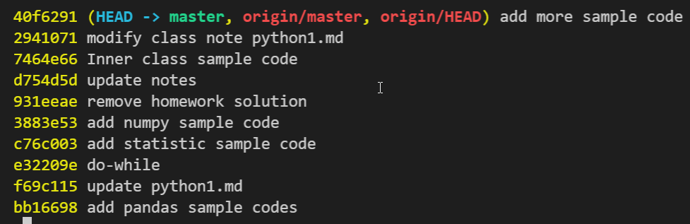
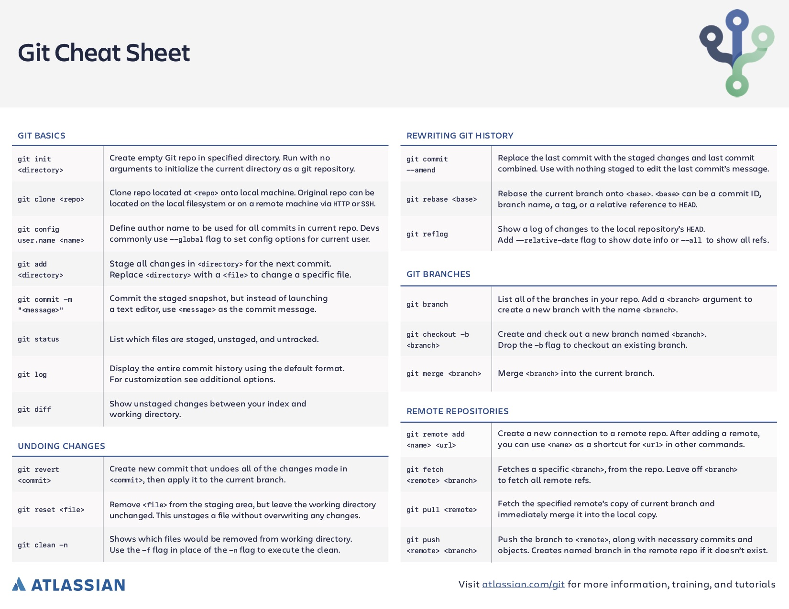

# Git Tricks
- [Git Tricks](#git-tricks)
  - [Git all source from GitHub](#git-all-source-from-github)
  - [Check Git Status](#check-git-status)
  - [Git Version Control](#git-version-control)
  - [Git branch](#git-branch)
  - [Git Config](#git-config)
  - [Git Cheat Sheet](#git-cheat-sheet)


## Git all source from GitHub
```
git clone <github url>
git clone https://github.com/jwang1122/python-I.git
```

## Check Git Status

```
git status
git log --oneline
git log --all
git log --graph
git log --oneline > <git.log>
```
Sample output:


## Git Version Control
```
git checkout <branch name>
git checkout -b <new branch name> [from branch]
git checkout <revision number>
git checkout bb16698
git add *
git commit -m <'message'>

git pull
git push
git 
```
* merge from dev to master
```
git checkout master
git merge dev
```


## Git branch

```
git branch
git branch <branch name>
git branch dev
git checkout dev
git checkout master

```

## Git Config

```
git init
git config user.name <'user name'>
git config user.email <'user emal'>
git config user.name 'jwang1122'
git config user.email 'jwang1122@gmail.com'
git remote add <origin> <url>
```

## Git Cheat Sheet
