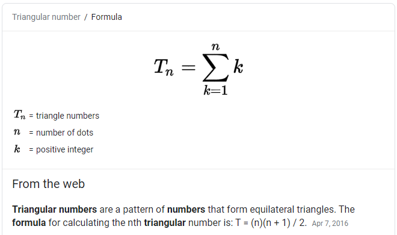
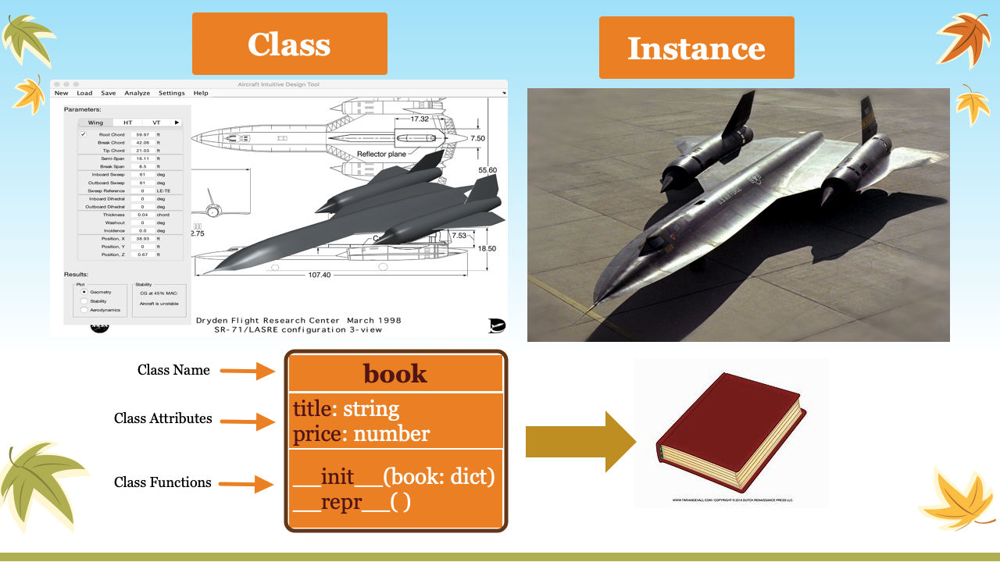
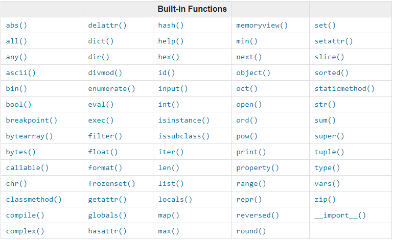

# 华夏中文学校 Python level-I

**开课前要把所有用到的程序运行一遍**

## Table of Contents
√ 
1. [Familiar with your keyboard](#Familiar-with-your-keyboard)
1. [Getting start](#Getting-start)
1. [Using Markdown](#Using-Markdown)
1. [print](#print)
1. [Turtle](#Turtle)
1. [draw snow man](#draw-snow-man)
1. [If-Else](#If-Else)
1. [Data Type](#Data-Type)
1. [Python playground](#Python-playground-and-help-document)
1. [Loop](#Loop)
1. [Ball Game](#ball-game)
1. [Simple Math](#simple-math)
1. [Function](#Function)
1. [Terminal Games](#Terminal-Games)
1. [Dice](#Dice)
1. [Prime](#Prime)
1. [File access](#File-access)
1. [Plot](#plot)
1. [App server](#App-server)
1. [Mongo DB](#Mongo-DB)
1. [ReactJS](#ReactJS)
1. [install npm](#install-npm)
1. [OOP](#OOP)
1. [Python Class](#Python-class)
1. [Review](#Review)
1. Additional Topic: [QuiteType](#install-and-using-QuickType); 

---
[Table of Contents](#Table-of-Contents)


## Familiar with your keyboard


[Share Keyboard document](keyboard.md)

1. [Key name](https://www.computerhope.com/keys.htm)

    Key | Name
    |---|---|
    space | space, empty space in editor
    Enter | return, enter, new line in editor
    :  | colon, key:value separator in dict
    ,  | comma, list or tuple item separator, delimiter in csv file
    .  | dot, period, instance function call()
    \# | pound, hashtag, number, hold shift key click number 3, comments the line
    `  | back quote, grave accent, command block in markdown
    \* | asterisk, star, bullet point in markdown, math multiply operator
    () | parenthesis, tuple, function definition and call
    \- | dash, hyphen, minus math operator, command option python --version
    _  | underscore, dunder function or variable, private or protected variables
    {} | curly bracket, dict or set
    [] | bracket, square bracket, list
    \  | back slash, line continue, escape sequence
    /  | forward slash, file name path fold dilimiter
    \| | pipe, virtical bar, bitwise OR operator
    &  | ampersand, and simple, bitwise AND operator
    ^  | caret, circumflex, bitwise XOR operator
    ?  | question mark, space holder in sqlit
    $  | dollar sign
    ;  | semicolon

* combination keys
```
    ctrl+c
    Ctrl+v
    ctrl+/
    shift+downarrow
    tab
    shift+tab
```
* Command line arrow key usage
```
    upArrow: bring previous command back
    downArrow: bring next command back
    leftArrow: move cursor to left in DOS window
    rightArrow: move cursor to right in DOS window
```
* Hight light block of code
* Ctrl+c: copy
* Ctrl+v: paste
* Ctrl+/: toggle comments

---
[Table of Contents](#Table-of-Contents)

## Using Markdown 
* turn in homework to GitHub
* VS Code Extension
    - Markdown All in One
    - Markdown Preview Enhanced
    - Unicode LaTex
* √ Markdown md文件的制作，制作课堂笔记

    - add Markdown Extension
    - 显示标题，子标题 #, ##
    - 显示 bullet point *，1
    - 显示命令行
    - 显示图形
    - 显示链接


* [Markdown Cheat Sheet](markdown-cheat-sheet.md)
* [Reference to pythonInstall.md](pythonInstall.md)
* Install Greenshot

    installation file name: Greenshot-INSTALLER-1.2.10.6-RELEASE.exe
* Basic operation    
---
[Table of Contents](#Table-of-Contents)

## Getting start
* install softwares needed

[refer to ](pythonInstall.md) python installation file.

* check installation
* installation check
```sh
python --version
git --version
code --version
```
* build working folders
```
mkdir workspace
cd workspace
mkdir python1
```
use text editor: NotePad.exe
```py
print("Hello, world!")
a = 4
b = 5
print(a+b)
```
save to first.py
```
python first.py
```
* build virtual environment

```
python -m venv env
```


---
[Table of Contents](#Table-of-Contents)

## print
* hello.py; getting start with Python > hello.ReadMe.md
* print.py; hello/print.py
* helloHim.py; intruduce input() function
* print-string.py; 
* input.py
* guessNumber.py
* dice.py; introduce random module, dice/dice1.py
* dice2.py; figure out possibility, understand how computer do things
---
[Table of Contents](#Table-of-Contents)

## Dice
* dice.py; introduce random module, dice/dice1.py
* dice2.py; figure out possibility, understand how computer do things
---
[Table of Contents](#Table-of-Contents)

## Simple math
./mymath
* math0.py
* math1.py
* math2.py
* math10.py
* solution.py
* circle.py

$$
    area = r^2  \pi
$$
* perfactNumber1.py

* Volumn of Sphere
$$
V = \frac 4 3 \pi  r^3
$$

* Volumn of Cylinder
$$
V = r^2 \pi \cdot h
$$

* Triangle area
  $$
  area = \frac 1 2 (b \cdot h)
  $$


* solution1.py
* circle.py
* prime1.py; ./prime/prime1.py
* prime1.py ~ prim7.py; treat computer as humanbeen, do it right
---
[Table of Contents](#Table-of-Contents)

## OOP  

- class book, __init__, __repr__
- class student.py constructor, __repr__ abstraction

- user.py, User, SubUser inheritence testUser
- person, teacher, student inheritence

[YouTube Classes](https://www.youtube.com/watch?v=apACNr7DC_s)
[Python Classes](https://docs.python.org/3/tutorial/classes.html)
--- 
[Table of Contents](#Table-of-Contents)

## Python class
```py
class User:
    pass
```
* assign fields to an instance of User

[Python Classes](https://www.w3schools.com/python/python_classes.asp)
 
* person.py 
* bookdb.py
* create a class snowman.py > drawSnowMan.py > shapes.py
* class0.py - pass class, instance and class level attributes
* create a class snowman.py > drawSnowMan.py > shapes.py
* class1.py > dynamically assign instance attribute and access it from outside function
* √ class2.py > define internal function
* √ class3.py > __init__(self) and internal function
* √ class4.py > use keyword argument in __init__(self)
* √ class5.py > understand __str__, __repr__, and __len__()
* √ class6.py > protected attribute and private attribute
* √ class7.py > getter/setter
* √ personInheritance.py > inheritance
* personTest.py > understand class name <module_name>.<class_name>
* √ bookdb.py > used in app4.py
* polygon.py; ask student implement __repr__(self)
* student.py; using class level method
*
---
[Table of Contents](#Table-of-Contents)

## install npm
[Download and install node](https://nodejs.org/en/download/)

    - windows File: node-v12.18.3-x64.msi
    - macos File: 
* √ Install NodeJS & npm on windows 10
[nodejs.org/en/](https://nodejs.org/en/)

Google Search: install reactjs on windows 10
[Step by step](https://www.liquidweb.com/kb/install-react-js-windows/) option 2
```
node --version
npm --version
```
* create react js application
```
npm install -g create-react-app

create-react-app --version

create-react-app reactproject2
```

* Install ReactJs on MacOS

```
sudo npx create-react-app wang-app
sudo chown -R wangqianjiang wang-app
cd wang-app
npm start
```
---
[Table of Contents](#Table-of-Contents)

## ReactJS
* web application vs. window application
open new VSCode window > python-gui (demo on window's machine.)
```
python calculator2.py
```


* get reactjs project from github
```
git clone https://github.com/jwang1122/reactjs.git
```
* start the application
open new VSCode > ~/workspace/reactjs

```
cd server
python app.py
cd ../book-app
npm start
```
---
[Table of Contents](#Table-of-Contents)

## App server
* URL: Uniform Resource Locator
    - https://www.google.com
    - Protocal: http, https, ftp ...
    - Host: www.google.com
    - Port: number followed by :, default 80 for http, 443 for https
    - Path: 
    - Querystring: text after ?, key=value pair separated by &
    - Fragment: text after #(hashtag), jump to certain section in the document 

* app1.py > ping-pong
* app2.py > <html>
* app3.py > display hardcoded books
* app4.py > display books from mongodb, postman > test service
* getJson.py > load books from given website url

* bookdb.py
* Install Postman
    [Download Website](https://www.postman.com/downloads/)
    
* start app4.py, test POST, UPDATE, DELETE methods
---
[Table of Contents](#Table-of-Contents)

## Mongo DB

[Install MongoDB](MongoDB.md)
* NoSQL - MongoDB -> 
    - [collection](images/collections.png)
* SQL: Structured Query Language
[What is SQL?](https://www.w3schools.com/sql/sql_intro.asp)

* create0.py > create book and save it to mongodb
* create1.py > create more than one document at once
* retrieve0.py > retrieve one book from mongodb
* retrieve1.py > retrieve all books from mongodb
* retrieve2.py > retrieve some books based on condition from mongodb
* update.py > update one document 
* delete.py > delete one document
* bookdb.py > create a class include all CRUD process.
---
[Table of Contents](#Table-of-Contents)

## Function


* type following code in python playground.
```py
def f():
    pass

dir()

f()

f

```

$$
area = \pi * r^2
$$
* math1.py (circle area, rectangule area, triangle area)
* defineFunction.py (help(sum))
* collision.py; use / to avoid collision
* keywordArgs.py
* practice: define a function with keyword arguments 
    - (createList.py parseString(str, sep=','))
* defaultValue.py
* annotation1.py; wonderful use of keyword arguments 
* annotation2.py; long large function
* ask.pys
* attribute.py
* optionalPositionalArgs.py
* innerFunction0.py
* innerFUnction1.py
* [homework1](../function/homework1.md)
* [homework2](../function/homework2.md)
---
[Table of Contents](#Table-of-Contents)

## Prime
* prime0.py > straight forward, define function
* prime1.py > optimized by half
* prime2.py > define function isPrime()
* prime3.py > calculate range(40-50)
* prime4.py > define function rangePrime(x,y)
---
[Table of Contents](#Table-of-Contents)

## plot
* plot0.py
* plot1.py
* plot2.py
* plot3.py
* plot-student-csv.py
* [Practice]: plot sin(x) and cos(x) in the same chart > plot4.py
* China-vs-USA.py
    - [Online data](https://open-covid-19.github.io/data/data.csv)
    - [Online data](https://open-covid-19.github.io/data/data_minimal.csv)
    - [Homework] Choose different two states, plot the data
* covid-19/covid0.py
* covid-19/covid1.py
* covid-19/covid2.py
---
[Table of Contents](#Table-of-Contents)
    
## Terminal Games
* Check homework
* roll dice
    - dice.py
    - [Practice]: add total value of 2 dices
    - [Practice]: circle.py > circle_area(r)
* guess number
    - guessNumber.py
* ball game
    ball10.py
---
[Table of Contents](#Table-of-Contents)

## draw snow man
* 
* demo draw_snowman.py
* shapes.py
* testShapes.py
* drawSun.py; add snow man in the picture.
* homework> draw snowcouple
---
[Table of Contents](#Table-of-Contents)


## turtle

```
python -m turtledemo
```
* turtle1.py; display turtle pen 
* turtle2.py; basic turtle move 
* turtle3.py; mouse click on turtle 
* turtle4.py; random move on click 
* turtle5.py; avoid turtle move out of window
* turtle6.py; avoid turtle move out of window
* turtle7.py; display card on turtle screen
* turtle8.py; draw star
* turtle9.py; draw half circle
* shapes.py; triangle, rectangle, line, circle
* testShapes.py; test all functions defined in shapes.py
* drawSun.py; drawing a sun and house by using shapes.py
    - assign homework draw snow couple

    
---
[Table of Contents](#Table-of-Contents)

## ball game
* ball1.py [Display a ball at center of the screen.]
* ball2.py []
* ball3.py 
* ball4.py 
* ball5.py 
* ball6.py 
* ball7.py 
* ball8.py 
* ball9.py 
* ball10.py [Final version of ball game.]
---
[Table of Contents](#Table-of-Contents)

## Loop
* forLoop1.py
* forBreak.py
* forContinue.py
* forNested1.py; print right triangle
* forNested2.py; print Equilatera triangle
* forNested3.py；print diamond
* forNested4.py; define function for n
* forElse.py
* for1.py; generator
* for2.py; more generator
* while.py
    - [Practice]: 
        ```output
        We're on time 0
        We're on time 1
        We're on time 2
        We're on time 3
        ```
    - loop string
* whileElse.py
* guessNumber.py
    - assign homework to modify guessNumber.py for two players
---
[Table of Contents](#Table-of-Contents)

## If-Else
    - ifelse.py
    - if-else.py  
    - Infinit loop while True: > input("Continue? (y/n)")
    - [Practice]:
```output
2, 4, 6, 8, 10
1, 3, 5, 7, 9

```
---
[Table of Contents](#Table-of-Contents)

## Data Type
* 
* python terminal
* datatype.py; simple datatype, number, string, boolean

    
* int, float, complex > floatTest.py
* str > strTest.py; operation on string
* tuple > tupleTest.py
* list > listTest.py
* set > setTest.py
    we use set when the order and frequency of data is not matter
    ```
    python >>>
    myset = set()
    dir(myset)
    help(myset.add)
    myset.add(1)
    myset.add("hello")
    myset.add(1)
    ```
    second time use myset.add(1) will be ignored.
    set do not contain duplicated element.
    
    

        
* dict > dictTest.py
---
[Table of Contents](#Table-of-Contents)

## Python playground and help document
* python >>> help(print) (positional arguments, keyword arguments)
* [Practice]: different print statements
* hello/print.py
* hello/print-string.py
* [Practice]: Homework
---
[Table of Contents](#Table-of-Contents)

## File access
* file0.py (write to file)
* file1.py (read and write to existing file)
* file2.py (with open, auto close)
* file3.py (dump json, write to json file)
* file3a.py (read json from file)
* file3b.py (read json from string)
* file4.py (pandas read csv)
* file5.py (read csv file, and plot the data)
* file6.py (write dict to csv file)
* readJson.py
* csvReader.py
---
[Table of Contents](#Table-of-Contents)

## Review
* Markdown document
* ball game
* draw snowman
* file access (read/write plain text, csv, json)
* plot
* covid_19
* debug python code
* database access (CRUD)
* Postman to test web service
* application web server
* react JS front end GUI server
---
[Table of Contents](#Table-of-Contents)

## install and using QuickType
[QuickType website](https://quicktype.io/)

* QuickType Installation

```
npm install -g quicktype
quicktype --version
```

* Python code generation
```
quicktype ./data/student.json -o student.py
```
* install
```
npm intall -g quicktype
quicktype --version
```
* generate python code based on Json
```
quicktype ./data/student.json -o student.py
```
* book.py > __init__, __str__
* student.py constructor, __repr__ abstraction

* user.py, User, SubUser inheritence testUser
* person, teacher, student inheritence

[YouTube Classes](https://www.youtube.com/watch?v=apACNr7DC_s)

classes are foundmantal tools to any object oriented programing language, think of class as template for creating object and related data and functions that do interesting things with that data. Python make it easy to create classes
---
[Table of Contents](#Table-of-Contents)

## Sqlite
* sqlite0.py > create connection
* sqlite1.py
* sqlite2.py
* install DB browser for SQLite

Google Search: DB Browser for Sqlite

[SQLite GUI Download Website](https://sqlitebrowser.org/dl/)

[SQLite Browser for MacOS](https://sqlitebrowser.org/blog/macos-installer-rebuilt-for-3-11-1/)

File: DB.Browser.for.SQLite-3.12.1-win64-v2.msi

* sqlite4.py
* sqlite5.py
* sqlite6.py


* sqlite7.py > build relational data
* sqlite8.py > show relation between project and task


* review bookdb.py
* sqlite9.py > create books table
* sqlite10.py > insert data into books table
* sqlitebookdb.py > build CRUD
* app5.py > use sqlitebookdb.py to provide service
    use Postman to check the service.
---
[Table of Contents](#Table-of-Contents)
