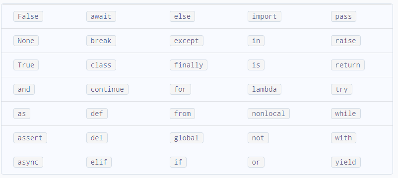

# Python References

## References
1. [Class Syllabus](https://www.javatpoint.com/python-tutorial)
1. [Python Tutorial](https://docs.python.org/3/tutorial/)

1. [MongoDB Tutorial](https://www.w3schools.com/python/python_mongodb_insert.asp)
1. [Create a new reactjs app](https://reactjs.org/docs/create-a-new-react-app.html)
1. [w3Schools](https://www.w3schools.com/)
1. [Python Slibes](https://www.w3schools.com/python/python_classes.asp)
1. [4 Attempts at Packaging Python as an Executable](https://tryexceptpass.org/article/package-python-as-executable/)
1. [Python GUI Programming With Tkinter](https://realpython.com/python-gui-tkinter/)
1. [Python and PyQt: Building a GUI Desktop Calculator](https://realpython.com/python-pyqt-gui-calculator/)
---
[Table of Contents](#Table-of-Contents)

