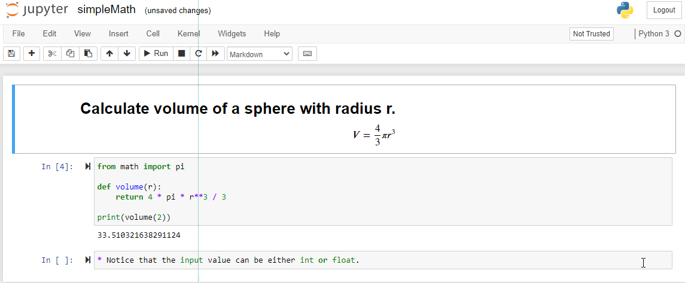
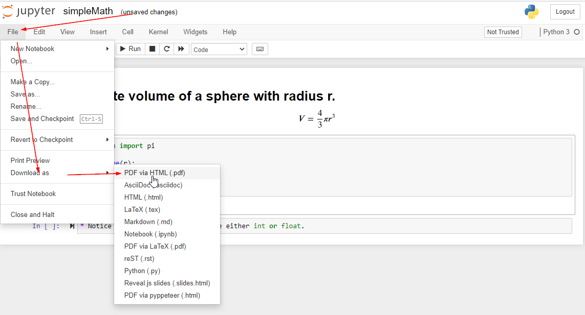
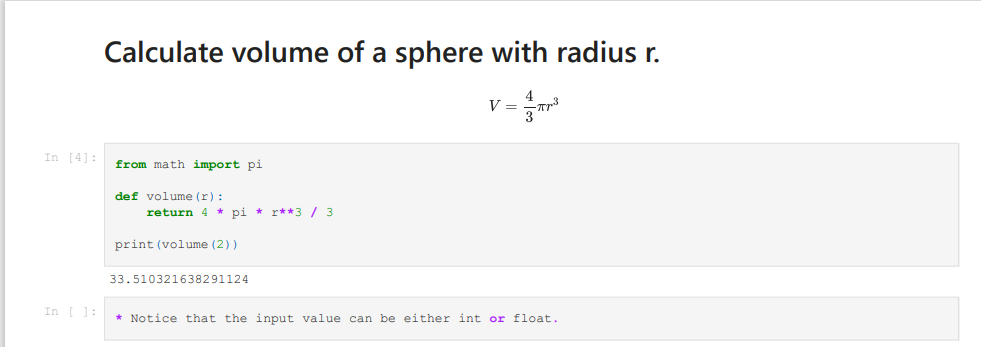

# How to use Jupyter Notebook in VS Code
* .ipynb; Jupyter Notebook file extension

* Right-click > Command Palette... > Jupyter: Create New Blank Jupyter Notebook

```
pip install -U notebook-as-pdf
pyppeteer-install
(env) C:\Users\12818\workspace\python-I>jupyter notebook

```







```
jupyter-nbconvert --to PDFviaHTML simpleMath.ipynb
```

* Use Jupyter in browser
```
(env) C:\Users\12818\workspace\python-I>jupyter notebook
```
[The server start on](http://localhost:8888/notebooks/mymath/mathHW2.ipynb#)

[Jupyter Notebook to PDF Tutorial](https://towardsdatascience.com/jupyter-notebook-to-pdf-in-a-few-lines-3c48d68a7a63)