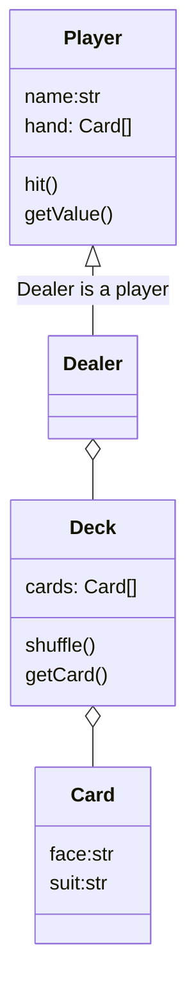
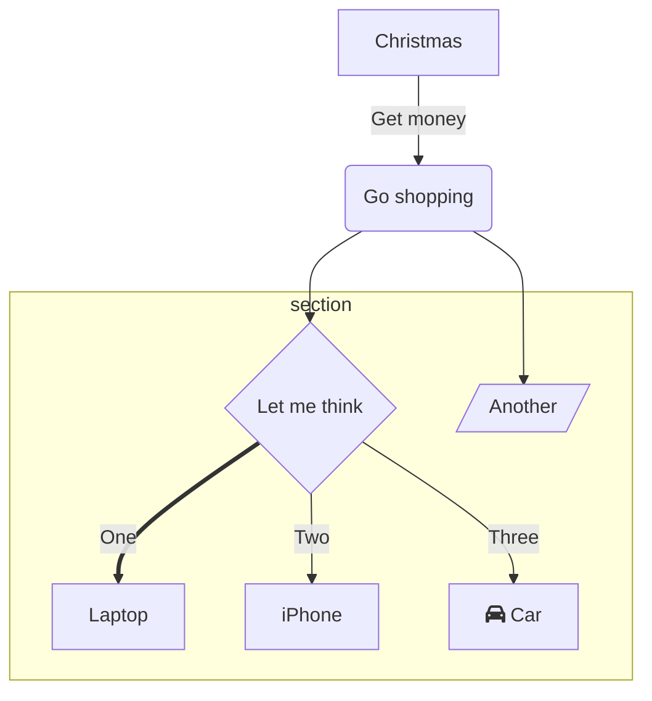
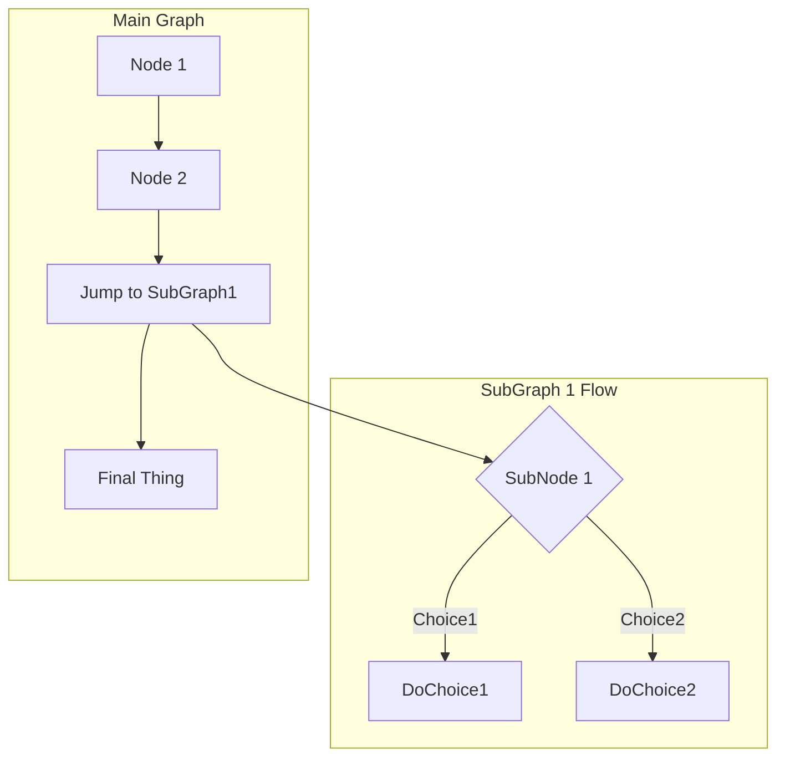
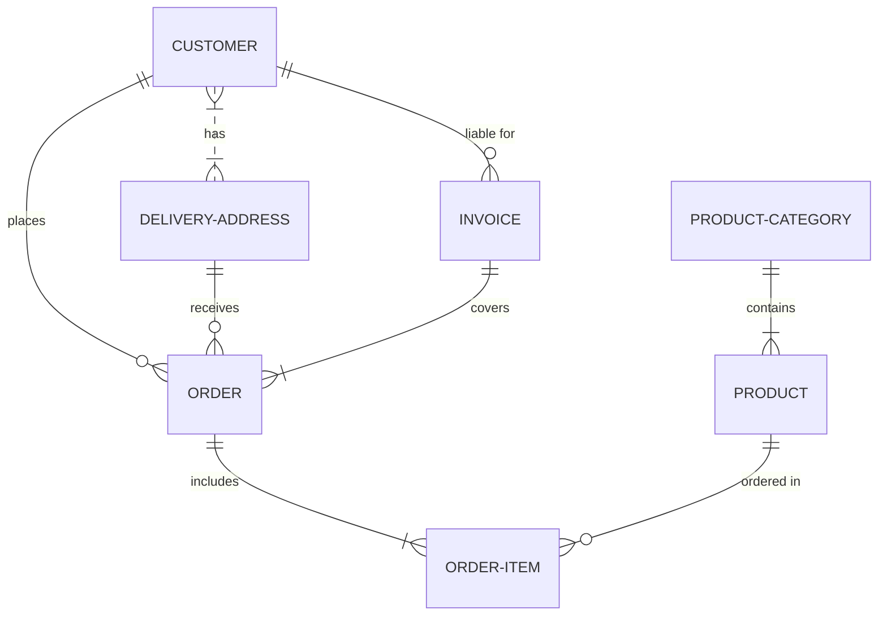
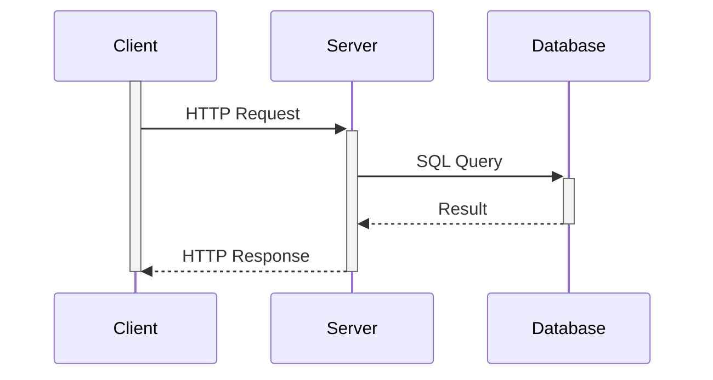
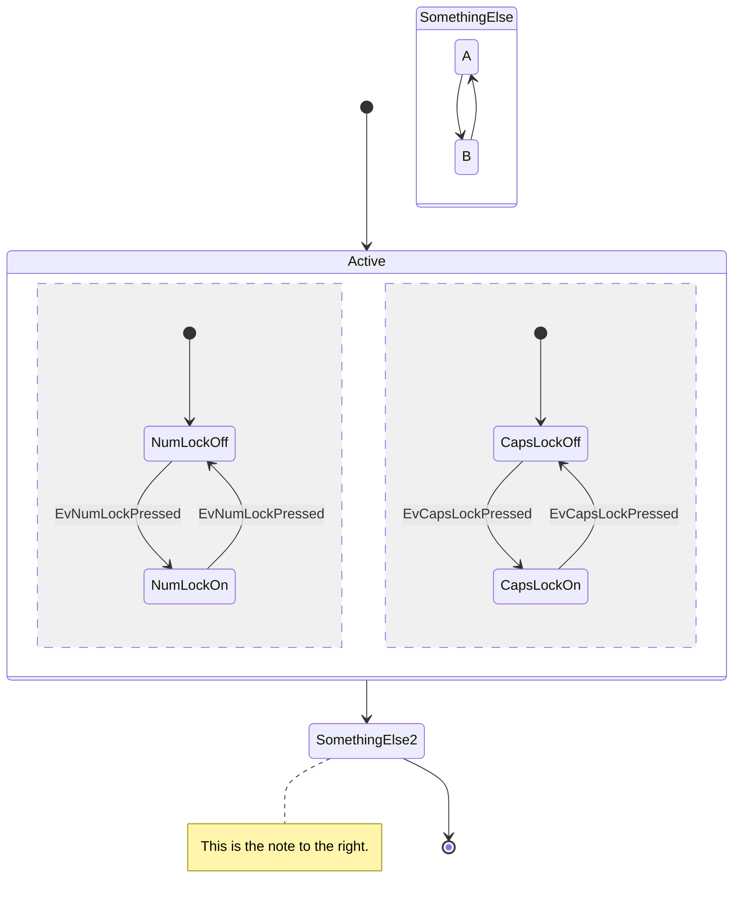
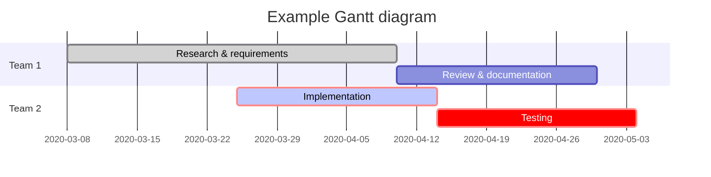
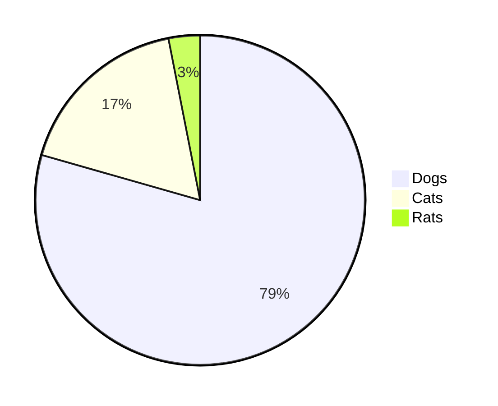

# Mermaid Diagram in Markdown Document
- [Mermaid Diagram in Markdown Document](#mermaid-diagram-in-markdown-document)
  - [Links](#links)
  - [Cardinality](#cardinality)
  - [Class Diagram](#class-diagram)
  - [Graph Diagram](#graph-diagram)
  - [Entity Relational Diagram](#entity-relational-diagram)
  - [Sequence Diagram](#sequence-diagram)
  - [State Diagram](#state-diagram)
  - [Project management diagram](#project-management-diagram)
  - [Pie chart](#pie-chart)
  - [Git Flow](#git-flow)

## Links
<|-- - Inheritance

*-- - Composition

o-- - Aggregation

--> - Association

-- - Link (Solid)

..> - Dependency

..|> - Realization

.. - Link (Dashed)

## Cardinality
0..1 - Zero or one

0..n - Zero to n (where n > 1)

0..* - Zero or more

1 - Only one

1..n - One to n (where n > 1)

1..* - One or more

* - Many

n..n - {where n>1}


## Class Diagram

## Graph Diagram
* graph (Left-Right)
    ```mermaid
    graph LR;
    A--> B & C & D;
    B--> A & E;
    C--> A & E;
    D--> A & E;
    E--> B & C & D;
    ```
* Flowchart (Top-Bottom)



## Entity Relational Diagram

## Sequence Diagram

## State Diagram


## Project management diagram
  * gantt


## Pie chart


## Git Flow
