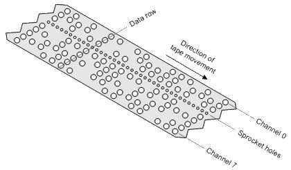
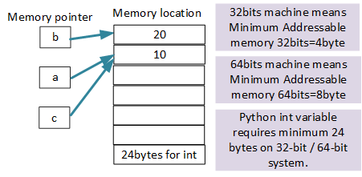

### getting formiliar your keyboard
[Keyboard](keyboard.md)

### My First python program
[hello world](../src/languageBasics/hello.py)
[line plot](../src/plot/plot0.py)
[x,y plot](../src/plot/plot01.py)

💡🔑 **Knowlodge Base**
> 1. in order to run python program, we need install python intereter.
> 2. in order to write python code, we need install VS Code.


❓ What is Python?
> Python is computer programming language.
✔️ Python is an interpreted, object-oriented, high-level programming language with dynamic semantics. Its high-level built in data structures, combined with dynamic typing and dynamic binding, make it very attractive for Rapid Application Development, as well as for use as a scripting or glue language to connect existing components together. 

❓ What is computer?
>✔️ computer is nothing but CPU and Memory.


❓ What is software programing language?
>✔️ A programming language is any set of rules that converts strings, or graphical program elements in the case of visual programming languages, to various kinds of machine code output.
any language can be changed to machine code and then run by computer.


* [ASCII Table](https://ascii-tables.com/)
❓ What is ASCII?
>✔️ASCII stands for American Standard Code for Information Interchange, a set of digital codes representing letters, numerals, and other symbols.


❓ Why we need so many different programing language?
> 1. each language could serve different purpose.
> 2. some old language still available due to some company still use it. (RPG, FORTRAN)

---
[Table of Contents](#table-of-contents)


### print
[print](../src/languageBasics/print.py)
* place holder (%s, %d, %f)
* print with tuple
* formated print: print(f"x={x}") 

❓ What is ASCII code?
>✔️ASCII Table: American Standard Code for Information Interchange




[ASCII website](https://ascii-tables.com/)

* Homeworks
    - [Math Competition](../homeworks/12023%20Harmoney%20School%20Houston.pdf)
    - [print-01](homeworks/print01.md)
    - [print-02](homeworks/print02.md)

### comment 
[comment](../src/languageBasics/../comment.py)
* single line comment: #
* multiple lines comment: """, '''
❓Why I need use comment?
✔️

### Variabls
❓ What is variable?
✔️ Contain two parts: 1. variable name; 2. variable value. It is called variable declaration when we assign a value to a variable name.

```py
width = 10
name = "John"
```

❓ Why we use variables?
✔️ I want use same value on many place, so that I can only change one place for all usage of the variable.


* Variable Naming Rules
1. variable name cannot start with number
2. variable can be combination of letters and numbers _, a~z, A~Z, 0~9, no other special characters
3. don't use reserved keywords as variable name


[Python Keywords](https://realpython.com/python-keywords/#:~:text=%20Python%20Keywords%20and%20Their%20Usage%20%201,are%20used%20for%20control%20flow%3A%20if%2C...%20More%20)

4. Avoid using existing function name as your variable name.
otherwise, your python builtins functions no longer works the way you expected.

```
>>> dir(__builtins__)
['ArithmeticError', 'AssertionError', 'AttributeError', 'BaseException', 'BlockingIOError', 'BrokenPipeError', 'BufferError', 'BytesWarning', 'ChildProcessError', 'ConnectionAbortedError', 'ConnectionError', 'ConnectionRefusedError', 'ConnectionResetError', 'DeprecationWarning', 'EOFError', 'Ellipsis', 'EnvironmentError', 'Exception', 'False', 'FileExistsError', 'FileNotFoundError', 'FloatingPointError', 'FutureWarning', 'GeneratorExit', 'IOError', 'ImportError', 'ImportWarning', 'IndentationError', 'IndexError', 'InterruptedError', 'IsADirectoryError', 'KeyError', 'KeyboardInterrupt', 'LookupError', 'MemoryError', 'ModuleNotFoundError', 'NameError', 'None', 'NotADirectoryError', 'NotImplemented', 'NotImplementedError', 'OSError', 'OverflowError', 'PendingDeprecationWarning', 'PermissionError', 'ProcessLookupError', 'RecursionError', 'ReferenceError', 'ResourceWarning', 'RuntimeError', 'RuntimeWarning', 'StopAsyncIteration', 'StopIteration', 'SyntaxError', 'SyntaxWarning', 'SystemError', 'SystemExit', 'TabError', 'TimeoutError', 'True', 'TypeError', 'UnboundLocalError', 'UnicodeDecodeError', 'UnicodeEncodeError', 'UnicodeError', 'UnicodeTranslateError', 'UnicodeWarning', 'UserWarning', 'ValueError', 'Warning', 'WindowsError', 'ZeroDivisionError', '__build_class__', '__debug__', '__doc__', '__import__', '__loader__', '__name__', '__package__', '__spec__', 'abs', 'all', 'any', 'ascii', 'bin', 'bool', 'breakpoint', 'bytearray', 'bytes', 'callable', 'chr', 'classmethod', 'compile', 'complex', 'copyright', 'credits', 'delattr', 'dict', 'dir', 'divmod', 'enumerate', 'eval', 'exec', 'exit', 'filter', 'float', 'format', 'frozenset', 'getattr', 'globals', 'hasattr', 'hash', 
'help', 'hex', 'id', 'input', 'int', 'isinstance', 'issubclass', 'iter', 'len', 'license', 'list', 'locals', 'map', 'max', 'memoryview', 'min', 'next', 'object', 'oct', 'open', 'ord', 'pow', 'print', 'property', 'quit', 'range', 'repr', 'reversed', 'round', 'set', 'setattr', 'slice', 'sorted', 'staticmethod', 'str', 'sum', 'super', 'tuple', 'type', 'vars', 'zip']
```
### Python Playground
❓ How do I get into python playground?
✔️ type in **python** in command prompt shown below:

```DOS
C:\Users\12818\workspace\2021fall\python>python
Python 3.9.1 (tags/v3.9.1:1e5d33e, Dec  7 2020, 17:08:21) [MSC v.1927 64 bit (AMD64)] on win32
Type "help", "copyright", "credits" or "license" for more information.
>>>
```
dunder: double underscore (hold shift + -)
```
>>> dir(__builtins__)
```
1. can execute any python code, it is good for your code testing.
2. execute multiple line of code.
3. to find document for all imported modules, and builtin functions.


> you can define more than one variable to point to same memory location.

### Variable and memory





* Homeworks
[variable-01](../homeworks/basics/print/variable01.md)
[variable-02](../homeworks/basics/print/variable02.md)
[variable-03](../homeworks/basics/print/variable03.md)

### Ways to Learn
1. learn from teacher;
2. learn from coding, practice;
3. learn from python document (help on playground)
4. learn from mistakes (your own, others)
5. document (take good note for everything we learn)