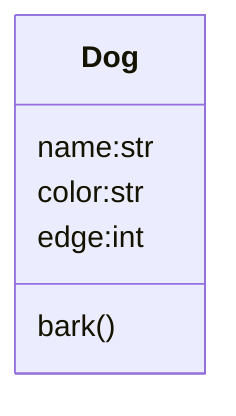
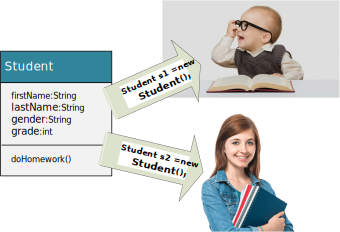

❓ What is data type in Python?
✔️ 1. built ins; 2. developer defined;
* built in data type:


### number 
[Numbers: int, float, complex](../src/languageBasics/number.py)
❓ What is number in python?
✔️ Python supports integers, floating-point numbers and complex numbers. They are defined as int, float, and complex classes in Python.

📌❗️ **Knowlodge Base**
> python is smart enough so that you don't need difine a variable type, based on the type of value you assigned to the variable, the variable will be that data type.

    - int: a=4
    - float: a=3.4
    - complex: c=4-3j
  - Homeworks
    [number-01](../homeworks/basics/datatype/number01.md)

### string 
* [String](../src/languageBasics/string.py)

❓ What is a str?
✔️ str variable is group of letters surounded by ' ', " ", ''' ''', """ """.   
    - s = 'hello'
    - single ' double " are no difference, but must to be pair.
    - ""; """ [put your text here] """; ''; ''' [your text here] '''
    - string is iterable
    - String is immutable
    - string slicing: [[start]:[end]:[step]]
    - String operator +, *
    - as function str(object)
    - string functions (isalnum(), isdigit(), strip(), split(), lower(), upper(), startswith(), endswith(), ...)
    - use built-in functions: len(), sorted(), reversed()
  
  - Homeworks
    [string-01](../homeworks/string/string01.md)
    [string-02](../homeworks/string/string02.md)
    [string-03](../homeworks/string/string03.md)

### tuple 
[Tuple](../src/languageBasics/tuple.py)
❓ What is a tuple?
✔️ tuple is a set of object element, separate by comma, suround by (). it is immutable once you defind.
  - (1.5,2,3,4,'hello')
  - elements can have different data type in tuple
  - we can use len() built in function to get total number of elements in the tuple
  - tuple is iterable
  - tuple is immutable
  - tuple slicing: tuple1[[start]:[end]:[step]]
  - tupler operator +, *
  - as function: tuple(iterable)
  - tuple() as functions () can be used as function to convert iterable object to tuple.

### list 
[List](../src/languageBasics/list.py)
❓ What is a list in python?
✔️ a **list** is a special data type in python. A List is an ordered collection of python objects that is iteralbe,mutable, separated by comma, surrounded by [].
  - [2, 3, 'hello']
  - elements can have different data type in tuple
  - we can use len() built in function to get total number of elements in the list
    - list is iterable
    - list is mutable
    - list slicing: list1[[start]:[end]:[step]]
    - list operators +, *
    - modify list
    - as function: list(iterable)
    - list functions (append, insert)
  - Homeworks
    [list-01](../homeworks/basics/datatype/list01.md)
    [list-02](../homeworks/basics/datatype/list02.md)

### set 
[Set](../src/languageBasics/set.py)
❓ What is set in Python?
✔️ A Set is an unordered collection pyhton objects that is iterable,
mutable, and separated by comma, surrounded by {}, has no duplicated elements.

  - {1,2,3}, set(), set(range(5)), set("hello")
  - elements can have different data type in set
    - set is iterable
    - set is mutable
    - set operators: &, |, <, >, ==
    - modify set
    - as function: set(iterable)
    - set functions ()


### dict 
[Dictionary](../src/languageBasics/dictionary.py)
❓ what is a dictionary data type in Python?
✔️ A dictionary consists of a collection of key-value pairs.
It is unordered, iterable, mutable, and each pair separated by comma,
surrounded by '{}', and no duplicated key. the key-value pair separated by ':'.

  - {1:'Monday', 2:'Tuesday'}
  - key-value pair can have different data type in dict
  - dict is iterable: only iterate key
  - dict cannot be slicing due to unordered key-value pair
  - dict operators: **, ==
  - dict is mutable: add, update, delete key-value pair
  - functions in dict: get(), items(), values(), pop(), ..
  - dict() can be used as function to convert iterable object to dict (need to be key-value pair).
  - dict modify==>CRUD

### bool
**True** or **False** are python reserved keyword for bool value.

### Developer desiged data type



```py
class Student:
  pass

s = Student()
print(type(s))
```



* [Simple user defined data type](../src/basics/dog.py)
* [class Hello](../src/languageBasics/datatype/myclass.py)

### Python modules date/time 
[date/time](../src/languageBasics/datatype/datetime1.py)
[Get time interval](../src/languageBasics/datatype/datetime2.py)
[Date time convertion](../src/languageBasics/datatype/datetime3.py)
[Date time detail](../src/languageBasics/datatype/datetime4.py)

📌❗️ **Knowlodge Base**
> the variable value can be reassigned to other data type. Once it is reassigned, the data type changes.
```py
i = 5
i = 'hello'
i = [1,2,3,4]
```

