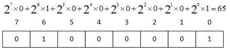

* [operator](../src/languageBasics/operator.py)
* Arithmatic Operator: +; -; *; /: %; **;//(floor divisor)
  
  [arithmatic](../src/languageBasics/operator/arithmatic.py)
* Assignment Operators: =; +=; -=; *=; /=; %=; **=; //=
  
  [assignment](../src/languageBasics/operator/assignment.py)
* Comparison Operators: ==, !=, <, >, <=, >=
  
  [comparison](../src/languageBasics/operator/comparison.py)

  

* Identity Operator: is, is not

  [identity](../src/languageBasics/operator/identity.py)


* Logical Operator: and, or, not

  [logical](../src/languageBasics/operator/logical.py)
* Membership Operator: in, not in

  [membership](../src/languageBasics/operator/membership.py)
* Multiple times operator: **
  
  [others](../src/languageBasics/operator/others.py)
* Ternary operator: if-else, and-or

  [ternary](../src/languageBasics/operator/ternary.py)
* Bitwise Operator: &, |, ^, <<, >>
  
  [bitwise](../src/languageBasics/operator/bitwise.py)



> ASCII Table: American Standard Code for Information Interchange


[byte for character](../src/languageBasics/ascii.py)


* [Understand Image Pixel RGBA mode](../src/languageBasics/operator/changeImage.py)
* 
* 
* [gunshot sound](whiff.wav)

  
* operator precendence: *, /; +, -; 
  multiply has higher precendence than +, -, use () to change precendence
  
* . operator
> in OOP, . operator is used to refer to an attribute of class instance.

```py
greeting = "Hello"
print(greeting.upper())
```
