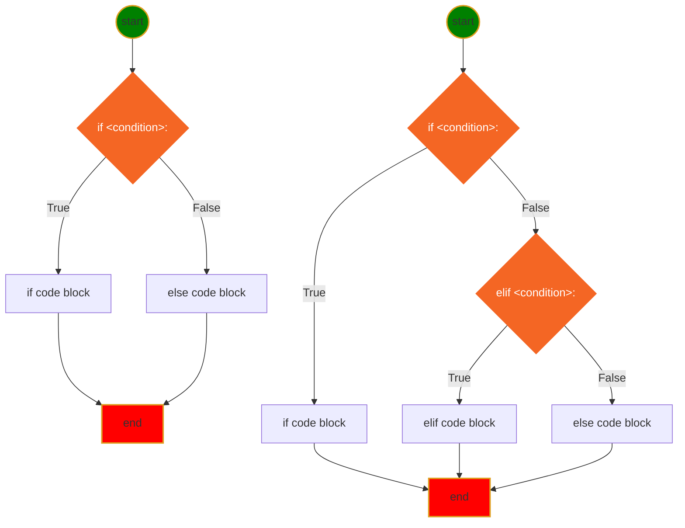

* **if-elif-else** statement Syntax
```py
# code before
if <condition>:
    # if code block here
elif <condition>:
    # elif code block here
else:
    #else code block here
# code continue ...
```


* Mermaid Diagram for if-else statement
  

* [User input](../src/languageBasics/if-else/if-else03.py)
  - Homeworks
    [ifelss-01](../homeworks/basics/flowcontrol/ifelse01.md)
    [ifelss-02](../homeworks/basics/flowcontrol/ifelse02.md)
    [ifelss-03](../homeworks/basics/flowcontrol/ifelse03.md)

