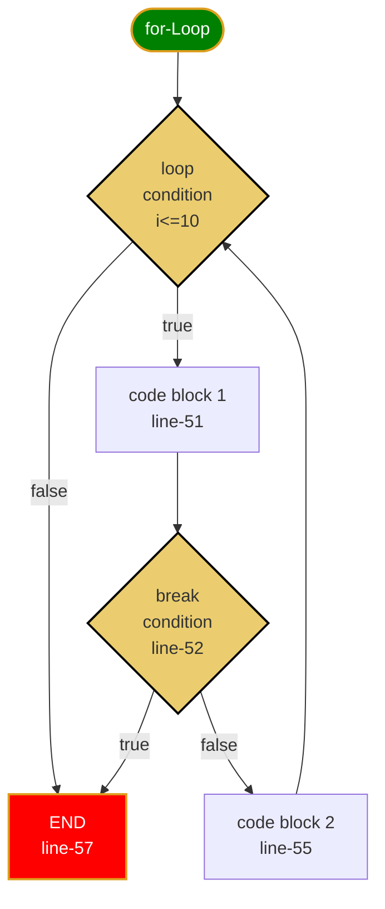
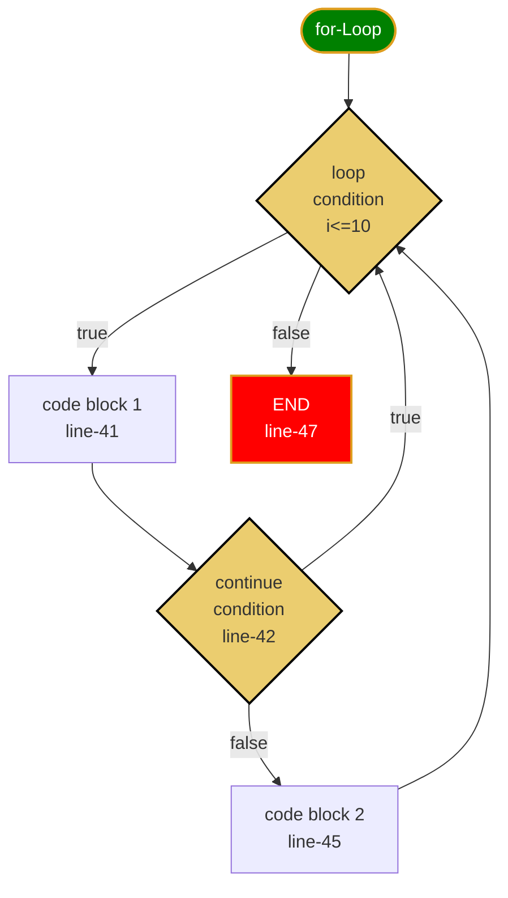

* [for1.py](../src/languageBasics/loop/for1.py)
* [for2.py](../src/languageBasics/loop/for2.py)
* [forBreak.py](../src/languageBasics/loop/forBreak.py)
* [forContinue.py](../src/languageBasics/loop/forContinue.py)

* Break on for-loop
  

* continue on for-loop
  

* [while.py](../src/languageBasics/loop/while.py)
  
  
  
* Homeworks
  - [loop-01](../homeworks/basics/loop/loop01.md)
  - [loop-02](../homeworks/basics/loop/loop02.md)
  - [loop-03](../homeworks/basics/loop/loop03.md)
  - [loop-04](../homeworks/basics/loop/loop04.md)
  - [loop-05](../homeworks/basics/loop/loop05.md)

📌❗️ **Knowlodge Base**
> Always adjust the condition variable toward making loop failed.

