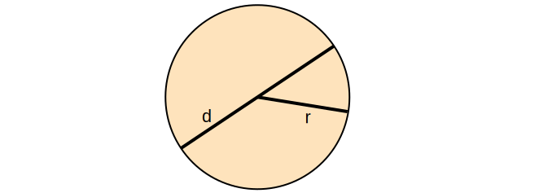

❓What is function?
>✔️A block of code defined by name and arguments, can be used by calling the name many times repeatedly. In Python, functions are first-class citizens. That means functions have the same characteristics as values like other data type such as strings and numbers. Anything you would expect to be able to do with a string or number you can do with a function as well.
* [function basic](../src/function/function.py)
* define a function
    - def, Python reserved keyword
    - function name, anything you want, but need follow the naming rules
    - (), must have open/close parenthesis pair, no matter it has arguments or not
    - arguments, positional or keyword arguments separated by comma ,
    - :, must end with colon
    - the function body must indent
    - ❗️⚡️function can be overridden
    - 😄return more than one value
    - 💡single response
    - call a function by function name and (), and arguments if there is any

$$ \underbrace {def}_{keyword} \underbrace {circle \_area}_{function \space name} \left(\underbrace {a, b,c ...}_{positional\; args} * \underbrace {e=None, f=200}_{keyword\;args}\right) \underbrace {:}_{eol} $$



Circle area formula: $ A=\pi r^2 $

* [circleArea](../src/function/function.py)
* [function arguments](../src/function/defineFunction.py)
* [function parameters](../src/function/declareArguments.py)
* [understand __name__](../src/function/circle.py)
* [understand if __name__=='__main__':](../src/function/useCircle.py)

Python document
```use python playground
>>> from src.function.defineFunction import *
>>> help(f)
```
* [One time assign default value](../src/function/defaultValue.py)
* [collision.py](../src/function/collision.py)
* [check user input](../src/function/ask.py)
* [access function attribute](../src/function/attribute.py)
* [simple math function](../src/function/math1.py)
* [optionalKeywordArgs.py](../src/function/optionalKeywordArgs.py)
* [optionalPositionalArgs.py](../src/function/optionalPositionalArgs.py)

### define function in function
* [innerFunction01.py](../src/function/innerFunction01.py)
* [innerFunction02.py](../src/function/innerFunction02.py)
* [define function in another function](../src/function/functionInFunction.py)
* [function In Function](../src/function/funcInFunc.py)

### return function from function
* [dynamicall generated quadratic function](../src/function/returnFunction.py)

### pass function as argument
* [passFuncAsArg.py](../src/function/passFuncAsArg.py)
* 👍[function as dictionary value](../src/function/dictFunction.py)


### function decorator
* [my_timer.py](../src/function/my_timer.py)
* [make simple job complecated](../src/function/myTimer1.py)
* [add timer](../src/function/myTimer2.py)
* [add decorator](../src/function/myTimer3.py)
* [add user check on function](../src/function/security.py)

### global variable
❓ What is global variable?
>✔️global keyword allows you to modify the variable outside of the current scope. It is used to create a global variable and make changes to the variable in a local context.

[use global variable](../src/function/globalVariable.py)
1. When we create a variable inside a function, it is local by default.
2. When we define a variable outside of a function, it is global by default. You don't have to use global keyword.
3. We use global keyword to read and write a global variable inside a function.
4. Use of global keyword outside a function has no effect.
5. It is not necessary to declare global variable outside function

### yield keyword
* [yield is simillar to return](../src/function/yield1.py)
* [yield returns value once needed](../src/function/yield2.py)
* [yield is simillar to return](../src/function/yield3.py)
* [async yield，不见不散-死等](../src/function/yield4.py)
* 
### recursive function
A function is recursive if it calls itself.
  1. termination condition.
  2. adjust status for each call.
  3. Python stops the cunction calls after a depth of 1000 calls.
* [factoria.py](../src/function/factorial.py)
$$ f(n) = n! = n (n-1) (n-2)\cdots1$$

* [recursiveBinarySearch.py](../src/algorithms/recursiveBinarySearch.py)

* Understand recursive find.
  ```mermaid
  graph TB
  START((find answer))
  END[end]
  B[add 10 to<br>the answer of<br>problem 52]
  C[Problem 52:<br>Add 12 to<br>the answer of<br>problem 85]
  D[Problem 85:<br>10]
  
  START-->B-->C-->D
  D--10+12-->C--22+10-->B--32-->END

  classDef html fill:#F46624,stroke:#F46624,stroke-width:4px,color:white;
  classDef js fill:yellow,stroke:#DE9E1F,stroke-width:2px;
  classDef start fill:green,stroke:#DE9E1F,stroke-width:2px;
  classDef end1 fill:red,stroke:#DE9E1F,stroke-width:2px;
  class START start
  class B,C,D html
  class END end1
  ```

### useful functions


$$ d = 2 \cdot r $$
$$ c = d \cdot \pi = 2 \cdot r \cdot \pi$$
$$ a = \pi r^2 $$
where r, d, c, a are radius, diameter, circumference and area respectively.

* [Circle](../src/function/circle.py)


* [Sphere volume and surface area](../src/function/sphere.py)


$$ a = \frac 1 2 b \cdot h $$
where a, b, h are area, base and height respectively.

* [triangle area](../src/function/triangle.py)
* 
* [check an number for Prime](../src/prime/prime1.py)
* [better implementation](../src/prime/prime2.py)
* [def isPrime() return True or False](../src/prime/prime3.py)
* [](../src/prime/prime4.py)
* [def rangePrime()](../src/prime/prime6.py)
* [use my_timer() check which function run faster](../src/prime/prime7.py)
> the greatest common divisor (GCD) of two or more integers, which are not all zero, is the largest positive integer that divides each of the integers.

$$n!=n (n-1) (n-2) ... 1$$
$$ 4!=4 \cdot 3 \cdot 2 \cdot 1 = 24$$
$$ 6!=6 \cdot 5 \cdot 4 \cdot 3 \cdot 2 \cdot 1 = 720$$

* [factorial](../src/function/factorial.py)
* [Greatest common divisor](../src/gcd.py)
* [recursive GCD](../src/recursiveGCD.py)
>the least common multiple, lowest common multiple, or smallest common multiple of two integers a and b,  is the smallest positive integer that is divisible by both a and b.
* [LCM least common multiple](../src/lcm.py)

$$ lcm(a,b) = \frac {|ab|} {gcd(a,b)}$$

* [use above formula](../src/lcm1.py)

### assert error check
* [❓what's wrongh?](../src/function/circle1.py)
* [✔️Assert check before calculation](../src/function/assert.py)

```syntax
assert <condition>,<error message>
```


### Raise Except


* [✋Raise TypeError](../src/function/raiseError.py)
* [assert](../src/function/assertCheck.py)
* [](../src/function/circle1.py)
* [](../src/function/circle3.py)

The difference between raise and assert:
1. assert: I swear this must be true, in case it happens, let me know. ❌❗️You have big problem! Debug aid for developer find root cause, not for handling run-time error. only give you one kind of error which is AssertionError.
>💡[I swear int('1')==1](../src/function/asInt.py)

2. raise: Try to catch run-time error. Developer sometimes use raise for execution control.

>👌💡[define isFloat(str) function](../src/function/checkFloat.py)

* [👌👎catch Assertion Error](../src/function/tryexcept1.py)
* [👌👎catch Different Error](../src/function/tryexcept2.py)

✔️Better solution is solve the issue at compiling time.

### catch Except avoid termination
* [catch assert](../src/function/tryexcept1.py)
* [catch raise](../src/function/tryexcept2.py)
* [](../src/function/tryexcept3.py)

### Create my own Error Type

> 1. look for the error type you may need;
```dos
>>> dir (__builtins__)
['ArithmeticError', 'AssertionError', 'AttributeError', 'BaseException', 'BlockingIOError', 'BrokenPipeError', 'BufferError', 'BytesWarning', 
'ChildProcessError', 'ConnectionAbortedError', 'ConnectionError', 'ConnectionRefusedError', 'ConnectionResetError', 'DeprecationWarning', 'EOFError', 'Ellipsis', 'EncodingWarning', 'EnvironmentError', 'Exception', 'False', 'FileExistsError', 'FileNotFoundError', 'FloatingPointError', 'FutureWarning', 'GeneratorExit', 'IOError', 'ImportError', 'ImportWarning', 'IndentationError', 'IndexError', 'InterruptedError', 'IsADirectoryError', 'KeyError', 'KeyboardInterrupt', 'LookupError', 'MemoryError', 'ModuleNotFoundError', 'NameError', 'None', 'NotADirectoryError', 'NotImplemented', 'NotImplementedError', 'OSError', 'OverflowError', 'PendingDeprecationWarning', 'PermissionError', 'ProcessLookupError', 'RecursionError', 'ReferenceError', 'ResourceWarning', 'RuntimeError', 'RuntimeWarning', 'StopAsyncIteration', 'StopIteration', 'SyntaxError', 'SyntaxWarning', 'SystemError', 'SystemExit', 'TabError', 'TimeoutError', 'True', 'TypeError', 'UnboundLocalError', 'UnicodeDecodeError', 'UnicodeEncodeError', 'UnicodeError', 'UnicodeTranslateError', 'UnicodeWarning', 'UserWarning', 'ValueError', 'Warning', 'WindowsError', 'ZeroDivisionError',
```
> 2. create your own error type
* [create application specific Error](../src/function/myerrortype.py) 

### pass by reference
* [Understand pass by reference](../src/function/passByReference.py)
* [Understand pass by value](../src/function/passByValue.py)


### function annotation
👍Avoid unexpected function call with wrong data type arguments.

👍Find out calling error before runtime.

* [❓what's wrong?](../src/function/circle1.py)

```DOS
mypy <filename.py>
```


* [annotation1.py](../src/function/annotation1.py)
* [annotation2.py](../src/function/annotation2.py)
* [annotation3.py](../src/function/annotation3.py)


