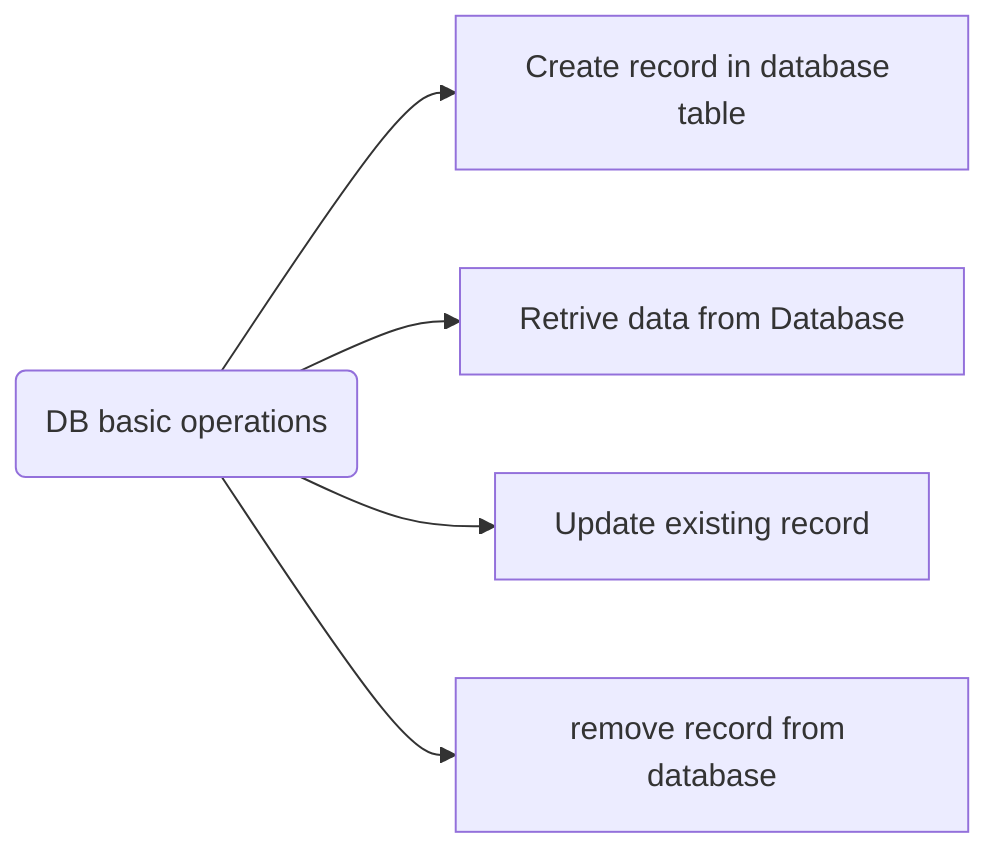
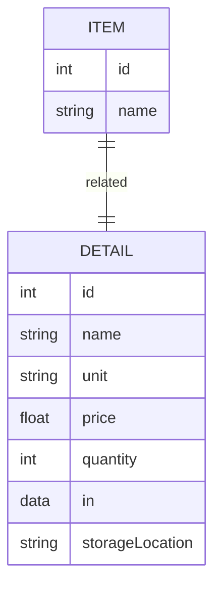
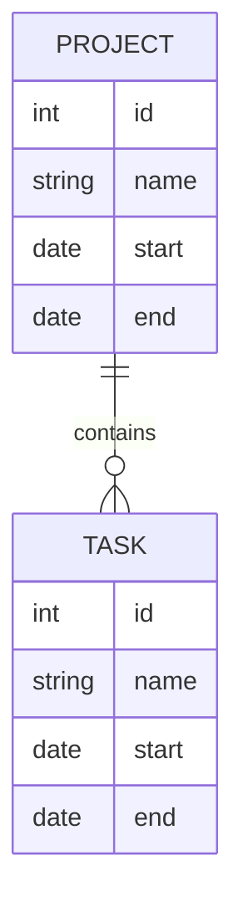
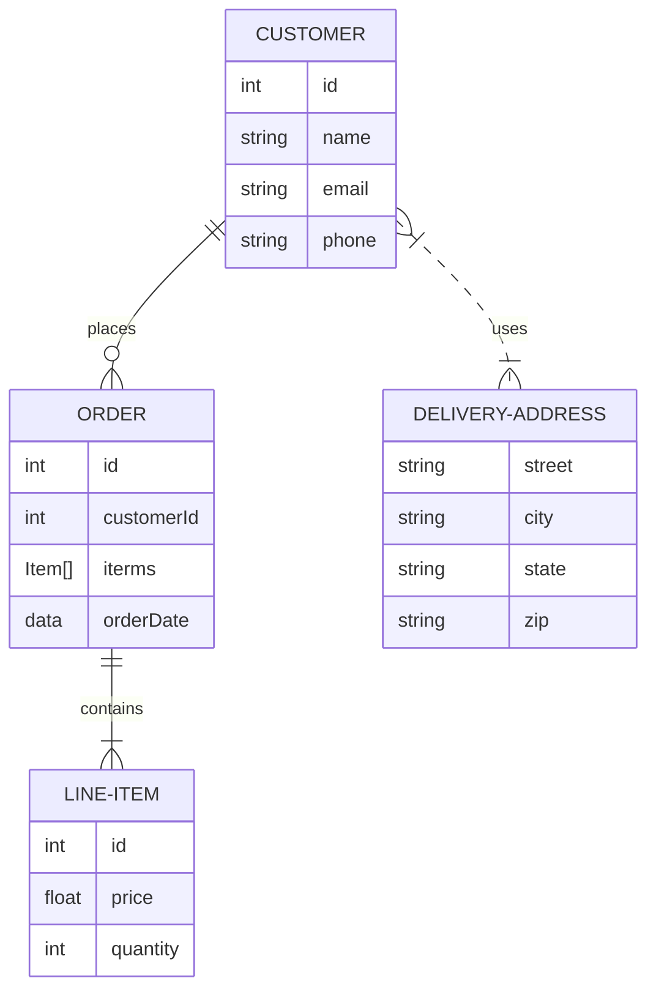
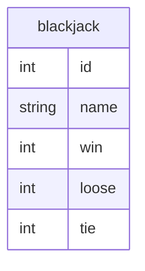
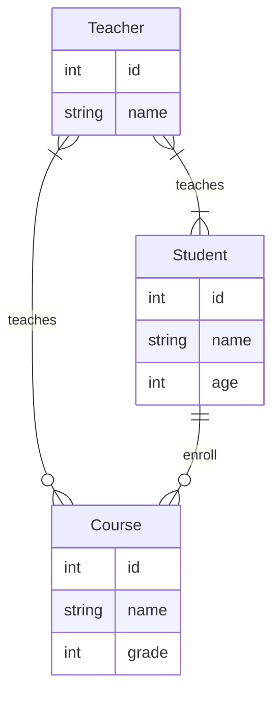

* [SQL Statement Documentation](https://www.w3schools.com/sql/sql_select.asp)

[](https://www.youtube.com/watch?v=byHcYRpMgI4)

CRUD: Create, Retrieve, Update, Delete
all database need to provide 4 basic operations


### create a table
```sql
CREATE TABLE table_name (
    column1 datatype,
    column2 datatype,
    column3 datatype,
   ....
);
```

### Insert data into table

```sql
INSERT INTO table_name (column1, column2, column3, ...)
VALUES (value1, value2, value3, ...);
```

* [Create database, table](../src/sqlite/sqlite01.py)

### Retrieve data from table

```sql
SELECT column1, column2, ...
FROM table_name
WHERE condition;
```
* [Insert many rows](../src/sqlite/sqlite02.py)
* [Retrive data](../src/sqlite/sqlite03.py)

### Update existing data

```sql
UPDATE table_name
SET column1 = value1, column2 = value2, ...
WHERE condition;
```
* [Update data](../src/sqlite/sqlite04.py)

### Delete data from table

```sql
DELETE FROM table_name WHERE condition;
```
* [Delete data](../src/sqlite/sqlite05.py)


### Relationship between tables
* [one-to-one relation](../src/sqlite/sqlite13.py)


* [One-to-Many Create table](../src/sqlite/sqlite06.py)





* [Create one-to-many data, insert project/tasks](../src/sqlite/sqlite07.py)
* [Retrieve one-to-many data, select project/tasks](../src/sqlite/sqlite08.py)
* [build class/objects for project and tasks]((../src/sqlite/sqlite08a.py))
* [Create books table](../src/sqlite/sqlite9.py)
* [insert sample books](../src/sqlite/sqlite10.py)
* [many-to-many relationship, DB helper](../src/sqlite/sqlite11.py)
* [Product, Provider class](../src/sqlite/sqlite12.py)
* [CRUD for books](../src/sqlite/sqlitebookdb.py)

Homework
1. create a database named game, and a table named blackjack to record blackjack game result
  

2. add DB operation on blackjack game
3. do analysis on data to see who will be the winner, players? or dealer?


* [CRUD for blackjack game](../src/sqlite/blackjackdb.py)
* [Save the game result to SQLite database](../src/blackjack/blackjackSave2DB.py)

4. [many-to-many, teacher-to-student](../src/sqlite/school.py)

