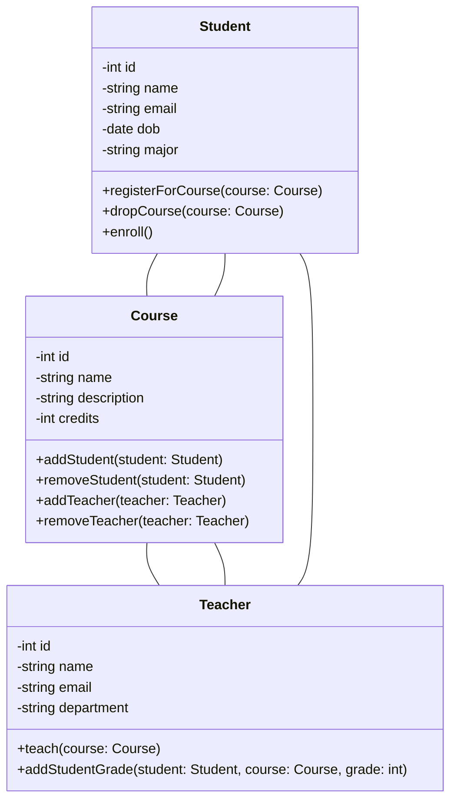

Prompt: could you build a student, teacher and course class diagram use mermaid, and include there relationship?

ChatGPT:



In this diagram, there are three classes: Student, Teacher, and Course. The Student class has properties for id, name, email, dob (date of birth), and major, and also includes methods for registering and dropping courses and enrolling in a course. The Teacher class has properties for id, name, email, and department, and includes methods for teaching a course and adding a student's grade for a course. The Course class has properties for id, name, description, and credits, and includes methods for adding/removing students and teachers for the course.

The relationships between the classes are represented using arrows between the classes. A student can be enrolled in multiple courses and a course can have multiple students, so there is a many-to-many relationship between Student and Course. A teacher can teach multiple courses and a course can have multiple teachers, so there is also a many-to-many relationship between Teacher and Course. Additionally, a teacher can assign grades to a student, so there is a relationship between Teacher and Student. Finally, there is a one-to-many relationship between Course and both Teacher and Student, as a course can have multiple teachers and students but each teacher and student can be associated with multiple courses.

prompt: could you create python program for this system?

```py
class Student:
    def __init__(self, id, name, email, dob, major):
        self.id = id
        self.name = name
        self.email = email
        self.dob = dob
        self.major = major
        self.courses = []

    def register_for_course(self, course):
        self.courses.append(course)
        course.add_student(self)

    def drop_course(self, course):
        self.courses.remove(course)
        course.remove_student(self)

    def enroll(self):
        # logic to enroll the student in the university

class Teacher:
    def __init__(self, id, name, email, department):
        self.id = id
        self.name = name
        self.email = email
        self.department = department
        self.courses = []

    def teach(self, course):
        self.courses.append(course)
        course.add_teacher(self)

    def add_student_grade(self, student, course, grade):
        # logic to add the student's grade for the course

class Course:
    def __init__(self, id, name, description, credits):
        self.id = id
        self.name = name
        self.description = description
        self.credits = credits
        self.students = []
        self.teachers = []

    def add_student(self, student):
        self.students.append(student)

    def remove_student(self, student):
        self.students.remove(student)

    def add_teacher(self, teacher):
        self.teachers.append(teacher)

    def remove_teacher(self, teacher):
        self.teachers.remove(teacher)

# Example usage:
math_course = Course(1, "Mathematics", "An introductory course on calculus", 3)
physics_course = Course(2, "Physics", "A course on classical mechanics", 4)

john_student = Student(1, "John Smith", "john@example.com", "1995-01-01", "Computer Science")
jane_student = Student(2, "Jane Doe", "jane@example.com", "1996-02-02", "Mechanical Engineering")

professor = Teacher(1, "Professor Smith", "prof@example.com", "Mathematics")

professor.teach(math_course)
professor.teach(physics_course)

john_student.register_for_course(math_course)
jane_student.register_for_course(physics_course)

john_student.drop_course(math_course)

# Add more methods and logic as needed for your specific educational system.

```