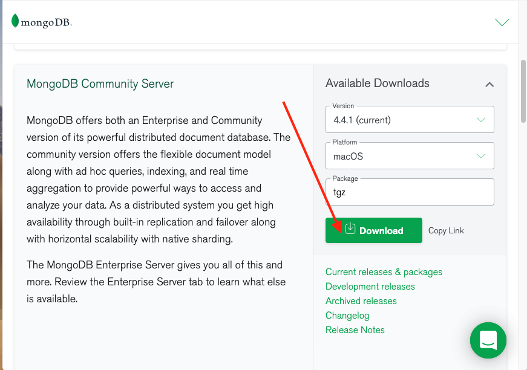
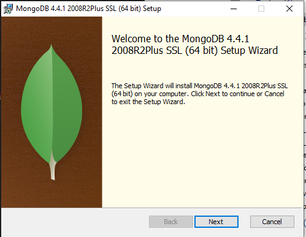
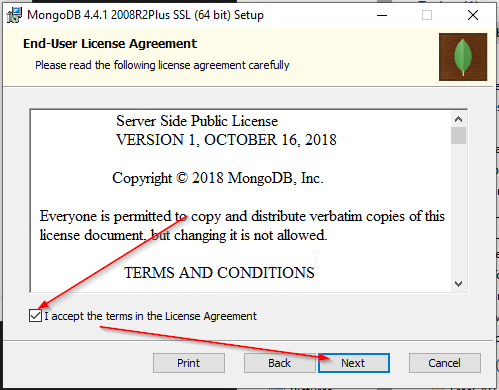
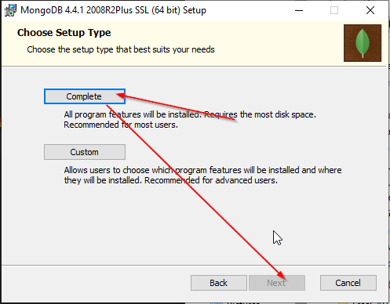
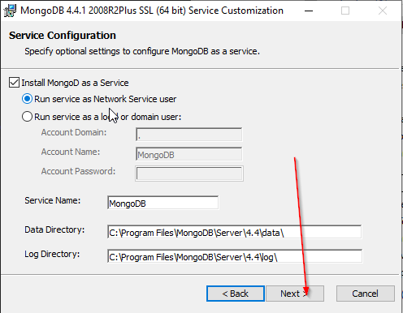
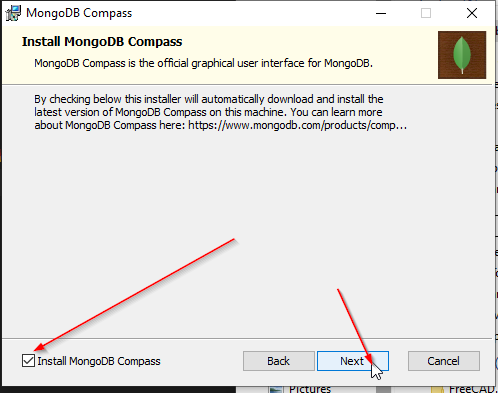
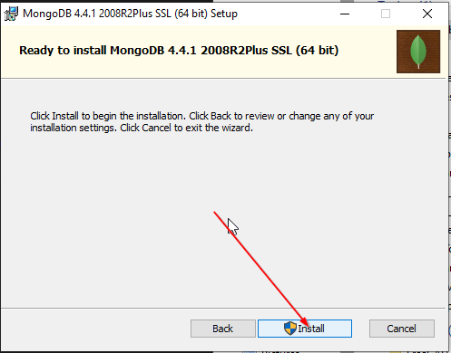
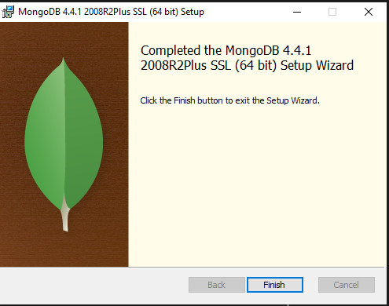
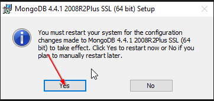

# MongoDB Installation Process

## Download MongoDB Installation File
* Windows 10 OS
[download website](https://www.mongodb.com/try/download/community?tck=docs_server)

Download File Name: mongodb-windows-x86_64-4.4.1-signed.msi

* Mac OS
[download website](https://www.mongodb.com/try/download/community)

Download File Name: mongodb-macos-x86_64-4.4.1.tgz

## Install MongoDB on Windows 10
* Run the download file above in Downloads folder

