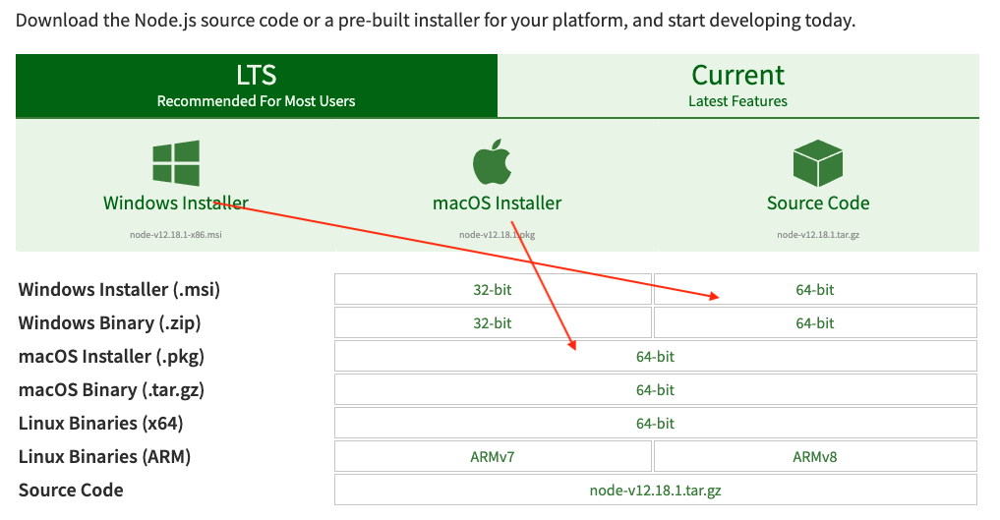
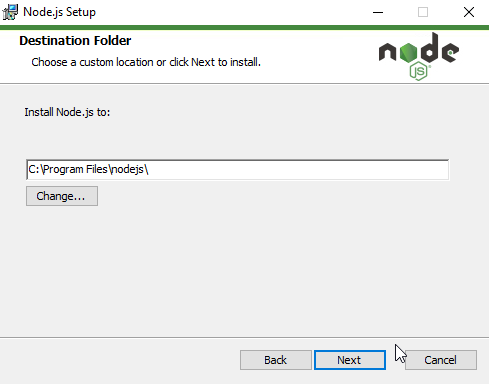

# 华夏中文学校2020-05-29 Python 暑期班 level1 （11:30-01:30pm）

## 2020-10-07
* check homework
GuessNumber.py from Ethan
Homework3.py from Jessie
drawperfactriangle.py from Eliott Zhang // file name, input n

[w3Schools](https://www.w3schools.com/)

## QuickType to generate python class from json
[QuickType website](https://quicktype.io/)
```
quicktype ./data/student.json -o student.py
```
## 2020-07-30
* OOP  
    [YouTube Classes](https://www.youtube.com/watch?v=apACNr7DC_s)
    [Python Classes]()
    
    - class book, __init__, __repr__
    - class student.py constructor, __repr__ abstraction
    
    - user.py, User, SubUser inheritence testUser
    - person, teacher, student inheritence
    
* sqlite
    - sqlite0.py > create connection
    - sqlite1.py
    - sqlite2.py

    - sqlite4.py
    - sqlite5.py
    - sqlite6.py
    - sqlite7.py > build relational data
    - sqlite8.py > show relation between project and task

---
## 2020-07-29
* Fix issue last class

## Review
    - Markdown document
    - ball game
    - draw snowman
    - plot
    - covid_19
    - debug python code
    - database access (CRUD)
    - Postman to test web service
    - application web server
    - react JS front end GUI server

## Function
    - math1.py (circle area, rectangule area, triangle area)
    - defineFunction.py (help(sum))
    - keywordArgs.py
    - practice: define a function with keyword arguments 
        -(createList.py parseString(str, sep=','))
    - defaultValue.py
    - ask.pys
## OOP  
    
    - class book, __init__, __repr__
    - class student.py constructor, __repr__ abstraction
    
    - user.py, User, SubUser inheritence testUser
    - person, teacher, student inheritence
    
## class
* class0.py - pass class, instance and class level attributes
* Person.py
* bookdb.py
* create a class snowman.py > drawSnowMan.py > shapes.py
---

## install npm
[Download and install node](https://nodejs.org/en/download/)

    - windows File: node-v12.18.3-x64.msi
    - macos File: 
* Install NodeJS & npm on windows 10
[nodejs.org/en/](https://nodejs.org/en/)

Google Search: install reactjs on windows 10
[Step by step](https://www.liquidweb.com/kb/install-react-js-windows/) option 2
```
node --version
npm --version
npm install -g create-react-app
create-react-app --version
create-react-app reactproject2
```
* get reactjs project from github
```
git clone https://github.com/jwang1122/reactjs.git
```
* Install ReactJs on MacOS

```
sudo npx create-react-app wang-app
sudo chown -R wangqianjiang wang-app
cd wang-app
npm start
```

## App server
* app1.py > ping-pong
* app2.py > <html>
* app3.py > display hardcoded books
* app4.py > display books from mongodb, postman > test service
* Install Postman
    [Download Website](https://www.postman.com/downloads/)
    
* start app4.py, test POST, UPDATE, DELETE methods
---

## Prime
    - prime0.py > straight forward
    - prime1.py > optimized by half
    - prime2.py > define function isPrime()
    - prime3.py > calculate range(40-50)
    - prime4.py > define function rangePrime(x,y)

## Mongo DB

[Install MongoDB](MongoDB.md)
* NoSQL - MongoDB -> 
* SQL: Structured Query Language
[What is SQL?](https://www.w3schools.com/sql/sql_intro.asp)

* create0.py > create book and save it to mongodb
* create1.py > create more than one document at once
* retrieve0.py > retrieve one book from mongodb
* retrieve1.py > retrieve all books from mongodb
* retrieve2.py > retrieve some books based on condition from mongodb
* update.py > update one document 
* delete.py > delete one document
* bookdb.py > create a class include all CRUD process.
---

## plot
* plot0.py
* plot1.py
* plot2.py
* plot3.py
* [Practice]: plot sin(x) and cos(x) in the same chart > plot4.py
* China-vs-USA.py
    - [Online data](https://open-covid-19.github.io/data/data.csv)
    - [Online data](https://open-covid-19.github.io/data/data_minimal.csv)
    - [Homework] Choose different two states, plot the data

---
    
## File access
* file0.py (write to file)
* file1.py (read and write to existing file)
* file2.py (with open, auto close)
* file3.py (dump json, write to json file)
* file3a.py (read json from file)
* file3b.py (read json from string)
* file4.py (pandas read csv)
* file5.py (read csv file, and plot the data)
* file6.py (write dict to csv file)
* readJson.py
* csvReader.py
    
---
## Terminal Games
* Check homework
* roll dice
    - dice.py
    - [Practice]: add total value of 2 dices
    - [Practice]: circle.py > circle_area(r)
* guess number
    - guessNumber.py

## draw snow man
* 
* demo draw_snowman.py
* shapes.py
* testShapes.py
* drawSun.py
* homework> draw snowcouple

---

## turtle
* turtle1.py 
* turtle2.py 
* turtle3.py 
* turtle4.py 
* turtle5.py
## ball game
* ball1.py [Display a ball at center of the screen.]
* ball2.py 
* ball3.py 
* ball4.py 
* ball5.py 
* ball6.py 
* ball7.py 
* ball8.py 
* ball9.py 
* ball10.py [Final version of ball game.]

---
## 2020-07-13
* check homework
    - yichen > 17 > Google Search: Roman Numerals >

## Loop
    - forLoop1.py
    - forBreak.py
    - forContinue.py
    - forNested1.py
    - while.py
    - [Practice]: 
        ```output
        We're on time 0
        We're on time 1
        We're on time 2
        We're on time 3
        ```
    - loop string
    - forElse.py

## If-Else
    - ifelse.py
    - if-else.py  
    - Infinit loop while True: > input("Continue? (y/n)")
    - [Practice]:
```output
2, 4, 6, 8, 10
1, 3, 5, 7, 9

```

## Data Type
* 
* python terminal
* int, float, complex > floatTest.py
* str > strTest.py
* tuple > tupleTest.py
* list > listTest.py
* set > setTest.py
* dict > dictTest.py

## Python playground and help document
* python >>> help(print) (positional arguments, keyword arguments)
* [Practice]: different print statements
* hello/print.py
* hello/print-string.py
* [Practice]: Homework
    
---

## Using Markdown 
* turn in homework to GitHub

* Markdown md文件的制作，制作课堂笔记

    - add Markdown Extension
    - 显示标题，子标题 #, ##
    - 显示 tablet *，1
    - 显示命令行
    - 显示图形
    - 显示链接

* [Reference to pythonInstall.md](pythonInstall.md)

## Familiar with your keyboard


```
space
:
ctrl+c
Ctrl+v
ctrl+/
shift+downarrow
tab
shift+tab
Enter(Return)
"
`
upArrow: bring previous command back
downArrow: bring next command back
leftArrow: move cursor to left in DOS window
rightArrow: move cursor to right in DOS window
```

* Hello World
    - hello.py
    - helloHim.py

---

## Getting start
* √ install softwares needed

[refer to ](pythonInstall.md) python installation file.

* check installation
* installation check
```sh
python --version
git --version
code --version
```
* build working folders
```
mkdir workspace
cd workspace
mkdir python1
```
use text editor: NotePad.exe
```py
print("Hello, world!")
a = 4
b = 5
print(a+b)
```
save to first.py
```
python first.py
```

## References
[Class Salible](https://www.javatpoint.com/python-tutorial)

[Python Tutorial](https://docs.python.org/3/tutorial/)


[MongoDB Tutorial](https://www.w3schools.com/python/python_mongodb_insert.asp)

[Create a new reactjs app](https://reactjs.org/docs/create-a-new-react-app.html)

---

## Email Address
Inact.audreyxy@gmail.com;
wanghangyao@gmail.com;
yutiyang@swbell.net;
meijenho0407@gmail.com;
xuelian.hu@outlook.com;
xinlian.chang@gmail.com;
libraluo@hotmail.com;
ty7701@gmail.com;
bing88us@yahoo.com;
pagyy26@gmail.com;
jzygeorgia@hotmail.com;
lanachau@gmail.com;
lanachau@gmail.com;
milmil_22@hotmail.com;
crystalchm@yahoo.com;
crystalchm@yahoo.com;

总校
* Kayden Gao（高宇晨） 
Katy
* Robert Garcia
* June Garcia