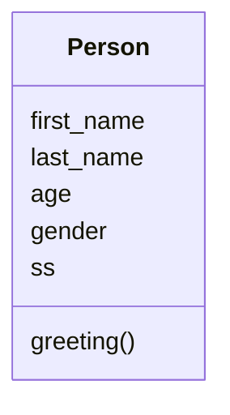

# Markdown Viewer and Editor


**Table of Contents**

[TOCM]

[TOC]

# Heading 1
## Heading 2               
### Heading 3
#### Heading 4
# Heading 1 link [Heading link](https://www.wikipedia.org/ "Heading link")
## Heading 2 link [Heading link](https://www.wikipedia.org/ "Heading link")
### Heading 3 link [Heading link](https://www.wikipedia.org/ "Heading link")
#### Heading 4 link [Heading link](https://www.wikipedia.org/ "Heading link") Heading link [Heading link](https://www.wikipedia.org/ "Heading link")

#### Heading (underline)

This is an H1
=============

This is an H2
-------------

~~Strike through~~ <s>Strike through（HTML Tags）</s>
*italic*      _italic_
**Bold**  __Bold__
***Bold Italic*** ___Bold Italic___

Superscript：X<sub>2</sub>，Subscript：O<sup>2</sup>

**Abbreviation (with the abbr tag of HTML)**

> An abbreviated form of a long word or phrase, provided that the HTML tag is turned on by default.

The <abbr title="Hyper Text Markup Language">HTML</abbr> specification is maintained by the <abbr title="World Wide Web Consortium">W3C</abbr>.

### Blockquotes

> Quoted text Blockquotes

### Anchor and Links

[Link](http://localhost/)

[Link with title](http://localhost/ "Link with title")

Direct Link：<https://www.wikipedia.org/>

[Anchor Link][anchor-id] 

[anchor-id]: http://www.this-anchor-link.com/

[mailto:test.test@gmail.com](mailto:test.test@gmail.com)

GFM a-tail link @earth  Email address auto link test.test@gmail.com  www@abc.com

> @earth

### Code Highlighting

#### Inline code

Command Line：`npm install marked`

#### Indented Style

This is, indenting 4 spaces, also as a function to implement `<pre>` Preformatted Text.

    <?php
        echo "Hello world!";
    ?>

Preformatted Text：

    | First Header  | Second Header |
    | ------------- | ------------- |
    | Content Cell  | Content Cell  |
    | Content Cell  | Content Cell  |

#### JS Code　

```javascript
function rot13(str) {
  var input     = 'ABCDEFGHIJKLMNOPQRSTUVWXYZabcdefghijklmnopqrstuvwxyz';
  var output    = 'NOPQRSTUVWXYZABCDEFGHIJKLMnopqrstuvwxyzabcdefghijklm';
  var index     = x => input.indexOf(x);
  var translate = x => index(x) > -1 ? output[index(x)] : x;
  return str.split('').map(translate).join('');
}
rot13('Hello world!');
```

#### HTML codes

```html
<html>
    <head>
        <mate charest="utf-8" />
        <meta name="keywords" content="Markdown, Editor" />
        <title>Hello world!</title>
        <style type="text/css">
            body{font-size:14px;color:#444; font-family: Tahoma, Arial; background:#fff;}
        </style>
    </head>
    <body>
        <h1 class="text-xxl">Hello world!</h1>
        <p class="text-green">Plain text</p>
    </body>
</html>
```

### Insert Images

Image:

 

> Cute Puppies!!


Image and Link:

[](https://en.wikipedia.org/wiki/Space "Wikipedia Space")

> Wikipedia Space
                
----

### Lists

#### Unordered Lists (-)
                
- List One
- List Two
- List Three
     
#### Unordered Lists (*)

* List One
* List Two
* List Three

#### Unordered Lists (+)
                
+ List One
+ List Two
    + List Two-1
    + List Two-2
    + List Two-3
+ List Three
    * List One
    * List Two
    * List Three

#### Ordered Lists (-)
                
1. First Line
2. Second Line
3. Third Line

#### GFM task list

- [x] GFM task list 1
- [x] GFM task list 2
- [ ] GFM task list 3
    - [ ] GFM task list 3-1
    - [ ] GFM task list 3-2
    - [ ] GFM task list 3-3
- [ ] GFM task list 4
    - [ ] GFM task list 4-1
    - [ ] GFM task list 4-2
                
----
                    
### Draw Tables

| Product        | Price   |  Quantity  |
| --------   | -----:  | :----:  |
| Computer      | $1600   |   5     |
| Phone        |   $12   |   12   |
| Pipeline        |    $1    |  234  |
                    
First Header  | Second Header
------------- | -------------
Content Cell  | Content \|\| Cell
Content Cell  | Content \|\| Cell 

| First Header  | Second Header |
| ------------- | ------------- |
| Content Cell  | Content Cell  |
| Content Cell  | Content Cell  |

| Function name | Description                    |
| ------------- | ------------------------------ |
| `help()`      | Display the help window.       |
| `destroy()`   | **Destroy objects**     |

| Left-Aligned  | Center Aligned  | Right Aligned |
| :------------ |:---------------:| -----:|
| col 3 is      | some wordy text | $1600 |
| col 2 is      | centered        |   $12 |
| zebra stripes | are neat        |    $1 |

----

#### Special Symbol HTML Entities Codes

&copy; &  &uml; &trade; &iexcl; &pound;
&amp; &lt; &gt; &yen; &euro; &reg; &plusmn; &para; &sect; &brvbar; &macr; &laquo; &middot; 

X&sup2; Y&sup3; &frac34; &frac14;  &times;  &divide;   &raquo;

18&ordm;C  &quot;  &apos;

[========]

### Emoji Expression :smiley:

> Blockquotes :star:

#### GFM task lists & Emoji & fontAwesome icon emoji 

- [x] :smiley: @mentions, :smiley: #refs, [links](), **formatting**, and <del>tags</del> supported
- [x] list syntax required (any unordered or ordered list supported)
- [x] [ ] :smiley: this is a complete item :smiley:
- [ ] []this is an incomplete item [test link](#) :fa-star: @earth
- [ ] [ ]this is an incomplete item :fa-star: :fa-gear:
    - [ ] :smiley: this is an incomplete item [test link](#) :fa-star: :fa-gear:
    - [ ] :smiley: this is  :fa-star: :fa-gear: an incomplete item [test link](#)
 
#### Backslash Escape

\*literal asterisks\*

[========]
            
### Scientific Formula TeX

$$E=mc^2$$

In-line formula $$E=mc^2$$，$$E=mc^2$$ formula.

$$x > y$$

$$\(\sqrt{3x-1}+(1+x)^2\)$$
                    
$$\sin(\alpha)^{\theta}=\sum_{i=0}^{n}(x^i + \cos(f))$$

Multiline Formula：

```math
\displaystyle
\left( \sum\_{k=1}^n a\_k b\_k \right)^2
\leq
\left( \sum\_{k=1}^n a\_k^2 \right)
\left( \sum\_{k=1}^n b\_k^2 \right)
```

```latex
\frac{n!}{r!(n-r)!}  \lim_{x \to a} \frac{f(x) - f(a)}{x - a}   
```
```latex
2H_2 + O_2 {\overset{n,m}{\longrightarrow}} 2H_2O
```

```katex
\displaystyle 
\mathbf{X} = \left(
\begin{array}{ccc}
x_1 & x_2 & \ldots \\
x_3 & x_4 & \ldots \\
\vdots & \vdots & \ddots
\end{array} \right),

\sqrt{\frac{x^2}{k+1}}\qquad
x^{\frac{2}{k+1}}\qquad
\frac{\partial^2f}{\partial x^2} 
```

### Page break

> Print Test: Ctrl + P

[========]

### Class Diagram


### Flowchart

```flow
st=>start: User Login
op=>operation: Login Operation
cond=>condition: validate?
e=>end: Enter

st->op->cond
cond(yes)->e
cond(no)->op
```

[========]
                    
### Sequence Diagram
                    
```seq
Andrew->Earth: Says Hello 
Note right of Earth: Earth thinks\nabout it 
Earth-->Andrew: How are you? 
Andrew->>Earth: I am good thanks!
```
