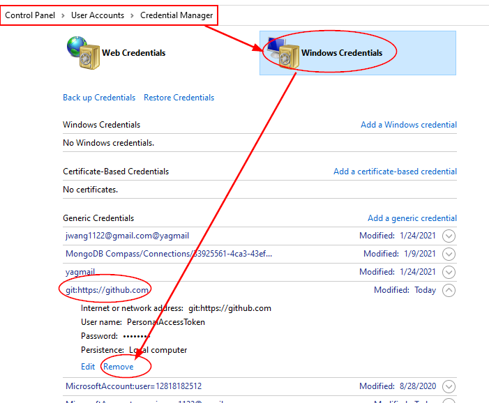
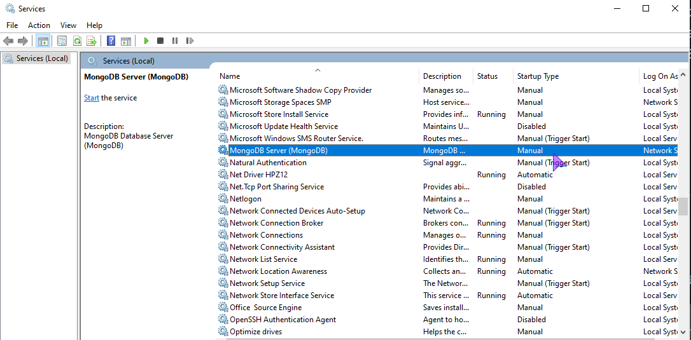

<h1>Mistakes in Class</h1>

[Markdown Shared Lib](myIcons.md)

* ❌Document can be linked in local file, but not github. 404 Error.
>✔️file name and links on github is case sensitive, make sure they are match each other. 

* ❌Student create GitHub account, as Collaborator, but cannot do **git push**, always get permission denied error.
>✔️this is due to github global credential configuration.
* Control Panel > User Accounts > Credential Manager > Manage Windows Credentials > remove



⚡️如果没有确认允许VS Code上传文件，也不能上传成功，需执行下面的命令，并使用password确认。
```DOS
git push
```
此时，应该自动打开浏览器，在浏览器中输入密码，确认成功后，就可以上传了。

❌ **Mistake:** Cannot update pip
<font color='red'>
ERROR: Could not install packages due to an OSError: [WinError 5] Access is denied: 'C:\\Users\\12818\\AppData\\Local\\Temp\\pip-uninstall-4u2s9lv_\\pip.exe'
Check the permissions.
</font>

✔️ **Solution:** Delete the folder by File Explore.

❌ **Mistake:** ModuleNotFoundError: No module named 'PIL'

✔️ **Solution:** 
1. install Pillow
2. select python interpreter

```
C:\Users\12818\workspace\python-I>pip install Pillow
```
Command Pallet > Python: Select Interpreter > ./env/Scripts/python.exe

❌ **Mistake:**
```
    raise ServerSelectionTimeoutError(
pymongo.errors.ServerSelectionTimeoutError: localhost:27017: [WinError 10061] No connection could be made because the target machine actively refused it, Timeout: 30s, Topology Description: <TopologyDescription id: 625f015cf9bcde4ebbe0b01b, topology_type: Unknown, servers: [<ServerDescription ('localhost', 27017) server_type: Unknown, rtt: None, error=AutoReconnect('localhost:27017: [WinError 10061] No connection could be made because the target machine actively refused it')>]>
```



✔️ **Solution:** 
From Control Panel Services, start the MoDB service
