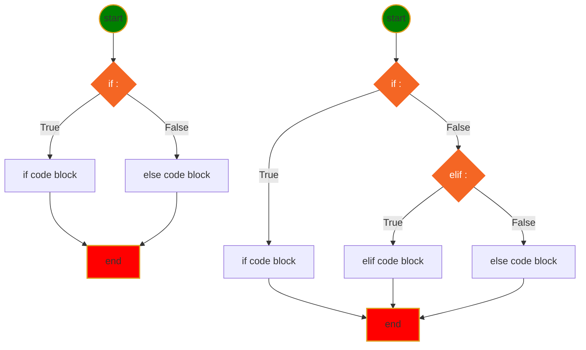
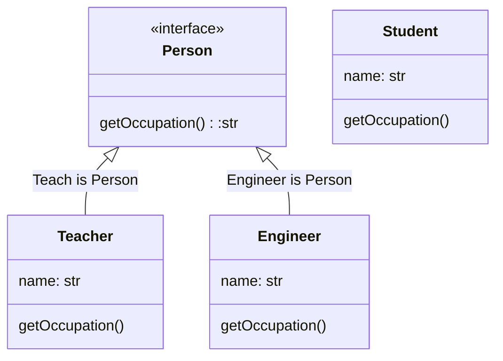

<h1>Python Language</h1>

[Markdown Shared Library](myIcons.md)

- [My First python program](#my-first-python-program)
- [print](#print)
- [comment](#comment)
- [Variable Naming](#variable-naming)
  - [Variable and memory](#variable-and-memory)
- [Data Type](#data-type)
- [Operator](#operator)
- [Execution Control](#execution-control)
- [Loop](#loop)
- [Function](#function)
  - [define function in function](#define-function-in-function)
  - [return function from function](#return-function-from-function)
  - [pass function as argument](#pass-function-as-argument)
  - [recursive function](#recursive-function)
  - [function decorator](#function-decorator)
  - [algorithms](#algorithms)
- [Class](#class)
  - [Python Interface](#python-interface)
- [References](#references)
  - [YouTube Tutorial](#youtube-tutorial)


## My First python program
[hello world](../src/languageBasics/hello.py)

## print
[print](../src/languageBasics/print.py)
* place holder (%s, %d, %f)
* print with tuple
* formated print: print(f"x={x}") 
* Homeworks
    - [Math Competition](../homeworks/12023%20Harmoney%20School%20Houston.pdf)
    - [print-01](homeworks/print01.md)
    - [print-02](homeworks/print02.md)

## comment 
[comment](../src/languageBasics/../comment.py)
* single line comment: #
* multiple lines comment: """, '''

## Variable Naming
1. variable name cannot start with number
2. variable can be combination of letters and numbers _, a~z, A~Z, 0~9, no other special characters
3. don't use reserved keywords as variable name

[Python Keywords](https://realpython.com/python-keywords/#:~:text=%20Python%20Keywords%20and%20Their%20Usage%20%201,are%20used%20for%20control%20flow%3A%20if%2C...%20More%20)
4. Avoid using existing function name as your variable name.
otherwise, your python builtins functions no longer works the way you expected.
### Variable and memory


* Homeworks
[variable-01](../homeworks/variable01.md)
[variable-02](../homeworks/variable02.md)
[variable-03](../homeworks/variable03.md)


## Data Type
* [Numbers](../src/languageBasics/number.py)
    - int: a=4
    - float: a=3.4
    - complex: c=4-3j
  - Homeworks
    [number-01](../homeworks/basics/datatype/number01.md)
* [String](../src/languageBasics/string.py)
    - string is iterable
    - string slicing: [[start]:[end]:[step]]
    - String operator +, *
    - as function str(object)
    - string functions
  - Homeworks
    [string-01](../homeworks/string/string01.md)
    [string-02](../homeworks/string/string02.md)
    [string-03](../homeworks/string/string03.md)
* [Tuple](../src/languageBasics/tuple.py)
    - tuple is iterable
    - tuple is immutable
    - tuple slicing: tuple1[[start]:[end]:[step]]
    - tupler operator +, *
    - as function: tuple(iterable)
    - tuple functions ()
* [List](../src/languageBasics/list.py)
    - list is iterable
    - list is mutable
    - list slicing: list1[[start]:[end]:[step]]
    - list operators +, *
    - modify list
    - as function: list(iterable)
    - list functions (append, insert)
  - Homeworks
    [list-01](../homeworks/basics/datatype/list01.md)
    [list-02](../homeworks/basics/datatype/list02.md)
* [Set](../src/languageBasics/set.py)
    - set is iterable
    - set is mutable
    - set operators: &, |, <, >, ==
    - modify set
    - as function: set(iterable)
    - set functions ()
* [Dictionary](../src/languageBasics/dictionary.py)
    - dict is iterable: only iterate key
    - dict is mutable
    - dict modify==>CRUD
    - 


## Operator 
[operator](../src/languageBasics/operator.py)
* [arithmatic](../src/languageBasics/operator/arithmatic.py)
* [assignment](../src/languageBasics/operator/assignment.py)
* [bitwise](../src/languageBasics/operator/bitwise.py)
* [comparison](../src/languageBasics/operator/comparison.py)
* [identity](../src/languageBasics/operator/identity.py)
* [logical](../src/languageBasics/operator/logical.py)
* [membership](../src/languageBasics/operator/membership.py)
* [others](../src/languageBasics/operator/others.py)
* [ternary](../src/languageBasics/operator/ternary.py)

## Execution Control
* **if-elif-else** statement Syntax
```py
if <condition>:
    # if code block here
elif <condition>:
    # elif code block here
else:
    #else code block here
# code continue ...
```


* Mermaid Diagram for if-else statement

* [User input](../src/languageBasics/if-else/if-else03.py)
  - Homeworks
    [ifelss-01](../homeworks/basics/flowcontrol/ifelse01.md)
    [ifelss-02](../homeworks/basics/flowcontrol/ifelse02.md)
    [ifelss-03](../homeworks/basics/flowcontrol/ifelse03.md)

## Loop
* [for1.py](../src/languageBasics/loop/for1.py)
* [for2.py](../src/languageBasics/loop/for2.py)
* [forBreak.py](../src/languageBasics/loop/forBreak.py)
* [forContinue.py](../src/languageBasics/loop/forContinue.py)
  

* [while.py]()
  
  
* Homeworks
  - [loop-01](../homeworks/basics/loop/loop01.md)
  - [loop-02](../homeworks/basics/loop/loop02.md)
  - [loop-03](../homeworks/basics/loop/loop03.md)
  - [loop-04](../homeworks/basics/loop/loop04.md)
  - [loop-05](../homeworks/basics/loop/loop05.md)


## Function
* [function basic](../src/function/function.py)
  - define a function
$$
\underbrace {def}_{keyword} \underbrace {circle \_area}_{function \space name} \left(\underbrace {a, b,c ...}_{positional\; args} * \underbrace {e=None, f=200}_{keyword\;args}\right) \underbrace {:}_{eol}
$$
  - def: Python reserved keyword
  - name: could be overriden
  - (): must have, no matter has arguments or not
  - arguments: positional, keyword
  - : must end with colon
  - ❗️⚡️function can be overridden
  - 😄return more than one value
  - 💡single response
* [function arguments](../src/function/defineFunction.py)


Circle area formula: $ A=\pi r^2 $

```use python playground
>>> from src.function.defineFunction import *
>>> help(f)
```
* [One time assign default value](../src/function/defaultValue.py)
* [Simple math function](../src/function/circle.py)
* [collision.py](../src/function/collision.py)
* [check user input](../src/function/ask.py)
* [access function attribute](../src/function/attribute.py)
* [simple math function](../src/function/math1.py)
* [optionalKeywordArgs.py](../src/function/optionalKeywordArgs.py)
* [optionalPositionalArgs.py](../src/function/optionalPositionalArgs.py)

### define function in function
* [funcInFunc.py](../src/function/funcInFunc.py)
* [innerFunction01.py](../src/function/innerFunction01.py)
* [innerFunction02.py](../src/function/innerFunction02.py)

### return function from function
* [dynamicall generated quadratic function](../src/function/returnFunction.py)

### pass function as argument
* [passFuncAsArg.py](../src/function/passFuncAsArg.py)

### recursive function
A function is recursive if it calls itself.
  1. termination condition.
  2. adjust status for each call.
  3. Python stops the cunction calls after a depth of 1000 calls.
* [factoria.py](../src/function/factorial.py)
$$ f(n) = n! = n (n-1) (n-2)\cdots1$$

* [recursiveBinarySearch.py](../src/algorithms/recursiveBinarySearch.py)

* Understand recursive find.
  ```mermaid
  graph TB
  START((find answer))
  END[end]
  B[add 10 to<br>the answer of<br>problem 52]
  C[Problem 52:<br>Add 12 to<br>the answer of<br>problem 85]
  D[Problem 85:<br>10]
  
  START-->B-->C-->D
  D--10+12-->C--22+10-->B--32-->END

  classDef html fill:#F46624,stroke:#F46624,stroke-width:4px,color:white;
  classDef js fill:yellow,stroke:#DE9E1F,stroke-width:2px;
  classDef start fill:green,stroke:#DE9E1F,stroke-width:2px;
  classDef end1 fill:red,stroke:#DE9E1F,stroke-width:2px;
  class START start
  class B,C,D html
  class END end1
  ```
### function decorator
* [my_timer.py](../src/function/my_timer.py)
### algorithms
Big O
* O(n)
* O(log n)
* [linearSearch.py](../src/algorithms/linearSearch.py)
* [binarySearch.py](../src/algorithms/binarySearch.py)
  
Operations on Data Structure
1. Access and read values
2. Search for an arbitrary values
3. Insert values at any point into the structure
4. Delete the value in the Data Structure
* [arrays.py](../src/algorithms/arrays.py)

## Class
4 Features of OOP
1. Abstraction（抽象性==》实体模拟）
2. Inheritance（继承性==》属性及功能的继承）
3. Polymorphism（多样性==》多类型同功能调用，same function behavior differently by different object type）
4. Encapsulation (封装性==》属性自我保护)


* [class01.py](../src/class/class01.py)
* [class02.py](../src/class/class02.py)
* [class03.py](../src/class/class03.py)
* [class04.py](../src/class/class04.py)
* [class05.py](../src/class/class05.py)
* [class06.py](../src/class/class06.py)
* [class07.py](../src/class/class07.py)
* [class08.py](../src/class/class08.py)
* [class09.py](../src/class/class09.py)
* [class10.py](../src/class/class10.py)
* [class11.py](../src/class/class11.py)
* [class12.py](../src/class/class12.py)
* [class13.py](../src/class/class13.py)
* [class14.py](../src/class/class14.py)
* [class15.py](../src/class/class15.py)
* [class16.py](../src/class/class16.py)
* [class17.py](../src/class/class17.py)
* [class18.py](../src/class/class18.py)
* [class19.py](../src/class/class19.py)
* [class20.py](../src/class/class20.py)
* [class21.py](../src/class/class21.py)
* [class22.py](../src/class/class22.py)
* [class23.py](../src/class/class23.py)

### Python Interface
[@abstractmethod](https://docs.python.org/3/library/abc.html)
[interface.py](../src/class/interface.py)


* @abstractmethod decorator from abc
* __subclasshook__(), __subclasscheck__(), issubclass(), isinstance()

## References
* [python.md](aDoc/python.md)
* [VS Code Tricks](aDoc/vscodeTricks.md)
* [Markdown Tricks](aDoc/markdownTricks.md)
* [Keyboard](aDoc/keyboard.md)
* [Excercise](https://pynative.com/python-exercises-with-solutions/)
* [Function Excercises](https://pynative.com/python-functions-exercise-with-solutions/)

### YouTube Tutorial
* [Algorithms and Data Structure](https://www.youtube.com/watch?v=8hly31xKli0)
