<h1>Python Language</h1>

[Markdown Shared Library](myIcons.md)

- [Getting Start](#getting-start)
  - [getting formiliar your keyboard](#getting-formiliar-your-keyboard)
  - [My First python program](#my-first-python-program)
  - [print](#print)
  - [comment](#comment)
  - [Variable Naming](#variable-naming)
  - [Variable and memory](#variable-and-memory)
- [Data Type](#data-type)
- [Operator](#operator)
- [Execution Control](#execution-control)
- [Loop](#loop)
- [Function](#function)
  - [define function in function](#define-function-in-function)
  - [return function from function](#return-function-from-function)
  - [pass function as argument](#pass-function-as-argument)
  - [global variable](#global-variable)
  - [raise Error and Try-Except](#raise-error-and-try-except)
  - [function annotation](#function-annotation)
  - [recursive function](#recursive-function)
  - [function decorator](#function-decorator)
- [Unit Test](#unit-test)
- [Logging](#logging)
- [algorithms](#algorithms)
- [Class](#class)
  - [class basic](#class-basic)
  - [dunder functions](#dunder-functions)
  - [attribute scope](#attribute-scope)
  - [class tricks](#class-tricks)
  - [class inheritance](#class-inheritance)
  - [Python Interface](#python-interface)
  - [Unit Test](#unit-test-1)
  - [Dunder Variables](#dunder-variables)
  - [Global Variables](#global-variables)
- [Blackjack Game](#blackjack-game)
  - [Blackjack Rules](#blackjack-rules)
  - [Object relationship](#object-relationship)
  - [Game logic](#game-logic)
  - [Code Optimization](#code-optimization)
  - [missing unit tests](#missing-unit-tests)
  - [Integration Test](#integration-test)
  - [Documentation](#documentation)
  - [Software development life cycle](#software-development-life-cycle)
- [Yahtzee Dice Game](#yahtzee-dice-game)
- [File Access](#file-access)
- [nmpy](#nmpy)
- [pandas](#pandas)
- [Plot](#plot)
- [Clean Code](#clean-code)
  - [Design Principles SOLID](#design-principles-solid)
- [Turtle](#turtle)
- [SQLite](#sqlite)
- [MongoDB](#mongodb)
- [tkinter(windows based GUI)](#tkinterwindows-based-gui)
  - [open window](#open-window)
  - [Label, Button, Entry widgets](#label-button-entry-widgets)
    - [pack attributes](#pack-attributes)
  - [pack layout](#pack-layout)
  - [grid layout](#grid-layout)
  - [place layout](#place-layout)
  - [icon and title](#icon-and-title)
  - [Other widgets](#other-widgets)
  - [color](#color)
  - [mouse](#mouse)
  - [table](#table)
  - [canvas](#canvas)
  - [tab window frame](#tab-window-frame)
  - [titled frame](#titled-frame)
  - [plot chart in tkinter](#plot-chart-in-tkinter)
  - [display image](#display-image)
  - [popup window](#popup-window)
  - [card game GUI](#card-game-gui)
  - [sqlite DB](#sqlite-db)
  - [Web Service API](#web-service-api)
  - [Application](#application)
- [Data Structure](#data-structure)
  - [stack](#stack)
  - [queue](#queue)
  - [Priority Queue](#priority-queue)
  - [Linked list](#linked-list)
  - [doubly linked list](#doubly-linked-list)
- [Functional Programing](#functional-programing)
  - [Function decorator(timer)](#function-decoratortimer)
  - [Lambda expression](#lambda-expression)
  - [map() function](#map-function)
  - [filter() function](#filter-function)
  - [reduce() function](#reduce-function)
  - [sort() function](#sort-function)
  - [zip() function](#zip-function)
  - [Calculate Square root](#calculate-square-root)
  - [Non-strict evaluation](#non-strict-evaluation)
  - [monad](#monad)
  - [Either](#either)
- [Design pattern](#design-pattern)
  - [Reactivex design pattern](#reactivex-design-pattern)

## Getting Start
### getting formiliar your keyboard
[Keyboard](keyboard.md)

### My First python program
[hello world](../src/languageBasics/hello.py)

### print
[print](../src/languageBasics/print.py)
* place holder (%s, %d, %f)
* print with tuple
* formated print: print(f"x={x}") 
* Homeworks
    - [Math Competition](../homeworks/12023%20Harmoney%20School%20Houston.pdf)
    - [print-01](homeworks/print01.md)
    - [print-02](homeworks/print02.md)

### comment 
[comment](../src/languageBasics/../comment.py)
* single line comment: #
* multiple lines comment: """, '''
❓Why I need use comment?
✔️

### Variable Naming
1. variable name cannot start with number
2. variable can be combination of letters and numbers _, a~z, A~Z, 0~9, no other special characters
3. don't use reserved keywords as variable name


[Python Keywords](https://realpython.com/python-keywords/#:~:text=%20Python%20Keywords%20and%20Their%20Usage%20%201,are%20used%20for%20control%20flow%3A%20if%2C...%20More%20)

4. Avoid using existing function name as your variable name.
otherwise, your python builtins functions no longer works the way you expected.

### Variable and memory


* Homeworks
[variable-01](../homeworks/variable01.md)
[variable-02](../homeworks/variable02.md)
[variable-03](../homeworks/variable03.md)


## Data Type
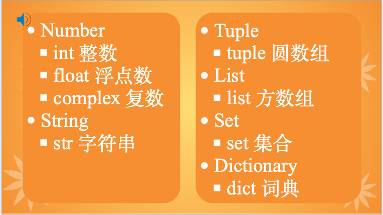

* [Numbers](../src/languageBasics/number.py)
    - int: a=4
    - float: a=3.4
    - complex: c=4-3j
  - Homeworks
    [number-01](../homeworks/basics/datatype/number01.md)
* [String](../src/languageBasics/string.py)
    - string is iterable
    - string slicing: [[start]:[end]:[step]]
    - String operator +, *
    - as function str(object)
    - string functions (isdigit(), strip(), split(), lower(), upper(), startswith(), endswith(), ...)
    - 
  - Homeworks
    [string-01](../homeworks/string/string01.md)
    [string-02](../homeworks/string/string02.md)
    [string-03](../homeworks/string/string03.md)
* [Tuple](../src/languageBasics/tuple.py)
    - tuple is iterable
    - tuple is immutable
    - tuple slicing: tuple1[[start]:[end]:[step]]
    - tupler operator +, *
    - as function: tuple(iterable)
    - tuple functions ()
* [List](../src/languageBasics/list.py)
    - list is iterable
    - list is mutable
    - list slicing: list1[[start]:[end]:[step]]
    - list operators +, *
    - modify list
    - as function: list(iterable)
    - list functions (append, insert)
  - Homeworks
    [list-01](../homeworks/basics/datatype/list01.md)
    [list-02](../homeworks/basics/datatype/list02.md)
* [Set](../src/languageBasics/set.py)
    - set is iterable
    - set is mutable
    - set operators: &, |, <, >, ==
    - modify set
    - as function: set(iterable)
    - set functions ()
* [Dictionary](../src/languageBasics/dictionary.py)
    - dict is iterable: only iterate key
    - dict is mutable
    - dict modify==>CRUD

* [date/time](../src/languageBasics/datatype/datetime1.py)
## Operator 
* [operator](../src/languageBasics/operator.py)
* Arithmatic Operator: +; -; *; /: %; **;//(floor divisor)
  
  [arithmatic](../src/languageBasics/operator/arithmatic.py)
* Assignment Operators: =; +=; -=; *=; /=; %=; **=; //=
  
  [assignment](../src/languageBasics/operator/assignment.py)
* Comparison Operators: ==, !=, <, >, <=, >=
  
  [comparison](../src/languageBasics/operator/comparison.py)
* Identity Operator: is, is not

  [identity](../src/languageBasics/operator/identity.py)

* Logical Operator: and, or, not

  [logical](../src/languageBasics/operator/logical.py)
* Membership Operator: in, not in

  [membership](../src/languageBasics/operator/membership.py)
* Multiple times operator: **
  
  [others](../src/languageBasics/operator/others.py)
* Ternary operator: if-else, and-or

  [ternary](../src/languageBasics/operator/ternary.py)
* Bitwise Operator: &, |, ^, <<, >>
  
  [bitwise](../src/languageBasics/operator/bitwise.py)

## Execution Control
* **if-elif-else** statement Syntax
```py
if <condition>:
    # if code block here
elif <condition>:
    # elif code block here
else:
    #else code block here
# code continue ...
```


* Mermaid Diagram for if-else statement
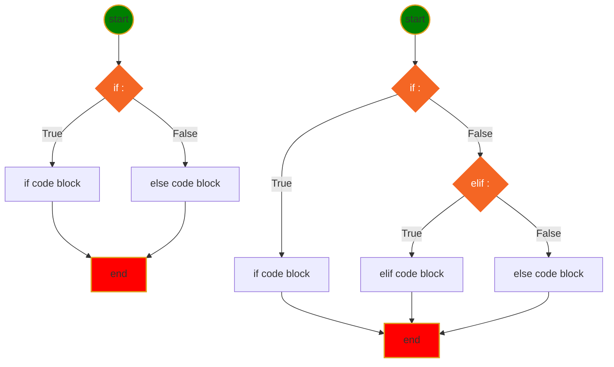
```mermaid
graph TB
A((start))
B{if <condition>:}
C[if code block]
D[else code block]
E[end]


A-->B
B--True-->C-->E
B--False-->D-->E

A1((start))
B1{if <condition>:}
B2{elif <condition>:}
C1[if code block]
D1[elif code block]
E1[end]
F1[else code block]

A1-->B1
B1--True-->C1-->E1
B1--False-->B2--True-->D1-->E1
B2--False-->F1-->E1


classDef html fill:#F46624,stroke:#F46624,stroke-width:4px,color:white;
classDef js fill:yellow,stroke:#DE9E1F,stroke-width:2px;
classDef start fill:green,stroke:#DE9E1F,stroke-width:2px;
classDef end1 fill:red,stroke:#DE9E1F,stroke-width:2px;
class A,A1 start
class B,B1,B2 html
class E,E1 end1
```
* [User input](../src/languageBasics/if-else/if-else03.py)
  - Homeworks
    [ifelss-01](../homeworks/basics/flowcontrol/ifelse01.md)
    [ifelss-02](../homeworks/basics/flowcontrol/ifelse02.md)
    [ifelss-03](../homeworks/basics/flowcontrol/ifelse03.md)

## Loop
* [for1.py](../src/languageBasics/loop/for1.py)
* [for2.py](../src/languageBasics/loop/for2.py)
* [forBreak.py](../src/languageBasics/loop/forBreak.py)
* [forContinue.py](../src/languageBasics/loop/forContinue.py)

* Break on for-loop
  
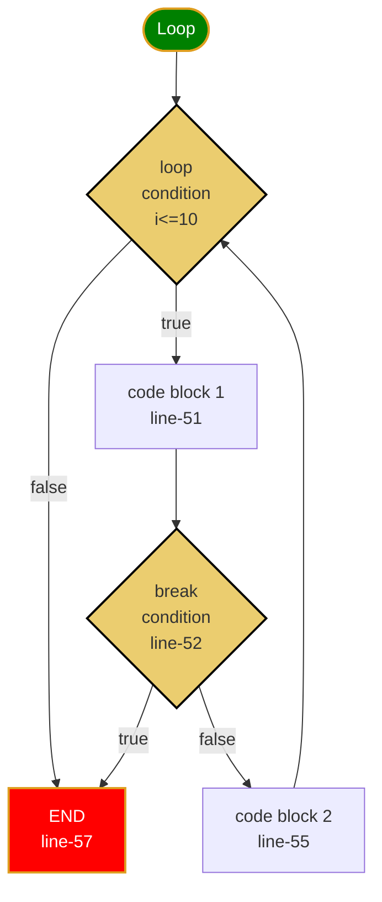
```mermaid
graph TB

A([Loop])
B{loop<br>condition<br>i<=10}
C[code block 1<br>line-51]
D{break<br>condition<br>line-52}
F[code block 2<br>line-55]
E[END<br>line-57]

A-->B
B--false-->E
B--true-->C-->D
D--true-->E
D--false-->F-->B

classDef if fill:#EBCD6F,stroke:black,stroke-width:2px;
classDef start fill:green,stroke:#DE9E1F,stroke-width:2px,color:white;
classDef end1 fill:red,stroke:#DE9E1F,stroke-width:2px,color:white;

class B,D if
class E end1
class A start
```

* continue on for-loop
  
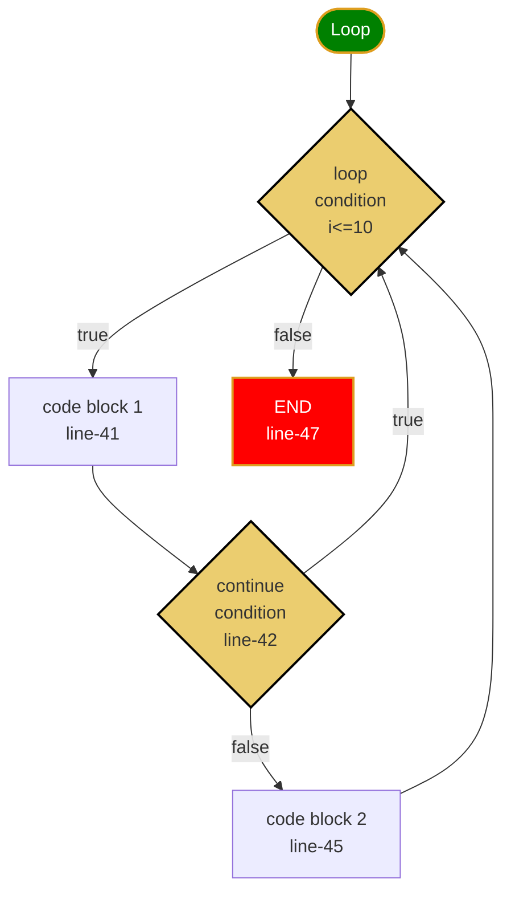
```mermaid
graph TB

A([Loop])
B{loop<br>condition<br>i<=10}
C[code block 1<br>line-41]
D{continue<br>condition<br>line-42}
F[code block 2<br>line-45]
E[END<br>line-47]

A-->B
B--false-->E
B--true-->C-->D
D--true-->B
D--false-->F-->B

classDef if fill:#EBCD6F,stroke:black,stroke-width:2px;
classDef start fill:green,stroke:#DE9E1F,stroke-width:2px,color:white;
classDef end1 fill:red,stroke:#DE9E1F,stroke-width:2px,color:white;

class B,D if
class E end1
class A start

```

* [while.py]()
  
  
* Homeworks
  - [loop-01](../homeworks/basics/loop/loop01.md)
  - [loop-02](../homeworks/basics/loop/loop02.md)
  - [loop-03](../homeworks/basics/loop/loop03.md)
  - [loop-04](../homeworks/basics/loop/loop04.md)
  - [loop-05](../homeworks/basics/loop/loop05.md)

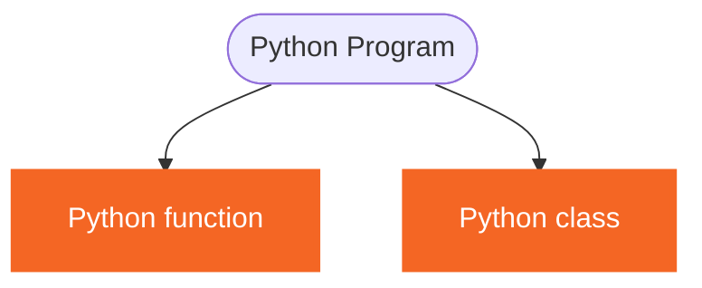
```mermaid
graph TB

B([Python Program])
C[Python function]
D[Python class]

B-->C
B-->D

classDef html fill:#F46624,stroke:#F46624,stroke-width:4px,color:white;
classDef js fill:yellow,stroke:#DE9E1F,stroke-width:2px;
classDef start fill:green,stroke:#DE9E1F,stroke-width:2px;
classDef end1 fill:red,stroke:#DE9E1F,stroke-width:2px;

class START start
class C,D html
class END end1
```
## Function
❓What is function?
>✔️A block of code defined by name and arguments, can be used by calling the name many times repeatedly. In Python, functions are first-class citizens. That means functions have the same characteristics as values like other data type such as strings and numbers. Anything you would expect to be able to do with a string or number you can do with a function as well.
* [function basic](../src/function/function.py)
* define a function
    - def, Python reserved keyword
    - function name, anything you want, but need follow the naming rules
    - (), must have open/close parenthesis pair, no matter it has arguments or not
    - arguments, positional or keyword arguments separated by comma ,
    - :, must end with colon
    - the function body must indent
    - ❗️⚡️function can be overridden
    - 😄return more than one value
    - 💡single response
    - call a function by function name and (), and arguments if there is any

$$ \underbrace {def}_{keyword} \underbrace {circle \_area}_{function \space name} \left(\underbrace {a, b,c ...}_{positional\; args} * \underbrace {e=None, f=200}_{keyword\;args}\right) \underbrace {:}_{eol} $$


Circle area formula: $ A=\pi r^2 $

* [circleArea](../src/function/function.py)
* [function arguments](../src/function/defineFunction.py)
* [understand __name__](../src/function/circle.py)
* [understand if __name__=='__main__':](../src/function/useCircle.py)
* Python document
```use python playground
>>> from src.function.defineFunction import *
>>> help(f)
```
* [One time assign default value](../src/function/defaultValue.py)
* [collision.py](../src/function/collision.py)
* [check user input](../src/function/ask.py)
* [access function attribute](../src/function/attribute.py)
* [simple math function](../src/function/math1.py)
* [optionalKeywordArgs.py](../src/function/optionalKeywordArgs.py)
* [optionalPositionalArgs.py](../src/function/optionalPositionalArgs.py)

### define function in function
* [innerFunction01.py](../src/function/innerFunction01.py)
* [innerFunction02.py](../src/function/innerFunction02.py)
* [define function in another function](../src/function/functionInFunction.py)
* [function In Function](../src/function/funcInFunc.py)

### return function from function
* [dynamicall generated quadratic function](../src/function/returnFunction.py)

### pass function as argument
* [passFuncAsArg.py](../src/function/passFuncAsArg.py)
* 👍[function as dictionary value](../src/function/dictFunction.py)

### global variable
❓ What is global variable?
>✔️global keyword allows you to modify the variable outside of the current scope. It is used to create a global variable and make changes to the variable in a local context.
[use global variable](../src/function/globalVariable.py)
1. When we create a variable inside a function, it is local by default.
2. When we define a variable outside of a function, it is global by default. You don't have to use global keyword.
3. We use global keyword to read and write a global variable inside a function.
4. Use of global keyword outside a function has no effect.
5. It is not necessary to declare global variable outside function


### raise Error and Try-Except
* [❓what's wrongh?](../src/function/circle1.py)
* [✔️Assert check before calculation](../src/function/assert.py)

```syntax
assert <condition>,<error message>
```

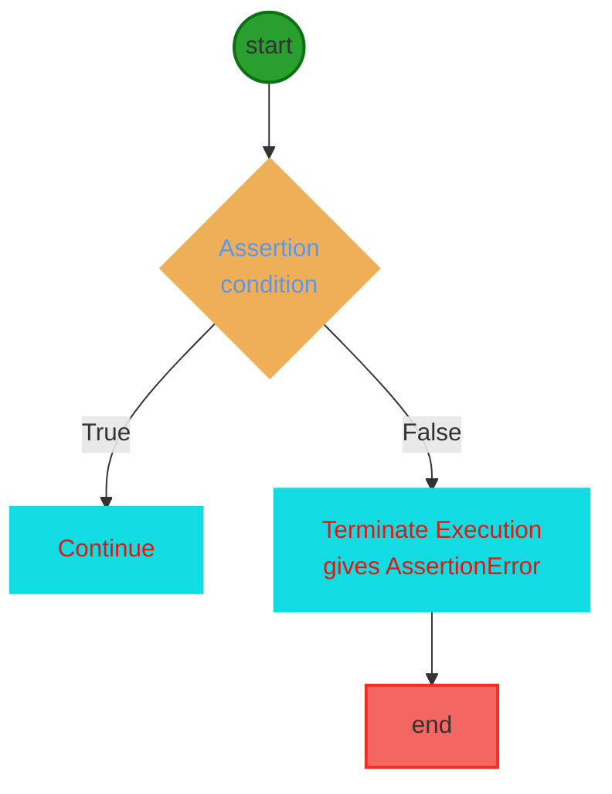
```mermaid
graph TB
START((start))
END[end]
B{Assertion<br>condition}
C[Continue]
D[Terminate Execution<br>gives AssertionError]

START-->B
B--True-->C
B--False-->D-->END

classDef html fill:#12DBE2,stroke:#12DBE2,stroke-width:4px,color:#E21912;
classDef js fill:yellow,stroke:#DE9E1F,stroke-width:2px;
classDef start fill:#299F30,stroke:#0B7111,stroke-width:2px;
classDef if fill:#EFAE58,stroke:#EFAE58,color:#5899EF;
classDef end1 fill:#F46661,stroke:#F12D26,stroke-width:2px;

class START start
class C,D html
class B if
class END end1
```

* [✋Raise TypeError](../src/function/raiseError.py)
* [assert](../src/function/assertCheck.py)
  
The difference between raise and assert:
1. assert: I swear this must be true, in case it happens, let me know. ❌❗️You have big problem! Debug aid for developer find root cause, not for handling run-time error. only give you one kind of error which is AssertionError.
>💡[I swear int('1')==1](../src/function/asInt.py)

2. raise: Try to catch run-time error. Developer sometimes use raise for execution control.

>👌💡[define isFloat(str) function](../src/function/checkFloat.py)

* [👌👎catch Assertion Error](../src/function/tryexcept1.py)
* [👌👎catch Different Error](../src/function/tryexcept2.py)

✔️Better solution is solve the issue at compiling time.

### function annotation
👍Avoid unexpected function call with wrong data type arguments.

👍Find out calling error before runtime.

* [❓what's wrongh?](../src/function/circle1.py)

```DOS
mypy <filename.py>
```


* [annotation1.py](../src/function/annotation1.py)
* [annotation2.py](../src/function/annotation2.py)
* [annotation3.py](../src/function/annotation3.py)

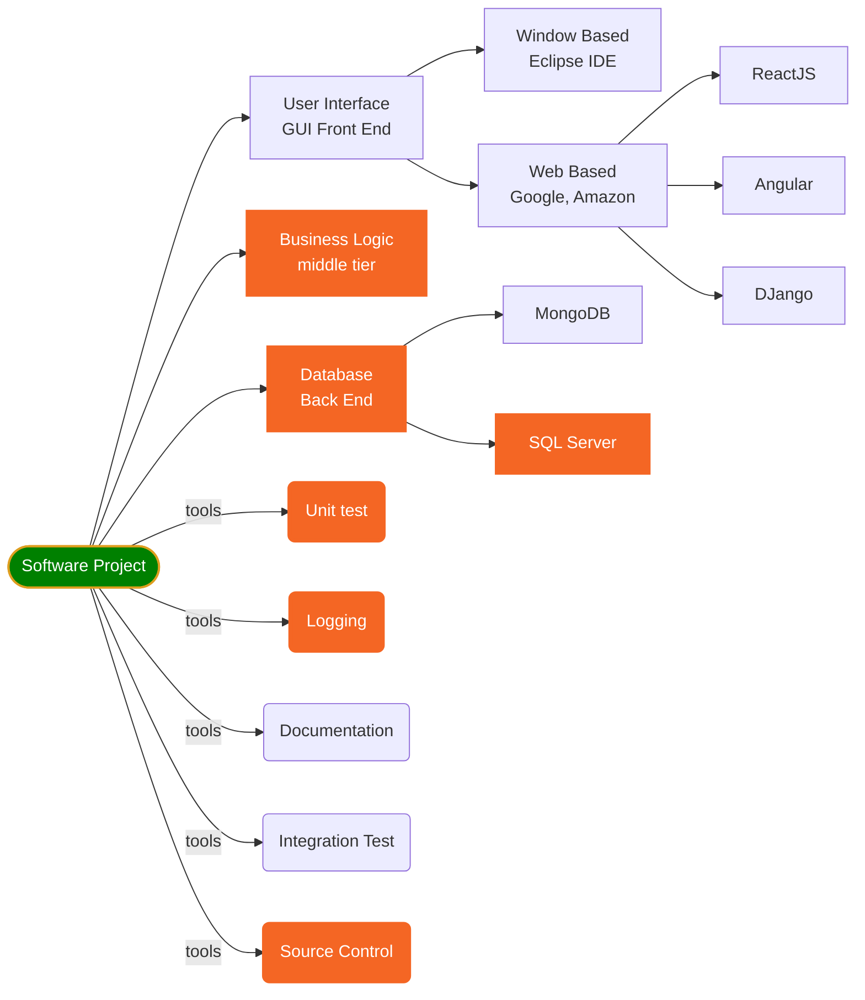
```mermaid
graph LR

A([Software Project])
B[User Interface<br>GUI Front End]
C[Business Logic<br>middle tier]
D[Database<br>Back End]
E(Unit test)
F(Logging)
K(Documentation)
L(Integration Test)
G[Window Based<br>Eclipse IDE]
H[Web Based<br>Google, Amazon]
I[MongoDB]
J[SQL Server]
REACT[ReactJS]
ANGULAR[Angular]
DJANGO[DJango]
GIT(Source Control)

A-->B & C & D 
A--tools--> E & F & K & L & GIT
B-->H & G
D-->I & J
H-->REACT & ANGULAR & DJANGO

classDef block1 fill:#F46624,stroke:#F46624,stroke-width:4px,color:white;
classDef start fill:green,stroke:#DE9E1F,stroke-width:2px,color:white;

class A start
class C,E,F,D,J,GIT block1
```


### recursive function
A function is recursive if it calls itself.
  1. termination condition.
  2. adjust status for each call.
  3. Python stops the cunction calls after a depth of 1000 calls.
* [factoria.py](../src/function/factorial.py)
$$ f(n) = n! = n (n-1) (n-2)\cdots1$$

* [recursiveBinarySearch.py](../src/algorithms/recursiveBinarySearch.py)

* Understand recursive find.
  ```mermaid
  graph TB
  START((find answer))
  END[end]
  B[add 10 to<br>the answer of<br>problem 52]
  C[Problem 52:<br>Add 12 to<br>the answer of<br>problem 85]
  D[Problem 85:<br>10]
  
  START-->B-->C-->D
  D--10+12-->C--22+10-->B--32-->END

  classDef html fill:#F46624,stroke:#F46624,stroke-width:4px,color:white;
  classDef js fill:yellow,stroke:#DE9E1F,stroke-width:2px;
  classDef start fill:green,stroke:#DE9E1F,stroke-width:2px;
  classDef end1 fill:red,stroke:#DE9E1F,stroke-width:2px;
  class START start
  class B,C,D html
  class END end1
  ```
### function decorator
* [my_timer.py](../src/function/my_timer.py)

## Unit Test
>A unit is a specific piece of code to be tested, such as a function or a class. Unit tests are then other pieces of code that specifically exercise the code unit with a full range of different inputs, including boundary and edge cases.

Right-Click inside Editor window ⟹ Command Palette... ⟹ Python Cofigure Tests ⟹ unittest ⟹ test ⟹ test_*.py
```
[project root]
    ├── 🔥src/
    |    └── function/ 
    |           ├── circle3.py
    |           └── circle.py
    ├── test/
    |    └── 🚧test_circleArea.py 
    └── 👉ReadMe.md
```
* 😢👎unittest cannot find the file unless
    1. test file name match the pattern
    2. test file located on right folder
    3. unittest always find test file from current running folder
    4. 👎module and function can be found in the module
    5. 👎module must be no compiler error

😄✔️👍所有的错误，都是因为vscode Python Extension中的python执行命令。
Python永远都是从当前文件夹开始查找所有的module。Python本身并没有错。大部分网上的解释都没有切中要害。要害是python的执行命令与python的设计相违背。
```DOS
(env) C:\Users\12818\workspace\python-I>c:/Users/12818/workspace/python-I/env/Scripts/python.exe 
👎❌❗️c:/Users/12818/workspace/python-I/src/blackjack/blackjackcard.py
Traceback (most recent call last):
  File "c:\Users\12818\workspace\python-I\src\blackjack\blackjackcard.py", line 1, in 
<module>
    from src.blackjack.card import Card # use this line for unit test
ModuleNotFoundError: No module named 'src'

(env) C:\Users\12818\workspace\python-I>
```
从命令行看出，命令是从project根目录发出（C:\Users\12818\workspace\python-I>），直接运行该文件（c:/Users/12818/workspace/python-I/src/blackjack/blackjackcard.py）
```py
# blackjackcard.py

# from src.blackjack.card import Card # use this line for unit test
from .card import Card # use relative path
# from card import Card # use this line for product
```
如果程序使用第三行，python当然知道从当前目录下寻找card module，所以直接运行该文件没有任何的问题。但是当使用unittest的时候，unittest就找不到card module了。（😄当然如果unittest也像python一样聪明，在相同文件夹中寻找，就更好了。目前想让unittest找当前文件夹下的module文件，必须使用相对路径，即第二行的 from .card， 又或者第一行的绝对路径）。unittest总是从绝对路径开始查找，所以第一行对unittest和python来说是轻车熟路。但是第一行和第二行对于命令行直接运行都是大问题，因为在该文件所在的文件夹中，根本不存在src或者.card的文件夹，所以相应的module当然也找不到。解决的办法是修改命令行命令。
```DOS
✔️😄python -m src.blackjack.blackjackcard
```
这样一来，第一行和第二行都可以直接运行，也同时能够让unittest找到。
网上很多解释说，你一定要在package文件夹中加入__init__.py的文件云云，其实没有一毛钱的关系。

❗️❗️😢👎可惜的是，没有人修改执行命令❗️❗️

👌Work around: it is hard to type in -m command, butter way to do this is add two line for the import, one for unittest, one for local run. switch the comment when you do different thing.

```py
# tests/test_basics.py

import unittest
from mycoolproject import my_module_1
from mycoolproject import my_module_2

class TestMe(unittest.TestCase):
    def test_stuff(self):
        assert my_module_1.my_string == 'whoa, this is so kewl'

    def test_other_stuff(self):
        assert my_module_2.my_new_string == 'carl said: whoa, this is so kewl'
 
if __name__ == '__main__':
    unittest.main()
```
C:\Users\12818\workspace\python1-2>python -m unittest test/test_basics.py
```DOS

```

[unit test for circleArea](../test/test_circleArea.py)

## Logging
❓What is logging?
✔️write software execution record to console, file or database used for application analysis.
there are at least 5 level of logging: Debug, Info, Warning, Error, Fatal

* [send log message to a file](../src/logging/logging1.py)

## algorithms
Big O
* O(n)
* O(log n)
* [linearSearch.py](../src/algorithms/linearSearch.py)
* [binarySearch.py](../src/algorithms/binarySearch.py)
  
Operations on Data Structure
1. Access and read values
2. Search for an arbitrary values
3. Insert values at any point into the structure
4. Delete the value in the Data Structure
* [arrays.py](../src/algorithms/arrays.py)

## Class
>Classes provide a means of bundling data and functionality together. Creating a new class creates a new type of object, allowing new instances of that type to be made. Each class instance can have attributes attached to it for maintaining its state. Class instances can also have methods (defined by its class) for modifying its state.

4 Features of OOP
1. Abstraction:class is a abstraction of object in real world to python program object type.（实体模拟）
2. Inheritance: a class can inherit from multiple other class to increase code reusability.（共性继承）
3. Polymorphism:same function behavior differently by different object type.（异类同功）
4. Encapsulation：avoid data or function being called outside the class unintentionally（自我保护)

* Robot from real world
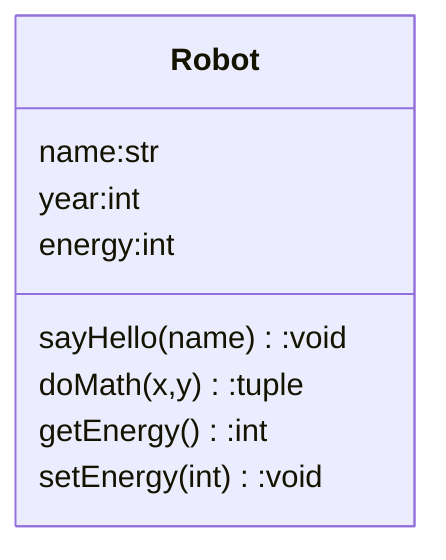
```mermaid
classDiagram
class Robot {
  name:str
  year:int
  energy:int
  sayHello(name):void
  doMath(x,y):tuple
  getEnergy():int
  setEnergy(int):void
}
```

### class basic
* [add attribute dynamically](../src/myclass/class01.py)
* [everythin in Python is class](../src/myclass/testRobot.py)
* [define function outside of class](../src/myclass/class02.py)
* [define function inside class](../src/myclass/class03.py)
* [define __init__()](../src/myclass/class04.py)
* [__init__(self, inputName=None)](../src/myclass/class05.py)
* [private attribute __energy](../src/myclass/class07.py)
* [getter, setter, property](../src/myclass/class08.py)

### dunder functions
* [__repr__(good enough) vs. __str__](../src/myclass/class06.py)
* [__init__(good enough) vs. __new__](../src/myclass/class09.py)
* [❓override __new__, return other class instance](../src/myclass/class10.py)
* [override __iter__, __next__, create iterable](../src/myclass/class15.py) 
* [range1 start from 1, include stop](../src/myclass/range1.py)
* [__call__() make object callable](../src/myclass/class22.py)
* [__eq__(check if same), __add__](../src/myclass/class24.py)
* [__eq__(), == vs is ](../src/myclass/class25.py)

### attribute scope
* [class level attribute](../src/myclass/class11.py)
* [instance level attribute](../src/myclass/class12.py)

### class tricks
* [override __new__, return other class instance](../src/myclass/class10.py)
* [pass outside function to class](../src/myclass/class13.py)
* [internal function call another internal](../src/myclass/class14.py)
* [nested class](../src/myclass/class20.py)
* [composition vs. inheritance](../src/myclass/class21.py)
* [class method, static method](../src/myclass/class23.py)
* [define a class as default value](../src/myclass/class26.py)

### class inheritance
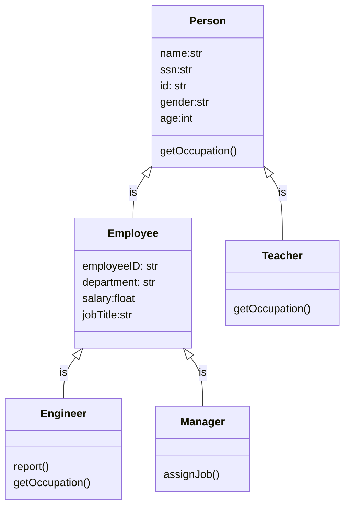
```mermaid
classDiagram
class Person {
  name:str
  ssn:str
  id: str
  gender:str
  age:int
  getOccupation()
}

class Employee{
  employeeID: str
  department: str
  salary:float
  jobTitle:str
}

class Engineer{
  report()
  getOccupation()
}

class Manager{
  assignJob()
}

class Teacher{
  getOccupation()
}

Person<|--Employee:is
Employee<|--Engineer:is
Employee<|--Manager:is
Person<|--Teacher:is
```
* [class inheritance, isinstance(obj, class)](../src/myclass/class16.py)
* [advatage of inheritance, inherite from Enum](../src/myclass/class17.py)
* [inherit from Enum](../src/myclass/class18.py)
* [multiple inheritance](../src/myclass/class19.py)

### Python Interface
[@abstractmethod](https://docs.python.org/3/library/abc.html)
[interface.py](../src/myclass/interface.py)

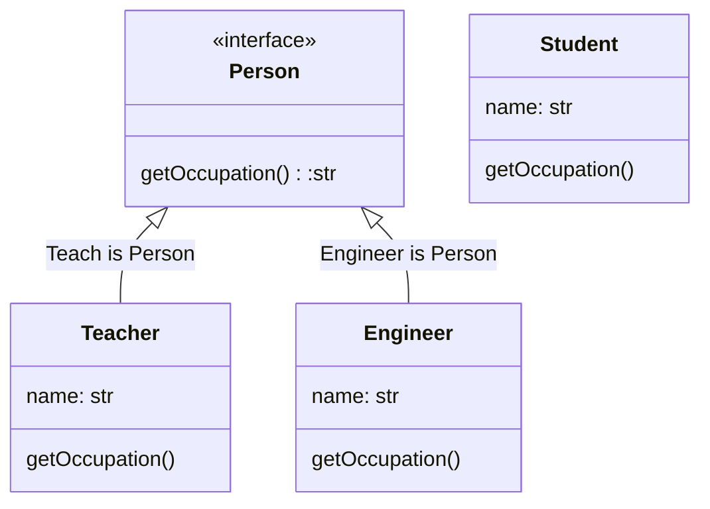
```mermaid
classDiagram

class Person {
  getOccupation():str
}

<<interface>> Person

class Teacher {
  name: str
  getOccupation()
}

class Engineer {
  name: str
  getOccupation()
}

class Student{
  name: str
  getOccupation()
}

Person<|--Teacher:Teach is Person
Person<|--Engineer:Engineer is Person
```
* @abstractmethod decorator from abc
* __subclasshook__(), __subclasscheck__(), issubclass(), isinstance()

### Unit Test
>A unit is a specific piece of code to be tested, such as a function or a class. Unit tests are then other pieces of code that specifically exercise the code unit with a full range of different inputs, including boundary and edge cases.

### Dunder Variables
* __doc__
* __name__
* __code__


### Global Variables

## Blackjack Game
### Blackjack Rules
* [Black Jack Rules](https://bicyclecards.com/how-to-play/blackjack/)
1. Object of the game: 
>beat the dealer by getting a count as close to 21 as possible, without going over 21
2. Card Values 
>ace is worth 1 or 11, J,Q,K are 10, other card is its pip value
3. Betting
>for simplicity, we don't bet.
4. Shuffle and cut
>the dealer shuffles the pack of card, no need player cut
5. Deal
>dealer gives one card face up to each player, and one card face up for himself. Another round of cards is then dealt face up to each player, but the dealer takes the second card face down.
6. Naturals
>If a player's first two cards are an ace and a "ten-card" (a picture card or 10), giving a count of 21 in two cards, this is a natural or "blackjack." If any player has a natural and the dealer does not, the dealer lose.  If the dealer has a natural, other doesn't, dealer win. If both dealer and player have natural, no body wins.
7. The Play
>any player on his turn must decide whether to "stand" (not ask for another card) or "hit" (ask for another card in an attempt to get closer to a count of 21, or even hit 21 exactly). Thus, a player may stand on the two cards originally dealt to them, or they may ask the dealer for additional cards, one at a time, until deciding to stand on the total (if it is 21 or under), or goes "bust" (if it is over 21). In the latter case, play loses the game. The dealer then turns to the next player and serves them in the same manner. The combination of an ace with a card other than a ten-card is known as a "soft hand," because the player can count the ace as a 1 or 11, and either draw cards or not. For example with a "soft 17" (an ace and a 6), the total is 7 or 17. While a count of 17 is a good hand, the player may wish to draw for a higher total. If the draw creates a bust hand by counting the ace as an 11, the player simply counts the ace as a 1 and continues playing by standing or "hitting" (asking the dealer for additional cards, one at a time).
8. The Dealer's Play
>When the dealer has served every player, the dealers face-down card is turned up. If the total is 17 or more, it must stand. If the total is 16 or under, they must take a card. The dealer must continue to take cards until the total is 17 or more, at which point the dealer must stand. If the dealer has an ace, and counting it as 11 would bring the total to 17 or more (but not over 21), the dealer must count the ace as 11 and stand. The dealer's decisions, then, are automatic on all plays, whereas the player always has the option of taking one or more cards.
9. No Splitting Pairs
10. No Doubing Down
11. No Insurance
12. Reshuffling when start new game.

### Object relationship
  
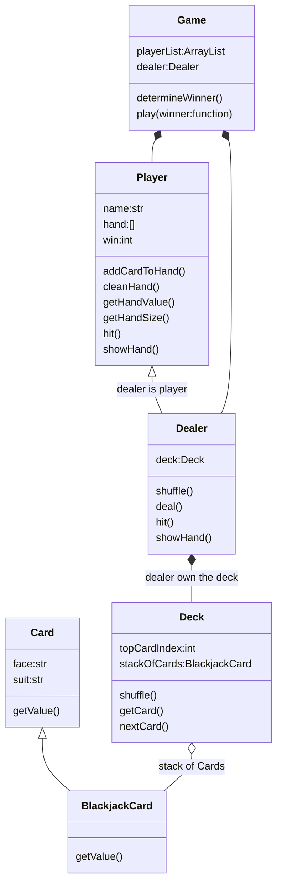
```mermaid
classDiagram
class Card {
  face:str
  suit:str
  getValue()
}

class BlackjackCard{
  getValue()
}

class Deck{
  topCardIndex:int
  stackOfCards:BlackjackCard
  shuffle()
  getCard()
  nextCard()
}

class Player{
  name:str
  hand:[]
  win:int
  addCardToHand()
  cleanHand()
  getHandValue()
  getHandSize()
  hit()
  showHand()
}

class Dealer {
  deck:Deck
  shuffle()
  deal()
  hit()
  showHand()
}

class Game{
  playerList:ArrayList<Player>
  dealer:Dealer
  determineWinner()
  play(winner:function)
}

Player<|--Dealer:dealer is player
Dealer *--Deck:dealer own the deck
Card<|--BlackjackCard
Deck o--BlackjackCard:stack of Cards
Game *-- Dealer
Game *-- Player
```
[blackjack](../src/blackjack.py)
[Unit test](../test/test_blackjack.py)

### Game logic
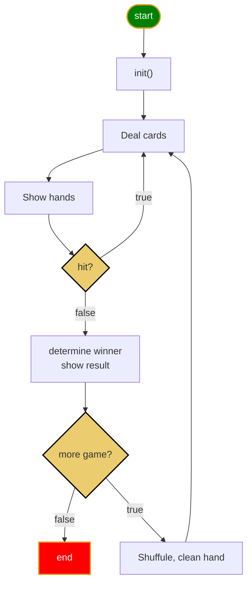
```mermaid
graph TB
A([start])
INIT["init()"]
B[Deal cards]
C[Show hands]
D{hit?}
F[determine winner<br>show result]
END[end]
AGAIN{more game?}
S[Shuffule, clean hand]

A-->INIT-->B-->C-->D
D--true-->B
D--false-->F-->AGAIN
AGAIN--false-->END
AGAIN--true-->S-->B

classDef start fill:green,stroke:#DE9E1F,stroke-width:2px,color:white;
classDef end1 fill:red,stroke:#DE9E1F,stroke-width:2px,color:white;
classDef if fill:#EBCD6F,stroke:black,stroke-width:2px;

class A start
class END end1
class D,AGAIN if
```
### Code Optimization
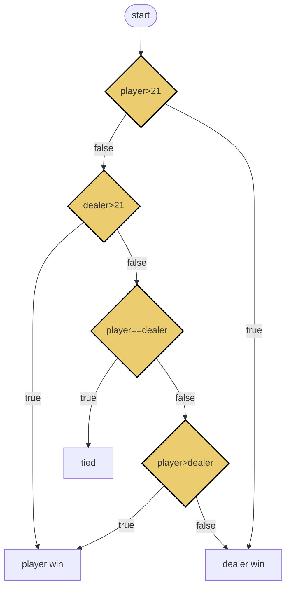
```mermaid
graph TB
START([start])
PLAYER[player win]
DEALER[dealer win]
TIED[tied]

A{player>21}
C{dealer>21}
D{player==dealer}
E{player>dealer}

START-->A
A--false-->C
A--true-->DEALER
C--true-->PLAYER
C--false-->
D--true-->TIED
D--false-->E
E--true-->PLAYER
E--false-->DEALER

classDef if fill:#EBCD6F,stroke:black,stroke-width:2px;

class A,D,C,E if
```
### missing unit tests
* player get 4 Ace
* player get 3 Ace
* player get 2 Ace

### Integration Test
❓What is Integration Test?
>✔️INTEGRATION TESTING is defined as a type of testing where software modules are integrated logically and tested as a group. A typical software project consists of multiple software modules, coded by different programmers. The purpose of this level of testing is to expose defects in the interaction between these software modules when they are integrated.

[Integration test](https://www.guru99.com/integration-testing.html)

✔️Play the Blackjack game by running Game class.

### Documentation
❓How to document Python code?
✔️

❓How to read Python code?
✔️

### Software development life cycle
* Test Driven Development (TDD)
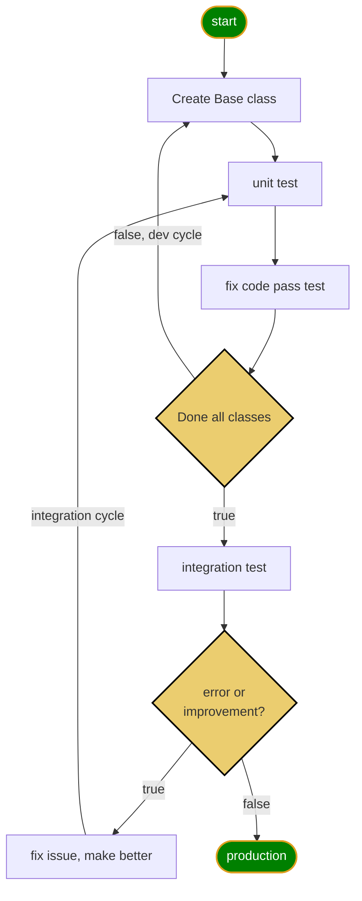
```mermaid
graph TB
START([start])
C[Create Base class]
UT[unit test]
F[fix code pass test]
DONE{Done all classes}
INT[integration test]
ERROR{error or <br>improvement?}
FIX[fix issue, make better]
PROD([production])

START-->C-->UT-->F-->DONE
DONE--true-->INT-->ERROR
DONE--false, dev cycle-->C
ERROR--true-->FIX--integration cycle-->UT
ERROR--false-->PROD

classDef if fill:#EBCD6F,stroke:black,stroke-width:2px;
classDef start fill:green,stroke:#DE9E1F,stroke-width:2px,color:white;

class ERROR,DONE if
class START,PROD start
```
* After integration test, we find
❗️missing test of 2,3,4 Ace?
✔️modify getHandValue() method defined in Player class, put if condition in for loop.
[test2Ace(),test3Ace(),test4Ace()](../test/com/huaxia/blackjack/PlayerTest.java)
❌we treat one Ace more than one time!
✔️
```py
    def getHandValue(self):
        value = 0
        for card in self.hand:
            value += card.getValue()
        a = self.numberAce()
        while value > 21 and a>0: # A=11,
            value -= 10 # change A=1
            a -= 1
        return value

    def numberAce(self):
        count = 0; 
        for card in self.hand:
            if card.face == 'A':
                count += 1
        return count # return number of Ace in hand

```
❗️the determineWinner() method looks ugly
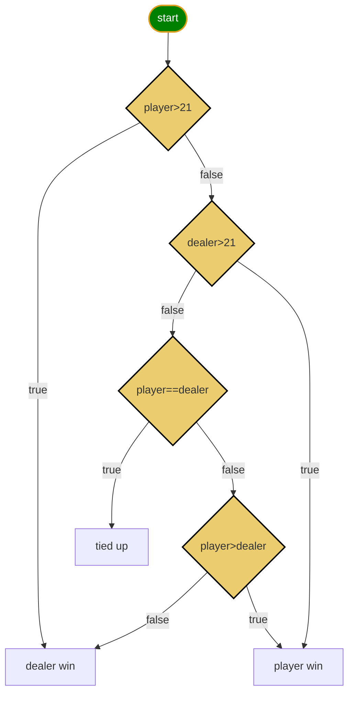
```mermaid
graph TB

START([start])
A{player>21}
DEALER[dealer win]
B{dealer>21}
PLAYER[player win]
C{player==dealer}
TIED[tied up]
D{player>dealer}

START-->A--true-->DEALER
A--false-->B
B--false-->C
B--true-->PLAYER
C--true-->TIED
C--false-->D
D--false-->DEALER
D--true-->PLAYER

classDef if fill:#EBCD6F,stroke:black,stroke-width:2px;
classDef db fill:#BEBDB7,stroke:black,stroke-width:2px;
classDef start fill:green,stroke:#DE9E1F,stroke-width:2px,color:white;

class START start
class A,B,C,D if
```
## Yahtzee Dice Game
[Yahtzee Dice Game](https://www.dicegamedepot.com/yahtzee-rules/)

## File Access

* [write plain text to file Hello.txt](../src/file/file0.py)
* [read/append plain text from/fo file](../src/file/file1.py)
* [read text file](../src/file/file7.py)
* [with open](../src/file/file2.py)
* [read CSV file using csv module](../src/file/csvReader1.py)
* [read CSV file using pandas](../src/file/csvReader2.py)
* [read large CSV file pokemon.csv](../src/file/csvReader3.py)
* [write dict to CSV file](../src/file/file6.py)
* [write json file](../src/file/file3.py)
* [read json file](../src/file/file3a.py)
* [load json string as dict](../src/file/file3b.py)
* [use pandas read json file](../src/file/file4.py)
* [plot student score](../src/file/file5.py)
* [list all files in directory](../src/file/dir.py)
  
## nmpy
❓ What is numpy module in python?
>✔️NumPy is the fundamental package for scientific computing in Python. It is a Python library that provides a multidimensional array object, various derived objects (such as masked arrays and matrices), and an assortment of routines for fast operations on arrays, including mathematical, logical, shape manipulation, sorting, selecting, I/O, discrete Fourier transforms, basic linear algebra, basic statistical operations, random simulation and much more.

[website](https://www.tutorialspoint.com/numpy/numpy_dot.htm)

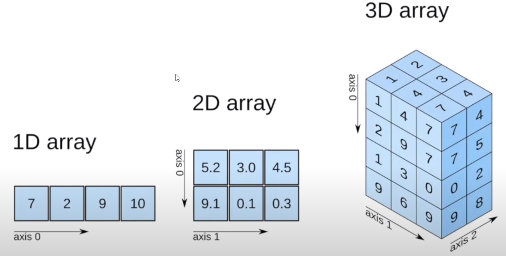

* Mathematics(MATLAB Replacement)
* Plotting (Matplotlib)
* Backend(Pandas, Connect 4, Digital Photography)
* Machine Learning

* [array basics](../src/numpy/numpy01.py)
* [Homework 01](../src/numpy/numpyHW01.md)
* [Homework 01 solution](../src/numpy/numpyHW01.py)
* [linear algebra](../src/numpy/numpy02.py)
* [read data from file](../src/numpy/numpy03.py)

## pandas
* [simple curves](../src/datavisualization/dataanalysis01.py)
* [Covid-19](../src/datavisualization/dataanalysis02.py)

## Plot
* [plot list](../src/plot/plot0.py)
* [plot sine wave](../src/plot/plot1.py)
* [plot both sine and cosine wave](../src/plot/sin-cos.py)
* [plot 3 functions in one chart](../src/plot/plot2.py)
* [plot 6 lines in one chart with legend](../src/plot/plot3.py)
* [multiple pages with title icon](../src/plot/plot4.py)
* [stack plot with custom color](../src/plot/plot5.py)
* [box plot with data list](../src/plot/plot6.py)
* [box plot with random data](../src/plot/plot7.py)
* [errorbar plot](../src/plot/plot8.py)
* [circle pie chart](../src/plot/plot9.py)
* [3D pie chart](../src/plot/plot10.py)
* [4 sub plots in one page](../src/plot/plot11.py)
* [4 sub plots with each lenged](../src/plot/plot12.py)
* [adjust plot programtically](../src/plot/plot13.py)
* [math symbol in legend](../src/plot/plot14.py)
* [custom tick label](../src/plot/plot15.py)
* [custom tick for sine wave](../src/plot/plot16.py)
* [color ticks](../src/plot/plot17.py)
* [remove chart box lines](../src/plot/plot18.py)
* [add grid to chart](../src/plot/plot19.py)
* [curve fit](../src/plot/plot20.py)
* [change background to dark](../src/plot/plot21.py)
* [log style](../src/plot/plot22.py)
* [generate animated sine wave](../src/plot/movingSinWave.py)
* [3D animation generator](../src/plot/3dAnimation.py)

[padans DataFrame](https://pandas.pydata.org/pandas-docs/stable/user_guide/visualization.html)

## Clean Code
[Clean code](Clean-Code.pdf")

### Design Principles SOLID

[SOLIS website](https://stackify.com/solid-design-principles/)

1. Single Responsibility principle
  >A class should have one, and only one, reason to change. You need to change your class as soon as one of its responsibilities changes. it makes your software easier to implement and prevents unexpected side-effects of future changes.
2. Open/Close Pricinple
  >Software entities (classes, modules, functions, etc.) should be open for extension, but closed for modification.
3. Liskov Substitution Principle
   >Let Φ(x) be a property provable about objects x of type T. Then Φ(y) should be true for objects y of type S where S is a subtype of T.

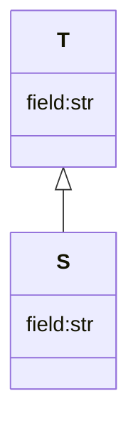
```mermaid

classDiagram

class T{
  field:str
}

class S{
  field:str
}

T<|--S
```

$$ \phi (x) = \phi (y) $$
where 

```py
x = T()
y = S()
```

4. Interface Segregation Principle
  >Clients should not be forced to depend upon interfaces that they do not use.”
5. Dependency Inversion
  >High-level modules, which provide complex logic, should be easily reusable and unaffected by changes in low-level modules, which provide utility features. 
  
应变（requirements change over time. least code change on requirement changes.）

## Turtle
[turtle document](https://docs.python.org/3/library/turtle.html)

* [Open window](../src/myturtle/turtle1.py)
* [move turtle](../src/myturtle/turtle2.py)
* [mouse click move turtle](../src/myturtle/turtle3.py)
* [Randomly moving turtle on mouse click.](../src/myturtle/turtle4.py)
* [limit the turtle within window bounds](../src/myturtle/turtle5.py)
* [turtle moving within certain area.](../src/myturtle/turtle6.py)
* [Display cards on turtle screen](../src/myturtle/turtle7.py)
* [draw star](../src/myturtle/turtle8.py)
* [draw half circle](../src/myturtle/turtle9.py)
* [draw spiral turtle](../src/myturtle/turtle10.py)
* [draw dragon curve](../src/myturtle/dragonCurve.py)
* [draw sun and house](../src/snowman/drawSun.py)
* [draw snowman by using class Snowman](../src/myclass/drawSnowMan.py)
* [draw ellipse](../src/myturtle/ellipse.py)
* [define functions for line, triangle, circle and rectangle](../src/myturtle/shapes.py)


## SQLite
CRUD: Create, Retrieve, Update, Delete

* [Create database, table](../src/sqlite/sqlite01.py)
* [Insert many rows](../src/sqlite/sqlite02.py)
* [Retrive data](../src/sqlite/sqlite03.py)
* [Update data](../src/sqlite/sqlite04.py)
* [Delete data](../src/sqlite/sqlite05.py)
* [One-to-Many Create table](../src/sqlite/sqlite06.py)

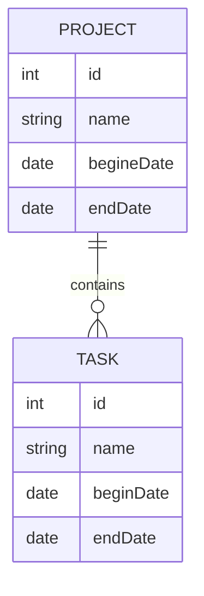
```mermaid
 erDiagram
    PROJECT ||--o{ TASK : contains
    PROJECT {
        int id
        string name
        date begineDate
        date endDate
    }
    TASK {
        int id
        string name
        date beginDate
        date endDate
    }
```
* [Create one-to-many data](../src/sqlite/sqlite07.py)
* [Retrieve one-to-many data](../src/sqlite/sqlite08.py)
* [Create books table](../src/sqlite/sqlite9.py)
* [insert sample books](../src/sqlite/sqlite10.py)
* [many-to-many relationship, DB helper](../src/sqlite/sqlite11.py)
* [Product, Provider class](../src/sqlite/sqlite12.py)
* [CRUD for books](../src/sqlite/sqlitebookdb.py)


## MongoDB
❓What is MongoDB?
✔️One of NoSQL database application written in C++.
1. stores data in JSON-like documents that can have various structures
2. uses dynamic schemas, which means that we can create records without predefining structure such as SQL relational database table.
3. the structure of a record can be changed simply by adding new fields or deleting existing ones.

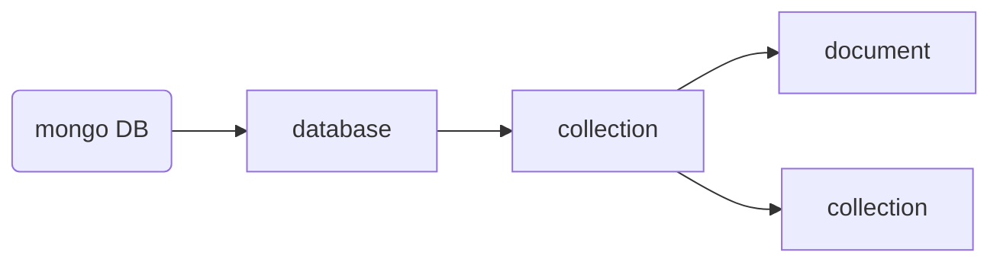
```mermaid
graph LR

MONGO(mongo DB)
D[database]
C[collection]
DOC[document]
COL[collection]

MONGO-->D-->C-->DOC & COL
```
4. document database
5. key-value database 

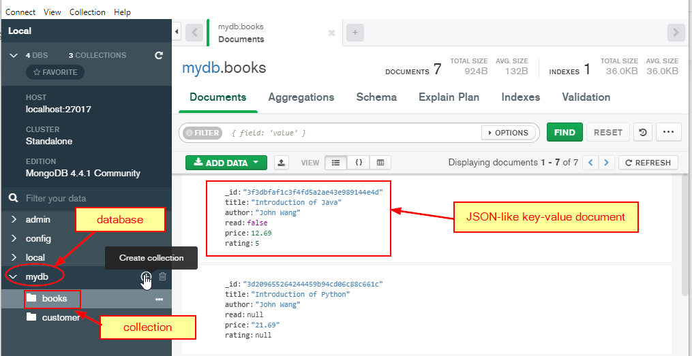

❓What is NoSQL database?
✔️NoSQL databases (aka "not only SQL") are non tabular, and store data differently than relational tables. NoSQL databases come in a variety of types based on their data model. The main types are document, key-value, wide-column, and graph. They provide flexible schemas and scale easily with large amounts of data and high user loads.

❓What is SQL?
✔️SQL stands for Structured Query Language specially for relational database.
SQLite: Python built in SQL database.

## tkinter(windows based GUI)

[image converter, mp4>gif, png>ico](https://cloudconvert.com/)

❓What is tkinter?
>✔️This framework provides Python users with a simple way to create GUI elements using the widgets found in the Tk toolkit. Tk widgets can be used to construct buttons, menus, data fields, etc. in a Python application.
* [Good tkinter document online](https://anzeljg.github.io/rin2/book2/2405/docs/tkinter/scale.html)
* [YouTube tutorial](https://www.youtube.com/watch?v=YXPyB4XeYLA)

in tkinter everyting is widget

### open window
* [open window with title](../src/tkinter/tkinter1.py)

### Label, Button, Entry widgets
* [Add label to window](../src/tkinter/tkinter2.py)
#### pack attributes
  * after=widget1 - pack this widget after widget1
  * before=widget1 - pack this widget before widget1
  * anchor='border' - where **border** must be n, ne, e, se, s, sw, w, nw, or center 
  * fill=NONE, or X, Y, BOTH
  * padx, pady
  * ipadx, ipady
  * side='top', 'left', 'right', 'bottom'
* [dynamically change label text](../src/tkinter/tkinter46.py)
* [change font of the label](../src/tkinter/tkinter3.py)
  - 💡Find available font: ✔️Control Panel ⇒ Apperance and Personalization ⇒ Fonts
  - [font folder location](C:\Windows\Fonts)
* [add button](../src/tkinter/tkinter4.py)
* [button action > print text on console](../src/tkinter/tkinter6.py)
* [lambda expression on button action](../src/tkinter/tkinter48.py)
* [button, quit, icon, image](../src/tkinter/tkinter53.py)
>In order to use PIL, you need install module Pillow
```
pip install Pillow
```
* [use tkinter Entry](../src/tkinter/tkinter47.py)

### pack layout
* [GUI Layout Management>pack](../src/tkinter/tkinter26.py)
* [pack(fill=tk.X)](../src/tkinter/tkinter27.py)
* [w.pack(fill=tk.X, padx=10, pady=5)](../src/tkinter/tkinter28.py)
* ☝️[pack(fill=tk.X, pady=10)](../src/tkinter/tkinter29.py)
* [pack(padx=5, pady=10, side=tk.LEFT)](../src/tkinter/tkinter30.py)

### grid layout
* [Grid system](../src/tkinter/tkinter50.py)

### place layout
* [Place system](../src/tkinter/tkinter51.py)

### icon and title
* [Place system](../src/tkinter/tkinter52.py)
* 
### Other widgets
* [using Combox, dropdown box](../src/tkinter/tkinter7.py)
* [using checkbox](../src/tkinter/tkinter8.py)
* [using spinbox](../src/tkinter/tkinter9.py)
* [using text field](../src/tkinter/tkinter10.py)
* [using form](../src/tkinter/tkinter11.py)
* [radio button](../src/tkinter/tkinter55.py)
* [using radio button and message box](../src/tkinter/tkinter12.py)
* [using yes/no, ok/cancel message](../src/tkinter/tkinter57.py)
* [Same as above, use pack instead of grid](../src/tkinter/tkinter13.py)
* [using scrolled text](../src/tkinter/tkinter14.py)
* [using progress bar](../src/tkinter/tkinter15.py)
* [enable/disable button](../src/tkinter/tkinter16.py)
* [using list box](../src/tkinter/tkinter17.py)
* [same as above with multiple selection](../src/tkinter/tkinter18.py)
* [using dialog](../src/tkinter/tkinter19.py)
* [using tk.Frame](../src/tkinter/tkinter20.py)
* [close window call back, display image](../src/tkinter/tkinter21.py)
* [using filedialog](../src/tkinter/tkinter22.py)
* [better version of tkinter22](../src/tkinter/tkinter23.py)
* [using save file dialog](../src/tkinter/tkinter24.py)
* [menubar = tkinter.Menu(root)](../src/tkinter/tkinter25.py)
* [slider (Scale)](../src/tkinter/tkinter59.py)
* [Scale: command](../src/tkinter/tkinter60.py)
  😄👍[Good website](https://anzeljg.github.io/rin2/book2/2405/docs/tkinter/scale.html)

### color
* [random background color](../src/tkinter/tkinter31.py)
* [built in color list](../src/tkinter/tkinter32.py)

### mouse 
* [mouse double click](../src/tkinter/tkinter33.py)
* [mouse position](../src/tkinter/tkinter34.py)

### table
* [create a table](../src/tkinter/tkinter35.py)

### canvas
* [using canvas draw pie chart](../src/tkinter/tkinter36.py)
* [draw line in canvas](../src/tkinter/tkinter5.py)
* 👎😢[data not available](../src/tkinter/tkinter37.py)

### tab window frame
* [tab window](../src/tkinter/tkinter38.py)

### titled frame
* [titled frame](../src/tkinter/tkinter39.py)
* [using frame](../src/tkinter/tkinter56.py)
* [open more than one window](../src/tkinter/tkinter58.py)

### plot chart in tkinter
* [canvas.draw() chart on canvas](../src/tkinter/tkinter40.py)
* [plot chart dynamically](../src/tkinter/tkinter41.py)

### display image
* [display image on frame](../src/tkinter/tkinter42.py)
* [deal cards in window](../src/tkinter/tkinter43.py)

### popup window
* [popup window](../src/tkinter/tkinter45.py)

### card game GUI
* [card game gui](../src/tkinter/tkinter44.py)

### sqlite DB
DB basic operations >> CRUD: Create, Retrieve, Update, Delete
* [Add record to DB >> Create](../src/tkinter/tkinter61.py)
* [Load records from DB >> Retrieve](../src/tkinter/tkinter62.py)
* [Modify record >> Update](../src/tkinter/tkinter63.py)
* [Delete record >> Delete](../src/tkinter/tkinter64.py)

### Web Service API
[Air Now Login](https://docs.airnowapi.org/login?index=)
wangqianjiang/Qianjiang1122
API Key: 84B7917D-C980-407F-ACBC-B29E3D2E4458

### Application
* [calculator](../src/tkinter/calculator.py)
* [tic tac toe](../src/tkinter/tictaktoe.py)
* [Temperature Converter](../src/tkinter/temperatureConverter.py)
* [image viewer](../src/tkinter/imageViewer.py)
* [Date interval calculator](../src/tkinter/dateInterval.py)

[隶书字体下载网站](https://www.fonts.net.cn/fonts-zh/tag-lishu-1.html)

## Data Structure
### stack
❓What is stack?
✔️a stack is an abstract data type that serves as a collection of elements, with two main principal operations: (LIFO) last in first out.

1. Push(), which adds an element to the collection, and
2. Pop(), which removes the most recently added element that was not yet removed.
you have list of element, stack each other.
3. empty(), returns whether the stack is empty
4. size(), returns the size of the stack
5. top(), returns a reference to the top most element of the stack


* [stack.py](../src/structure/stack.py)

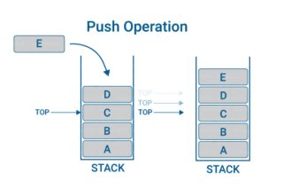

### queue
❓What is queue?
✔️A Queue is a linear structure which follows a particular order in which the operations are performed. The order is First In First Out (FIFO).


1. Enqueue: Adds an item to the queue. If the queue is full, then it is said to be an Overflow condition – Time Complexity : O(1)
2. Dequeue: Removes an item from the queue. The items are popped in the same order in which they are pushed. If the queue is empty, then it is said to be an Underflow condition – Time Complexity : O(1)
3. Front: Get the front item from queue – Time Complexity : O(1)
4. Rear: Get the last item from queue – Time Complexity : O(1)

1. push(): insert a new data into the queue
2. pop(): return the front data in the queue, and remove it from the queue
3. peek()/top(): return the front data in the queue without remove it
 
### Priority Queue
❓What is priority queue?

✔️Priority Queue is an extension of queue with following properties.

1. Every item has a priority associated with it.
2. An element with high priority is dequeued before an element with low priority.
3. If two elements have the same priority, they are served according to their order in the queue.

* [priorityqueue.py](../src/structure/priorityqueue.py)
* [priorityqueue2.py](../src/structure/priorityqueue2.py)
* [priorityqueue3.py](../src/structure/priorityqueue3.py)

### Linked list
❓What is linked list?
✔️A linked list is a sequence of data elements, which are connected together via links.


[Linked list](../src/structure/linkedlist.py)

❓Why do I need use linked list?
✔️Insert new node in list is expensive because all elements on right-hand side need to be shifted.


### doubly linked list
[doubly linked data list](../src/structure/doubleLinkedList.py)


## Functional Programing
❓What is functional programming?
✔️ functional programming is a programming paradigm where programs are constructed by applying and composing functions. functional programming is a programming paradigm where programs are constructed by applying and composing functions. Goal oriented

### Function decorator(timer)
* [Understand my wrapper function](../src/timerDecorator/my_timer1.py)
* [add decorator to any function](../src/timerDecorator/my_timer2.py)
* [pass function to class](../src/timerDecorator/my_timer3.py)
* [timer](../src/timerDecorator/my_timer.py)


### Lambda expression
❓What is lambda function?
✔️A Lambda Function in Python programming is an anonymous function or a function having no name.

* Syntax
```py
lambda <variable list separated by comma>: expression
print(lambda x, y: x + y)
```


* [map ](../src/functional/lambda01.py)

### map() function
❓What is map() function?
>✔️ the map() function is processing iterables without loop.

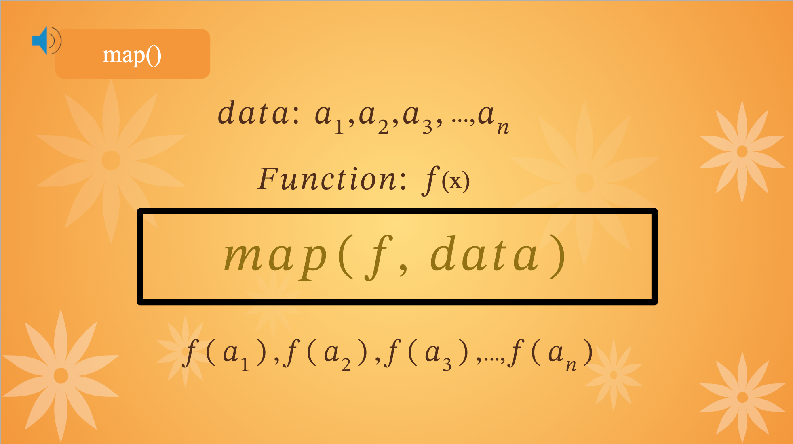

```
map(func, *iterables) --> map object
map(lambda x:x*x, list1)
map(lambda x,y:x+y, tuple1, tuple2)
```
1. map() takes two argument, a function and an iterable data
2. map() applys the given function to each element in the iterable
3. map() return a map object which is iterable and can be converted to list or tuple

[map 2 list to one](../src/functional/map0.py)
[convert temperature](../src/functional/map1.py)
[understand map() function](../src/functional/map2.py)
[map with multiple iterables](../src/functional/map3.py)
[convert temperature](../src/functional/map4.py)
[map with multiple iterables](../src/functional/map5.py)
[map vs. for-loop](../src/functional/map6.py)

### filter() function
❓What is filter() function?
✔️Return an iterator yielding those items of iterable for which function(item) |  is true. If function is None, return the items that are true.

```
filter(function or None, iterable) --> filter object
filter(lambda x:x%2==0, list1)
```
* [](../src/functional/filter0.py)
* [](../src/functional/filter1.py)
* [](../src/functional/filter2.py)

* filter object is iterable and can be converted to list or tuple
[get all prime number from 2 to n](../src/functional/prime.py)
[func.py](../src/functional/func.py)
[lambda02.py](../src/functional/lambda02.py)

### reduce() function
❓What is reduce() function?
✔️The reduce(fun,seq) function is used to apply a particular function passed in its argument to all of the list elements

* [sum over iterable](../src/functional/reduce01.py)
* [find max and min](../src/functional/reduce02.py)
* [multiply all elements](../src/functional/reduce03.py)

### sort() function
❓How to use sort function?

✔️sort dict
* [sort car dict by year](../src/functional/sort0.py)

✔️sort list by lambda expression
* [sort temperature by city](../src/functional/sort1.py)
* [reverse sort by temperature](../src/functional/sort2.py)

✔️sort list with tuple element
* [sort list](../src/functional/sort3.py)

### zip() function
* [Combine city with temperatur](../src/functional/zip1.py)
* [combine list](../src/functional/zip2.py)
* [matrix operation](../src/functional/zip3.py)
* [understand zip() function](../src/functional/zip4.py)


### Calculate Square root

$$ a_{i+1} = \frac {(a_i + \frac n {a_i})} 2 $$
$$ a_1 = f(a_0) $$
$$ a_2 = f(f(a_0)) $$

* [Function chain](../src/functional/squareRoot.py)

### Non-strict evaluation
* [Lasy or non-strict evaluation](../src/languageBasics/operator/logical.py)
* [pure function](../src/functional/pureFunction.py)
❓ What is a pure function?
>✔️A pure function is a function whose output value follows solely from its input values, without any observable **side effects**.

❓ Why use functional programming?
✔️ The functional paradigm is popular because it offers several advantages over other programming paradigms.
1. **High level**: You’re describing the result you want rather than explicitly specifying the steps required to get there. Single statements tend to be concise but pack a lot of punch.
2. **Transparent**: The behavior of a pure function depends only on its inputs and outputs, without intermediary values. That eliminates the possibility of side effects, which facilitates debugging.
3. **Parallelizable**: Routines that don’t cause side effects can more easily run in parallel with one another.

❓ How Python support functional programming?
✔️two features:
1. To take another function as an argument
2. To return another function to its caller

### monad
❓ Why use monad?
✔️ to solve very common program issues
1. Null pointer exception.
2. function call failure.

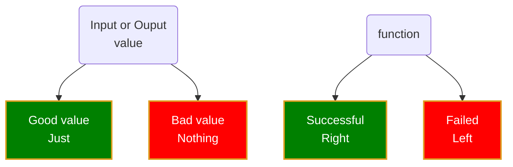
```mermaid
graph TB

A(Input or Ouput<br>value)
B[Good value<br>Just]
C[Bad value<br>Nothing]

A-->B & C

D(function)
E[Successful<br>Right]
F[Failed<br>Left]

D-->E & F

classDef good fill:green,stroke:#DE9E1F,stroke-width:2px,color:white;
classDef bad fill:red,stroke:#DE9E1F,stroke-width:2px,color:white;

class B,E good
class C,F bad
```
* [None value and function failure](../src/functional/whyWrapperBox.py)
```py
def neg(num):
  return -num

x = 10
y = str(neg(int(x)))
```

if x is not an intege string, cause software blows up.
* [avoid function call failure](../src/functional/whyMonad1.py)
* [blows up](../src/functional/whyMonad2.py)
* [List monad](../src/functioal/../functional/whyMonad3.py)

❓What is monad?
>✔️ A monad is a design pattern that allows us to add a context to data values, and also allows us to easily compose existing functions so that they execute in a context aware manner.
✔️a monad is an abstraction that allows structuring programs generically. 

* In English dictionary, monad is
✔️Unit, one; Atom sence; 
✔️an elementary individual substance which reflects the order of the world and from which material properties are derived

❓ How does the monad solve those two issues?
✔️ box value, return either

* [kleisli Compose](../src/functional/kleisliCompose.py)

[Definition of Monad](https://www.merriam-webster.com/dictionary/monad)

✔️Wrapper Class type with implementation of fmap(), amap() and bind() functions. 

* One to wrap values of any basic type within the monad (yielding a monadic value);
* Another to compose functions that output monadic values (called monadic functions).

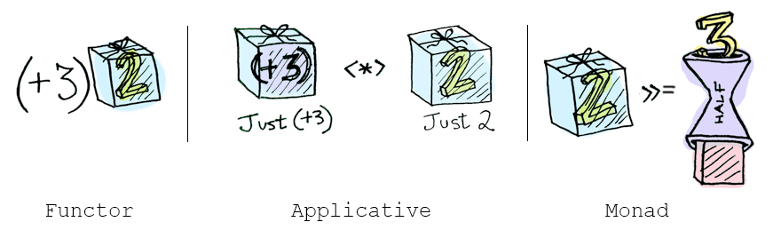
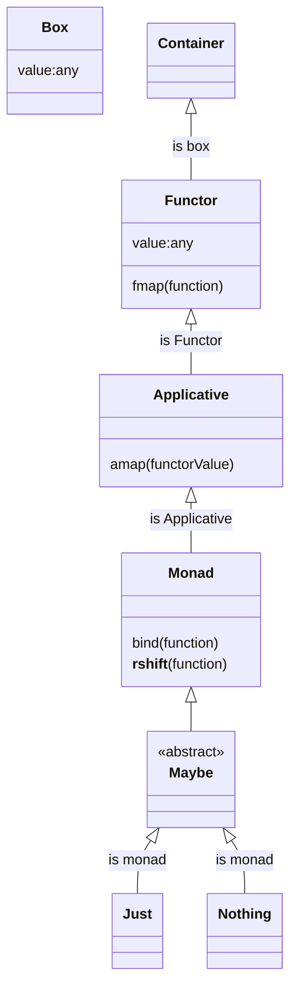
```mermaid
classDiagram

class Box{
  value:any
}
class Functor{
  value:any
  fmap(function)
}
class Applicative{
  amap(functorValue)
}
class Monad{
  bind(function)
  __rshift__(function)
}
Container<|--Functor:is box
Functor<|--Applicative: is Functor
Applicative<|--Monad: is Applicative
Monad<|--Maybe
Maybe<|--Just:is monad
Maybe<|--Nothing: is monad

<<abstract>> Maybe

```
* [Functor.py](../src/functional/functor.py)
  
❓ What is functors?
✔️you apply a function to a wrapped value using map
implement fmap() function: functor map

❓what is applicatives?
✔️you apply a wrapped function to a wrapped value using apply, if defined
implement amap() function: applicative map

❓what is monads
✔️you apply a function that returns a wrapped value, to a wrapped value using flatMap.
implement bind() function: binding function
✔️ Override binding operator (*, >>)

* [Understand functor, applicative, monad](../src/functional/box.py) 
* [Functor >> bind](../src/functional/math1.py)
* [Applicative](../src/functional/monad2.py)
* [Applicative](../src/functional/applicative.py)
* [Applicative](../src/functional/monad3.py)
* [.then() fuction chain for applicative](../src/functional/monad13.py)
* [ReactiveX](../src/functional/math2.py)
* 😢[monad01.py](../src/functional/monad01.py)
* ✔️[operate a founction to a boxed value](../src/functional/monad1.py)
* [Understand Functor, applicative, monad](../src/functional/monad02.py)
* [Monad >> bind](../src/functional/monad03.py)
* [Compose funtion chain](../src/functional/monad4.py)
* [Compose function chain head tail](../src/functional/monad5.py)
* [@curry function decorator](../src/functional/monad6.py)
* [Use ListMonad create list, then do then() or map()](../src/functional/monad7.py)
* [applicative handle error](../src/functional/monad8.py)
* [ListMode and monad bind()](../src/functional/monad9.py)
* [Monad bind](../src/functional/monad10.py)
* [Use Maybe solve the None issue](../src/functional/monad11.py)
* [Maybe.maybe() function](../src/functional/monad12.py)
* [How applicative works](../src/functional/monad13.py)
* [process to write code in VSCode](../src/functional/writePythonMonad.py)
* [Shopping function list](../src/functional/shoppingMonad1.py)
* [observer pattern](../src/functional/shoppingMonad2.py)
* [map shopping functions](../src/functional/shoppingMonad3.py)
  
❓ what is fmap?
>✔️Applies 'function' to the wrapper box value and returns a new wrapper box value
✔️We have a polymorphic type f, and fmap gives us the ability to:
1. Liberate a pure value from the type constructor that refers to it
2. Call a function on it, which could return a result of a different type
3. Have the type constructor refer to the type of the result

❓ what is amap?
>✔️Applies the function stored in the functor to the value of 'functorValue',
		returning a new wrapper box value.


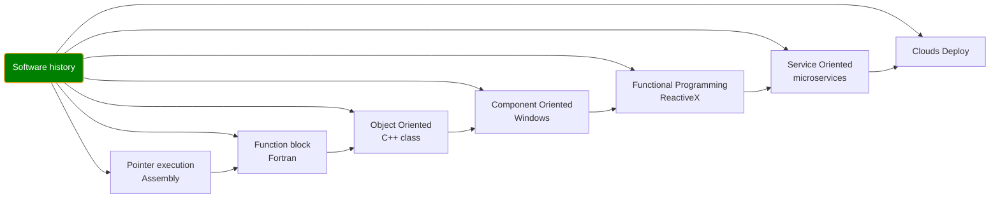
```mermaid
graph LR

H(Software history)
A[Pointer execution<br>Assembly]
FORTRAN[Function block<br>Fortran]
C[Object Oriented<br>C++ class]
FUNC[Functional Programming<br>ReactiveX]
COMP[Component Oriented<br>Windows]
SERV[Service Oriented<br>microservices]
CLOUDS[Clouds Deploy]

H --> A & FORTRAN & C & COMP & FUNC & SERV & CLOUDS

A-->FORTRAN-->C -->COMP-->FUNC-->SERV-->CLOUDS

classDef start fill:green,stroke:#DE9E1F,stroke-width:2px,color:white;

class H start
```

### Either
❓ Any application service
✔️
* [](../src/functional/either0.py)
* [check a even number](../src/functional/either1.py)
* [return Right/Left](../src/functional/either2.py)
* [bind functions](../src/functional/either3.py)
* [circle area Either](../src/functional/circle3.py)

❓ what is flatmap?
✔️FlatMap differs from Map in a key way. Instead of the Map operation returning an Option automatically, it instead requires that the function passed to it return an Option type result itself. That is, while Map returns an Option, FlatMap returns a value (or None value) for each option, regardless of whether it is a “something” or a “nothing” and requires that the input method applied return an Option type response.

* 👎[Understnd map vs flatmap](../src/functional/mymonad0.py)
* [Understand monad map vs flatmap](../src/functional/mymonad.py)
* [mymonad: Some or Nil](../src/functional/option1.py)
* [pymonad implementation](../src/functional/option2.py)
* [map() function as Functor](../src/functional/mymonad1.py)
* [Understand Either and flat_map](../src/functional/myeither.py)
* [simulate aireline tickets](../src/functional/airlineticket.py)


## Design pattern

### Reactivex design pattern
❓ What is ReactiveX?
✔️Reactive programming is a programming paradigm, that deals with data flow and the propagation of change. It means that, when a data flow is emitted by one component, the change will be propagated to other components by a reactive programming library. The propagation of change will continue until it reaches the final receiver.

[ReactiveX design pattern](https://www.tutorialspoint.com/rxpy/rxpy_examples.htm)


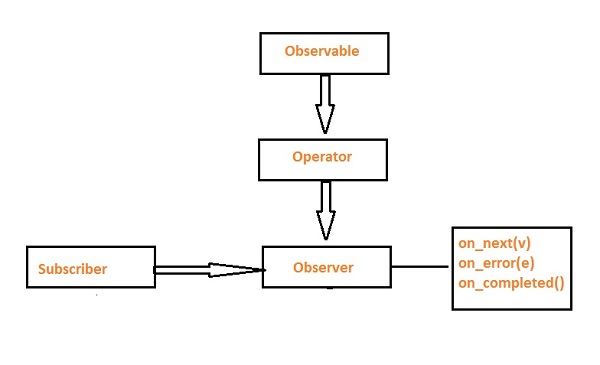

```mermaid
graph TB

Obs[Observable]
Op[Operator]
Ob[Observer]
Sub[Subscriber]
Func["on_next(v)<br>on_error(e)<br>on_completed()"]

Obs-->Op-->Ob
Sub-->Ob
Ob---Func
```
* [use 'of' to create observable](../src/designPattern/rx01.py)
* [use 'create' to create observable](../src/designPattern/rx02.py)
* [use 'pipe' function and operator](../src/designPattern/rx03.py)
* [Define processor first, pass data later](../src/designPattern/rx04.py)
  
where RxPY offers operators such as
* Mathematical operators (average, concat, count, max, min, reduce,sum)
* Transformation operators (buffer, ground_by, map, scan)
* Filtering operators (distinct, element_at, filter, first, ignore_element, last, skip, take)
* Error handling operators (catch, retry)
* Utility operators (delay, time_interval, timeout, timestamp)
* Conditional operators
* Creation operators
* Connectable operators
* Combining Operators

❓What is Observable?
>✔️ An observable is a function that creates an observer and attaches it to the source having data streams that are expected from, for example, Tweets, computer−related events, etc.
✔️ Data Stream

❓ What is Observer?
✔️ It is an object with on_next(), on_error() and on_completed() methods, that will get called when there is interaction with the observable i.e. the source interacts for an example incoming Tweets, etc.
✔️ Who process Data Stream

❓ What is Subscription?
✔️ When the observable is created, to execute the observable we need to subscribe to it.
✔️ trigger above process

❓ What are Operators?
✔️ An operator is a pure function that takes in observable as input and the output is also an observable. You can use multiple operators on an observable data by using the pipe operator.

❓ What is Subject?
✔️ A subject is an observable sequence as well as an observer that can multicast, i.e. talk to many observers that have subscribed. The subject is a cold observable, i.e. the values will be shared between the observers that have been subscribed.

❓ What is Subscription?
✔️ When the observable is created, to execute the observable we need to subscribe to it.

❓ Advantages of using RxPy?
✔️the following
* RxPY is an awesome library when it comes to the handling of async data streams and events. RxPY uses observables to work with reactive programming that deals with asynchronous data calls, callbacks and event-based programs.
* RxPY offers a huge collection of operators in mathematical, transformation, filtering, utility, conditional, error handling, join categories that makes life easy when used with reactive programming.
* Concurrency i.e. working of multiple tasks together is achieved using schedulers in RxPY.
* The performance is improved using RxPY as handling of async task and parallel processing is made easy.

❓ Disadvantage of using RxPY
✔️ Debugging the code with observables is a little difficult.