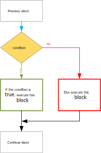
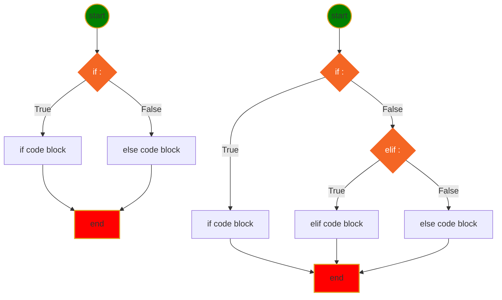
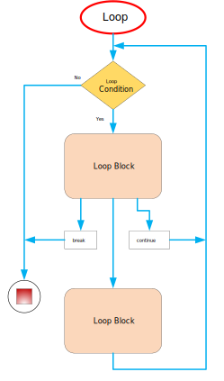
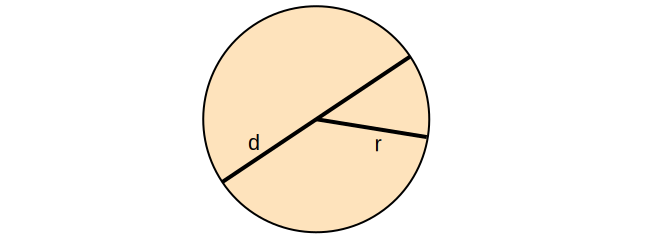
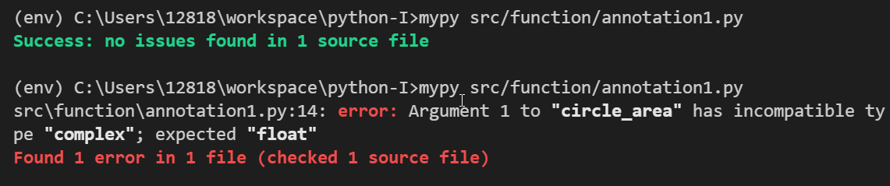
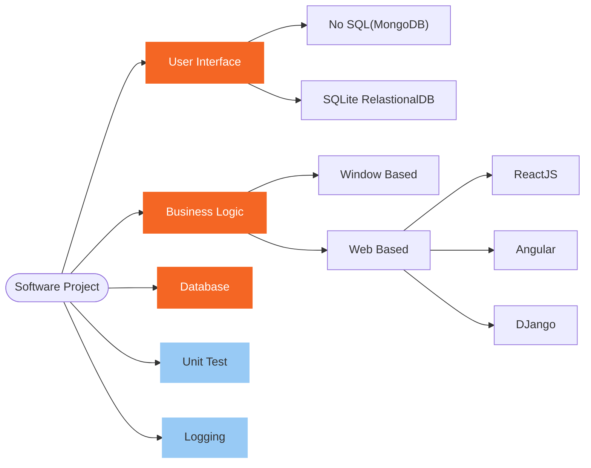
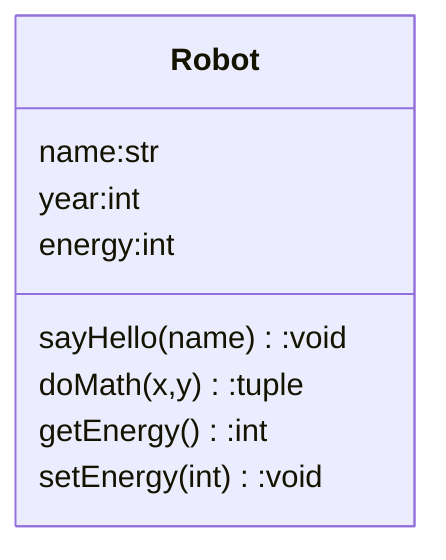
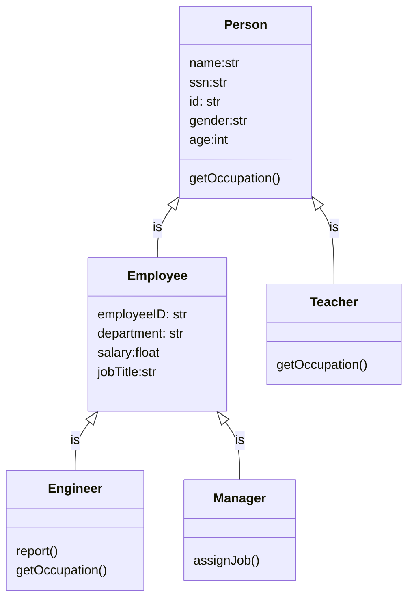
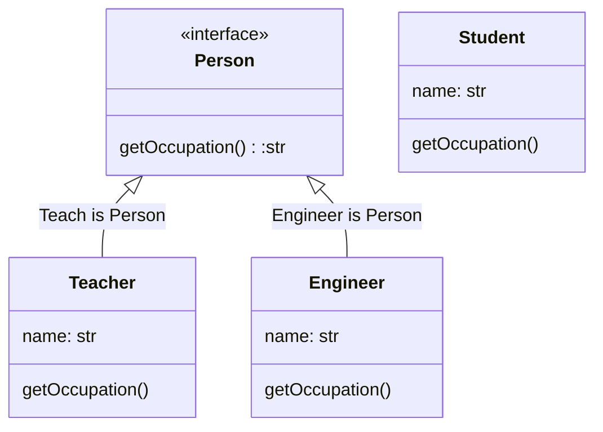
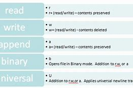

<h1>Python Language</h1>

[Markdown Shared Library](myIcons.md)

- [My First python program](#my-first-python-program)
- [print](#print)
- [comment](#comment)
- [Variable Naming](#variable-naming)
  - [Variable and memory](#variable-and-memory)
- [Data Type](#data-type)
- [Operator](#operator)
- [Execution Control](#execution-control)
- [Loop](#loop)
- [Function](#function)
  - [define function in function](#define-function-in-function)
  - [return function from function](#return-function-from-function)
  - [pass function as argument](#pass-function-as-argument)
  - [raise Error and Try-Except](#raise-error-and-try-except)
  - [function annotation](#function-annotation)
  - [Unit Test](#unit-test)
  - [loggin](#loggin)
  - [recursive function](#recursive-function)
  - [function decorator](#function-decorator)
  - [algorithms](#algorithms)
- [Class](#class)
  - [Python Interface](#python-interface)
- [File](#file)
- [Plot](#plot)
- [Turtle](#turtle)
- [MongoDB](#mongodb)


## My First python program
[hello world](../src/languageBasics/hello.py)

## print
[print](../src/languageBasics/print.py)
* place holder (%s, %d, %f)
* print with tuple
* formated print: print(f"x={x}") 
* Homeworks
    - [Math Competition](../homeworks/12023%20Harmoney%20School%20Houston.pdf)
    - [print-01](homeworks/print01.md)
    - [print-02](homeworks/print02.md)

## comment 
[comment](../src/languageBasics/../comment.py)
* single line comment: #
* multiple lines comment: """, '''

## Variable Naming
1. variable name cannot start with number
2. variable can be combination of letters and numbers _, a~z, A~Z, 0~9, no other special characters
3. don't use reserved keywords as variable name

[Python Keywords](https://realpython.com/python-keywords/#:~:text=%20Python%20Keywords%20and%20Their%20Usage%20%201,are%20used%20for%20control%20flow%3A%20if%2C...%20More%20)
4. Avoid using existing function name as your variable name.
otherwise, your python builtins functions no longer works the way you expected.
### Variable and memory


* Homeworks
[variable-01](../homeworks/variable01.md)
[variable-02](../homeworks/variable02.md)
[variable-03](../homeworks/variable03.md)


## Data Type
* [Numbers](../src/languageBasics/number.py)
    - int: a=4
    - float: a=3.4
    - complex: c=4-3j
  - Homeworks
    [number-01](../homeworks/basics/datatype/number01.md)
* [String](../src/languageBasics/string.py)
    - string is iterable
    - string slicing: [[start]:[end]:[step]]
    - String operator +, *
    - as function str(object)
    - string functions
  - Homeworks
    [string-01](../homeworks/string/string01.md)
    [string-02](../homeworks/string/string02.md)
    [string-03](../homeworks/string/string03.md)
* [Tuple](../src/languageBasics/tuple.py)
    - tuple is iterable
    - tuple is immutable
    - tuple slicing: tuple1[[start]:[end]:[step]]
    - tupler operator +, *
    - as function: tuple(iterable)
    - tuple functions ()
* [List](../src/languageBasics/list.py)
    - list is iterable
    - list is mutable
    - list slicing: list1[[start]:[end]:[step]]
    - list operators +, *
    - modify list
    - as function: list(iterable)
    - list functions (append, insert)
  - Homeworks
    [list-01](../homeworks/basics/datatype/list01.md)
    [list-02](../homeworks/basics/datatype/list02.md)
* [Set](../src/languageBasics/set.py)
    - set is iterable
    - set is mutable
    - set operators: &, |, <, >, ==
    - modify set
    - as function: set(iterable)
    - set functions ()
* [Dictionary](../src/languageBasics/dictionary.py)
    - dict is iterable: only iterate key
    - dict is mutable
    - dict modify==>CRUD

## Operator 
[operator](../src/languageBasics/operator.py)
* [arithmatic](../src/languageBasics/operator/arithmatic.py)
* [assignment](../src/languageBasics/operator/assignment.py)
* [comparison](../src/languageBasics/operator/comparison.py)
* [identity](../src/languageBasics/operator/identity.py)
* [logical](../src/languageBasics/operator/logical.py)
* [membership](../src/languageBasics/operator/membership.py)
* [others](../src/languageBasics/operator/others.py)
* [ternary](../src/languageBasics/operator/ternary.py)
* [bitwise](../src/languageBasics/operator/bitwise.py)

## Execution Control
* **if-elif-else** statement Syntax
```py
if <condition>:
    # if code block here
elif <condition>:
    # elif code block here
else:
    #else code block here
# code continue ...
```


* Mermaid Diagram for if-else statement

* [User input](../src/languageBasics/if-else/if-else03.py)
  - Homeworks
    [ifelss-01](../homeworks/basics/flowcontrol/ifelse01.md)
    [ifelss-02](../homeworks/basics/flowcontrol/ifelse02.md)
    [ifelss-03](../homeworks/basics/flowcontrol/ifelse03.md)

## Loop
* [for1.py](../src/languageBasics/loop/for1.py)
* [for2.py](../src/languageBasics/loop/for2.py)
* [forBreak.py](../src/languageBasics/loop/forBreak.py)
* [forContinue.py](../src/languageBasics/loop/forContinue.py)
  

* [while.py]()
  
  
* Homeworks
  - [loop-01](../homeworks/basics/loop/loop01.md)
  - [loop-02](../homeworks/basics/loop/loop02.md)
  - [loop-03](../homeworks/basics/loop/loop03.md)
  - [loop-04](../homeworks/basics/loop/loop04.md)
  - [loop-05](../homeworks/basics/loop/loop05.md)


## Function
* [function basic](../src/function/function.py)
* define a function
$$
\underbrace {def}_{keyword} \underbrace {circle \_area}_{function \space name} \left(\underbrace {a, b,c ...}_{positional\; args} * \underbrace {e=None, f=200}_{keyword\;args}\right) \underbrace {:}_{eol}
$$

  - def: Python reserved keyword
  - name: could be overriden
  - (): must have, no matter has arguments or not
  - arguments: positional, keyword
  - : must end with colon
  - ❗️⚡️function can be overridden
  - 😄return more than one value
  - 💡single response



Circle area formula: $ A=\pi r^2 $

* [circleArea](../src/function/function.py)
* [function arguments](../src/function/defineFunction.py)
* [understand __name__](../src/function/circle.py)
* [](../src/function/useCircle.py)
* Python document
```use python playground
>>> from src.function.defineFunction import *
>>> help(f)
```
* [One time assign default value](../src/function/defaultValue.py)
* [collision.py](../src/function/collision.py)
* [check user input](../src/function/ask.py)
* [access function attribute](../src/function/attribute.py)
* [simple math function](../src/function/math1.py)
* [optionalKeywordArgs.py](../src/function/optionalKeywordArgs.py)
* [optionalPositionalArgs.py](../src/function/optionalPositionalArgs.py)

### define function in function
* [innerFunction01.py](../src/function/innerFunction01.py)
* [innerFunction02.py](../src/function/innerFunction02.py)
* [define function in another function](../src/function/functionInFunction.py)
* [function In Function](../src/function/funcInFunc.py)

### return function from function
* [dynamicall generated quadratic function](../src/function/returnFunction.py)

### pass function as argument
* [passFuncAsArg.py](../src/function/passFuncAsArg.py)


### raise Error and Try-Except
* [❓what's wrongh?](../src/function/circle1.py)
* [✋Raise TypeError](../src/function/raise.py)
* [👌👎catch Error](../src/function/tryexcept.py)

✔️Better solution is solve the issue at compiling time.

### function annotation
👍Avoid unexpected function call with wrong data type arguments.

👍Find out calling error before runtime.

* [❓what's wrongh?](../src/function/circle1.py)

```DOS
mypy <filename.py>
```



* [annotation1.py](../src/function/annotation1.py)
* [annotation2.py](../src/function/annotation2.py)
* [annotation3.py](../src/function/annotation3.py)


### Unit Test
>A unit is a specific piece of code to be tested, such as a function or a class. Unit tests are then other pieces of code that specifically exercise the code unit with a full range of different inputs, including boundary and edge cases.

Right-Click > Command Palette... >Python Cofigure Tests > unittest > src > test_*.py
```
[project root]
    ├── 📝doc/
    |    ├── mistakes.md 
    |    ├── vscodeTrics.md 
    |    └── python.md 
    ├── 🔨homeworks/
    |       └── <filenameXX.md>
    ├── 🔥src/
    |    ├── function/ 
    |    |     ├── circle3.py
    |    |     └── circle.py
    |    └── 🚧test_circleArea.py 
    └── 👉ReadMe.md
```
* To find test program
    1. test file name match the pattern
    2. rest file located on right folder
    3. module and function can be found in the module

### loggin
* [logging1.py](../src/logging/logging1.py)

### recursive function
A function is recursive if it calls itself.
  1. termination condition.
  2. adjust status for each call.
  3. Python stops the cunction calls after a depth of 1000 calls.
* [factoria.py](../src/function/factorial.py)
$$ f(n) = n! = n (n-1) (n-2)\cdots1$$

* [recursiveBinarySearch.py](../src/algorithms/recursiveBinarySearch.py)

* Understand recursive find.
  ```mermaid
  graph TB
  START((find answer))
  END[end]
  B[add 10 to<br>the answer of<br>problem 52]
  C[Problem 52:<br>Add 12 to<br>the answer of<br>problem 85]
  D[Problem 85:<br>10]
  
  START-->B-->C-->D
  D--10+12-->C--22+10-->B--32-->END

  classDef html fill:#F46624,stroke:#F46624,stroke-width:4px,color:white;
  classDef js fill:yellow,stroke:#DE9E1F,stroke-width:2px;
  classDef start fill:green,stroke:#DE9E1F,stroke-width:2px;
  classDef end1 fill:red,stroke:#DE9E1F,stroke-width:2px;
  class START start
  class B,C,D html
  class END end1
  ```
### function decorator
* [my_timer.py](../src/function/my_timer.py)

### algorithms
Big O
* O(n)
* O(log n)
* [linearSearch.py](../src/algorithms/linearSearch.py)
* [binarySearch.py](../src/algorithms/binarySearch.py)
  
Operations on Data Structure
1. Access and read values
2. Search for an arbitrary values
3. Insert values at any point into the structure
4. Delete the value in the Data Structure
* [arrays.py](../src/algorithms/arrays.py)

## Class
>Classes provide a means of bundling data and functionality together. Creating a new class creates a new type of object, allowing new instances of that type to be made. Each class instance can have attributes attached to it for maintaining its state. Class instances can also have methods (defined by its class) for modifying its state.

4 Features of OOP
1. Abstraction:class is a abstraction of object in real world to python program object type.（实体模拟）
2. Inheritance: a class can inherit from multiple other class to increase code reusability.（共性继承）
3. Polymorphism:same function behavior differently by different object type.（异类同功）
4. Encapsulation：avoid data or function being called outside the class unintentionally（自我保护)

* Robot from real world



* [class01.py](../src/class/class01.py)
* [class02.py](../src/class/class02.py)
* [class03.py](../src/class/class03.py)
* [class04.py](../src/class/class04.py)
* [class05.py](../src/class/class05.py)
* [class06.py](../src/class/class06.py)
* [class07.py](../src/class/class07.py)
* [class08.py](../src/class/class08.py)
* [class09.py](../src/class/class09.py)
* [class10.py](../src/class/class10.py)
* [class11.py](../src/class/class11.py)
* [class12.py](../src/class/class12.py)
* [class13.py](../src/class/class13.py)
* [class14.py](../src/class/class14.py)
* [class15.py](../src/class/class15.py)
* [class16.py](../src/class/class16.py)
* [class17.py](../src/class/class17.py)
* [class18.py](../src/class/class18.py)
* [class19.py](../src/class/class19.py)
* [class20.py](../src/class/class20.py)
* [class21.py](../src/class/class21.py)
* [class22.py](../src/class/class22.py)
* [class23.py](../src/class/class23.py)
### Python Interface
[@abstractmethod](https://docs.python.org/3/library/abc.html)
[interface.py](../src/class/interface.py)


* @abstractmethod decorator from abc
* __subclasshook__(), __subclasscheck__(), issubclass(), isinstance()


## File

* [write plain text to file Hello.txt](../src/file/file0.py)
* [read/append plain text from/fo file](../src/file/file1.py)
* [read text file](../src/file/file7.py)
* [with open](../src/file/file2.py)
* [read CSV file using csv module](../src/file/csvReader1.py)
* [read CSV file using pandas](../src/file/csvReader2.py)
* [read large CSV file pokemon.csv](../src/file/csvReader3.py)
* [write dict to CSV file](../src/file/file6.py)
* [write json file](../src/file/file3.py)
* [read json file](../src/file/file3a.py)
* [load json string as dict](../src/file/file3b.py)
* [use pandas read json file](../src/file/file4.py)
* [plot student score](../src/file/file5.py)
* 
## Plot
* [plot list](../src/plot/plot0.py)
* [plot sine wave](../src/plot/plot1.py)
* [plot both sine and cosine wave](../src/plot/sin-cos.py)
* [plot 3 functions in one chart](../src/plot/plot2.py)
* [plot 6 lines in one chart with legend](../src/plot/plot3.py)
* [multiple pages with title icon](../src/plot/plot4.py)
* [stack plot with custom color](../src/plot/plot5.py)
* [box plot with data list](../src/plot/plot6.py)
* [box plot with random data](../src/plot/plot7.py)
* [errorbar plot](../src/plot/plot8.py)
* [circle pie chart](../src/plot/plot9.py)
* [3D pie chart](../src/plot/plot10.py)
* [4 sub plots in one page](../src/plot/plot11.py)
* [4 sub plots with each lenged](../src/plot/plot12.py)
* [adjust plot programtically](../src/plot/plot13.py)
* [math symbol in legend](../src/plot/plot14.py)
* [custom tick label](../src/plot/plot15.py)
* [custom tick for sine wave](../src/plot/plot16.py)
* [color ticks](../src/plot/plot17.py)
* [remove chart box lines](../src/plot/plot18.py)
* [add grid to chart](../src/plot/plot19.py)
* [curve fit](../src/plot/plot20.py)
* [change background to dark](../src/plot/plot21.py)
* [log style](../src/plot/plot22.py)
* [generate animated sine wave](../src/plot/movingSinWave.py)
* [3D animation generator](../src/plot/3dAnimation.py)
[padans DataFrame](https://pandas.pydata.org/pandas-docs/stable/user_guide/visualization.html)


## Turtle

## MongoDB

