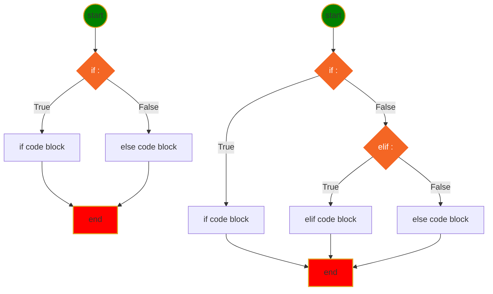
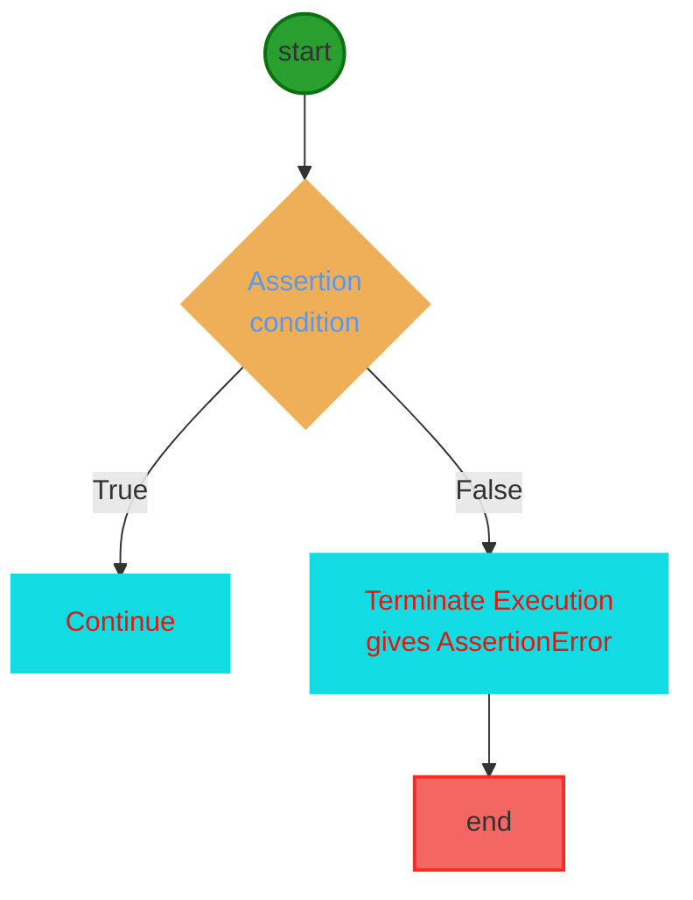
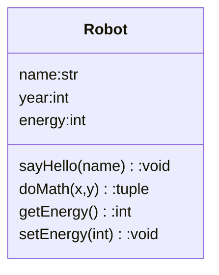
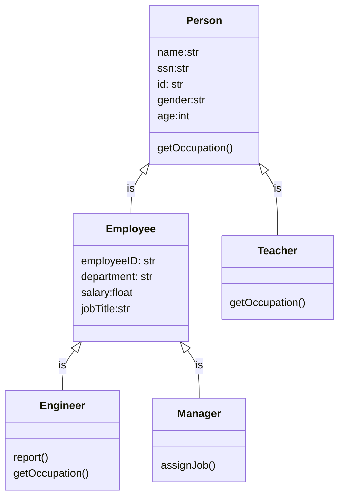
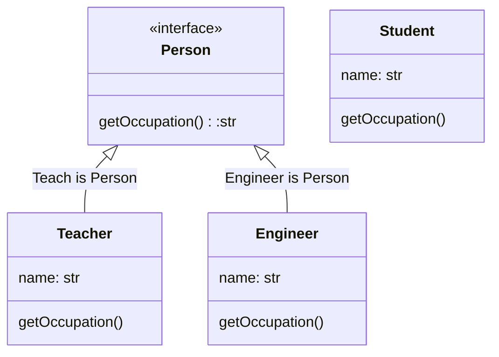
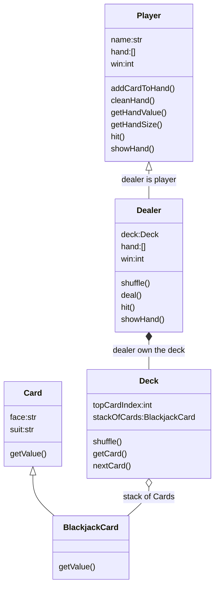

<h1>Python Language</h1>

[Markdown Shared Library](myIcons.md)

- [My First python program](#my-first-python-program)
- [print](#print)
- [comment](#comment)
- [Variable Naming](#variable-naming)
  - [Variable and memory](#variable-and-memory)
- [Data Type](#data-type)
- [Operator](#operator)
- [Execution Control](#execution-control)
- [Loop](#loop)
- [Function](#function)
  - [define function in function](#define-function-in-function)
  - [return function from function](#return-function-from-function)
  - [pass function as argument](#pass-function-as-argument)
  - [raise Error and Try-Except](#raise-error-and-try-except)
  - [function annotation](#function-annotation)
  - [Unit Test](#unit-test)
  - [loggin](#loggin)
  - [recursive function](#recursive-function)
  - [function decorator](#function-decorator)
  - [algorithms](#algorithms)
- [Class](#class)
  - [class basic](#class-basic)
  - [dunder functions](#dunder-functions)
  - [attribute scope](#attribute-scope)
  - [class tricks](#class-tricks)
  - [class inheritance](#class-inheritance)
  - [Python Interface](#python-interface)
- [Blackjack Game](#blackjack-game)
  - [Blackjack Rules](#blackjack-rules)
  - [Object relationship](#object-relationship)
  - [Unit Test](#unit-test-1)
- [File](#file)
- [Plot](#plot)
- [Turtle](#turtle)
- [MongoDB](#mongodb)


## My First python program
[hello world](../src/languageBasics/hello.py)

## print
[print](../src/languageBasics/print.py)
* place holder (%s, %d, %f)
* print with tuple
* formated print: print(f"x={x}") 
* Homeworks
    - [Math Competition](../homeworks/12023%20Harmoney%20School%20Houston.pdf)
    - [print-01](homeworks/print01.md)
    - [print-02](homeworks/print02.md)

## comment 
[comment](../src/languageBasics/../comment.py)
* single line comment: #
* multiple lines comment: """, '''

## Variable Naming
1. variable name cannot start with number
2. variable can be combination of letters and numbers _, a~z, A~Z, 0~9, no other special characters
3. don't use reserved keywords as variable name

[Python Keywords](https://realpython.com/python-keywords/#:~:text=%20Python%20Keywords%20and%20Their%20Usage%20%201,are%20used%20for%20control%20flow%3A%20if%2C...%20More%20)
4. Avoid using existing function name as your variable name.
otherwise, your python builtins functions no longer works the way you expected.
### Variable and memory


* Homeworks
[variable-01](../homeworks/variable01.md)
[variable-02](../homeworks/variable02.md)
[variable-03](../homeworks/variable03.md)


## Data Type
* [Numbers](../src/languageBasics/number.py)
    - int: a=4
    - float: a=3.4
    - complex: c=4-3j
  - Homeworks
    [number-01](../homeworks/basics/datatype/number01.md)
* [String](../src/languageBasics/string.py)
    - string is iterable
    - string slicing: [[start]:[end]:[step]]
    - String operator +, *
    - as function str(object)
    - string functions
  - Homeworks
    [string-01](../homeworks/string/string01.md)
    [string-02](../homeworks/string/string02.md)
    [string-03](../homeworks/string/string03.md)
* [Tuple](../src/languageBasics/tuple.py)
    - tuple is iterable
    - tuple is immutable
    - tuple slicing: tuple1[[start]:[end]:[step]]
    - tupler operator +, *
    - as function: tuple(iterable)
    - tuple functions ()
* [List](../src/languageBasics/list.py)
    - list is iterable
    - list is mutable
    - list slicing: list1[[start]:[end]:[step]]
    - list operators +, *
    - modify list
    - as function: list(iterable)
    - list functions (append, insert)
  - Homeworks
    [list-01](../homeworks/basics/datatype/list01.md)
    [list-02](../homeworks/basics/datatype/list02.md)
* [Set](../src/languageBasics/set.py)
    - set is iterable
    - set is mutable
    - set operators: &, |, <, >, ==
    - modify set
    - as function: set(iterable)
    - set functions ()
* [Dictionary](../src/languageBasics/dictionary.py)
    - dict is iterable: only iterate key
    - dict is mutable
    - dict modify==>CRUD

## Operator 
* [operator](../src/languageBasics/operator.py)
* Arithmatic Operator: +; -; *; /: %; **;//(floor divisor)
  
  [arithmatic](../src/languageBasics/operator/arithmatic.py)
* Assignment Operators: =; +=; -=; *=; /=; %=; **=; //=
  
  [assignment](../src/languageBasics/operator/assignment.py)
* Comparison Operators: ==, !=, <, >, <=, >=
  
  [comparison](../src/languageBasics/operator/comparison.py)
* Identity Operator: is, is not

  [identity](../src/languageBasics/operator/identity.py)

* Logical Operator: and, or, not

  [logical](../src/languageBasics/operator/logical.py)
* Membership Operator: in, not in

  [membership](../src/languageBasics/operator/membership.py)
* Multiple times operator: **
  
  [others](../src/languageBasics/operator/others.py)
* Ternary operator: if-else, and-or

  [ternary](../src/languageBasics/operator/ternary.py)
* Bitwise Operator: &, |, ^, <<, >>
  
  [bitwise](../src/languageBasics/operator/bitwise.py)

## Execution Control
* **if-elif-else** statement Syntax
```py
if <condition>:
    # if code block here
elif <condition>:
    # elif code block here
else:
    #else code block here
# code continue ...
```


* Mermaid Diagram for if-else statement

* [User input](../src/languageBasics/if-else/if-else03.py)
  - Homeworks
    [ifelss-01](../homeworks/basics/flowcontrol/ifelse01.md)
    [ifelss-02](../homeworks/basics/flowcontrol/ifelse02.md)
    [ifelss-03](../homeworks/basics/flowcontrol/ifelse03.md)

## Loop
* [for1.py](../src/languageBasics/loop/for1.py)
* [for2.py](../src/languageBasics/loop/for2.py)
* [forBreak.py](../src/languageBasics/loop/forBreak.py)
* [forContinue.py](../src/languageBasics/loop/forContinue.py)
  

* [while.py]()
  
  
* Homeworks
  - [loop-01](../homeworks/basics/loop/loop01.md)
  - [loop-02](../homeworks/basics/loop/loop02.md)
  - [loop-03](../homeworks/basics/loop/loop03.md)
  - [loop-04](../homeworks/basics/loop/loop04.md)
  - [loop-05](../homeworks/basics/loop/loop05.md)


## Function
* [function basic](../src/function/function.py)
* define a function
$$
\underbrace {def}_{keyword} \underbrace {circle \_area}_{function \space name} \left(\underbrace {a, b,c ...}_{positional\; args} * \underbrace {e=None, f=200}_{keyword\;args}\right) \underbrace {:}_{eol}
$$

    - def, Python reserved keyword
    - function name, anything you want, but need follow the naming rules
    - (), must have open/close parenthesis pair, no matter it has arguments or not
    - arguments, positional or keyword arguments separated by comma ,
    - :, must end with colon
    - the function body must indent
    - ❗️⚡️function can be overridden
    - 😄return more than one value
    - 💡single response
    - call a function by function name and (), and arguments if there is any


Circle area formula: $ A=\pi r^2 $

* [circleArea](../src/function/function.py)
* [function arguments](../src/function/defineFunction.py)
* [understand __name__](../src/function/circle.py)
* [](../src/function/useCircle.py)
* Python document
```use python playground
>>> from src.function.defineFunction import *
>>> help(f)
```
* [One time assign default value](../src/function/defaultValue.py)
* [collision.py](../src/function/collision.py)
* [check user input](../src/function/ask.py)
* [access function attribute](../src/function/attribute.py)
* [simple math function](../src/function/math1.py)
* [optionalKeywordArgs.py](../src/function/optionalKeywordArgs.py)
* [optionalPositionalArgs.py](../src/function/optionalPositionalArgs.py)

### define function in function
* [innerFunction01.py](../src/function/innerFunction01.py)
* [innerFunction02.py](../src/function/innerFunction02.py)
* [define function in another function](../src/function/functionInFunction.py)
* [function In Function](../src/function/funcInFunc.py)

### return function from function
* [dynamicall generated quadratic function](../src/function/returnFunction.py)

### pass function as argument
* [passFuncAsArg.py](../src/function/passFuncAsArg.py)
* 👍[function as dictionary value](../src/function/dictFunction.py)


### raise Error and Try-Except
* [❓what's wrongh?](../src/function/circle1.py)
* [✔️Assert check before calculation](../src/function/assert.py)

```syntax
assert <condition>,<error message>
```



* [✋Raise TypeError](../src/function/raise.py)
The difference between raise and assert:
1. assert: I swear this must be true, in case it happens, let me know. ❌❗️You have big problem! Debug aid for developer find root cause, not for handling run-time error. only give you one kind of error which is AssertionError.
>💡[I swear int('1')==1](../src/function/asInt.py)

2. raise: Try to catch run-time error. Developer sometimes use raise for execution control.

>👌💡[define isFloat(str) function](../src/function/checkFloat.py)

* [👌👎catch Assertion Error](../src/function/tryexcept1.py)
* [👌👎catch Different Error](../src/function/tryexcept2.py)

✔️Better solution is solve the issue at compiling time.

### function annotation
👍Avoid unexpected function call with wrong data type arguments.

👍Find out calling error before runtime.

* [❓what's wrongh?](../src/function/circle1.py)

```DOS
mypy <filename.py>
```


* [annotation1.py](../src/function/annotation1.py)
* [annotation2.py](../src/function/annotation2.py)
* [annotation3.py](../src/function/annotation3.py)


### Unit Test
>A unit is a specific piece of code to be tested, such as a function or a class. Unit tests are then other pieces of code that specifically exercise the code unit with a full range of different inputs, including boundary and edge cases.

Right-Click inside Editor window ⟹ Command Palette... ⟹ Python Cofigure Tests ⟹ unittest ⟹ src ⟹ test_*.py
```
[project root]
    ├── 🔥src/
    |    └── function/ 
    |           ├── circle3.py
    |           └── circle.py
    ├── tests/
    |    └── 🚧test_circleArea.py 
    └── 👉ReadMe.md
```
* 😢👎unittest cannot find the file unless
    1. test file name match the pattern
    2. test file located on right folder
    3. 👎module and function can be found in the module

😄✔️👍所有的错误，都是因为vscode Python Extension中的python执行命令。
Python永远都是从根上查找所有的module。Python本身并没有错。大部分网上的解释都没有切中要害。要害是python的执行命令与python的设计相违背。
```DOS
(env) C:\Users\12818\workspace\python-I>c:/Users/12818/workspace/python-I/env/Scripts/python.exe 
👎❌❗️c:/Users/12818/workspace/python-I/src/blackjack/blackjackcard.py
Traceback (most recent call last):
  File "c:\Users\12818\workspace\python-I\src\blackjack\blackjackcard.py", line 1, in 
<module>
    from src.blackjack.card import Card # use this line for unit test
ModuleNotFoundError: No module named 'src'

(env) C:\Users\12818\workspace\python-I>
```
从命令行看出，命令是从project根目录发出（C:\Users\12818\workspace\python-I>），直接运行该文件（c:/Users/12818/workspace/python-I/src/blackjack/blackjackcard.py）
```py
# blackjackcard.py

# from src.blackjack.card import Card # use this line for unit test
from .card import Card # use relative path
# from card import Card # use this line for product
```
如果程序使用第三行，python当然知道从当前目录下寻找card module，所以直接运行该文件没有任何的问题。但是当使用unittest的时候，unittest就找不到card module了。（😄当然如果unittest也像python一样聪明，在相同文件夹中寻找，就更好了。目前想让unittest找当前文件夹下的module文件，必须使用相对路径，即第二行的 from .card， 又或者第一行的绝对路径）。unittest总是从绝对路径开始查找，所以第一行对unittest和python来说是轻车熟路。但是第一行和第二行对于命令行直接运行都是大问题，因为在该文件所在的文件夹中，根本不存在src或者.card的文件夹，所以相应的module当然也找不到。解决的办法是修改命令行命令。
```DOS
✔️😄python -m src.blackjack.blackjackcard
```
这样一来，第一行和第二行都可以直接运行，也同时能够让unittest找到。
网上很多解释说，你一定要在package文件夹中加入__init__.py的文件云云，其实没有一毛钱的关系。

❗️❗️😢👎可惜的是，没有人修改执行命令❗️❗️

👌Work around: it is hard to type in -m command, butter way to do this is add two line for the import, one for unittest, one for local run. switch the comment when you do different thing.


### loggin
* [logging1.py](../src/logging/logging1.py)

### recursive function
A function is recursive if it calls itself.
  1. termination condition.
  2. adjust status for each call.
  3. Python stops the cunction calls after a depth of 1000 calls.
* [factoria.py](../src/function/factorial.py)
$$ f(n) = n! = n (n-1) (n-2)\cdots1$$

* [recursiveBinarySearch.py](../src/algorithms/recursiveBinarySearch.py)

* Understand recursive find.
  ```mermaid
  graph TB
  START((find answer))
  END[end]
  B[add 10 to<br>the answer of<br>problem 52]
  C[Problem 52:<br>Add 12 to<br>the answer of<br>problem 85]
  D[Problem 85:<br>10]
  
  START-->B-->C-->D
  D--10+12-->C--22+10-->B--32-->END

  classDef html fill:#F46624,stroke:#F46624,stroke-width:4px,color:white;
  classDef js fill:yellow,stroke:#DE9E1F,stroke-width:2px;
  classDef start fill:green,stroke:#DE9E1F,stroke-width:2px;
  classDef end1 fill:red,stroke:#DE9E1F,stroke-width:2px;
  class START start
  class B,C,D html
  class END end1
  ```
### function decorator
* [my_timer.py](../src/function/my_timer.py)

### algorithms
Big O
* O(n)
* O(log n)
* [linearSearch.py](../src/algorithms/linearSearch.py)
* [binarySearch.py](../src/algorithms/binarySearch.py)
  
Operations on Data Structure
1. Access and read values
2. Search for an arbitrary values
3. Insert values at any point into the structure
4. Delete the value in the Data Structure
* [arrays.py](../src/algorithms/arrays.py)

## Class
>Classes provide a means of bundling data and functionality together. Creating a new class creates a new type of object, allowing new instances of that type to be made. Each class instance can have attributes attached to it for maintaining its state. Class instances can also have methods (defined by its class) for modifying its state.

4 Features of OOP
1. Abstraction:class is a abstraction of object in real world to python program object type.（实体模拟）
2. Inheritance: a class can inherit from multiple other class to increase code reusability.（共性继承）
3. Polymorphism:same function behavior differently by different object type.（异类同功）
4. Encapsulation：avoid data or function being called outside the class unintentionally（自我保护)

* Robot from real world


### class basic
* [add attribute dynamically](../src/myclass/class01.py)
* [everythin in Python is class](../src/myclass/testRobot.py)
* [define function outside of class](../src/myclass/class02.py)
* [define function inside class](../src/myclass/class03.py)
* [define __init__()](../src/myclass/class04.py)
* [__init__(self, inputName=None)](../src/myclass/class05.py)
* [private attribute __energy](../src/myclass/class07.py)
* [getter, setter, property](../src/myclass/class08.py)

### dunder functions
* [__repr__(good enough) vs. __str__](../src/myclass/class06.py)
* [__init__(good enough) vs. __new__](../src/myclass/class09.py)
* [❓override __new__, return other class instance](../src/myclass/class10.py)
* [override __iter__, __next__, create iterable](../src/myclass/class15.py) 
* [range1 start from 1, include stop](../src/myclass/range1.py)
* [__call__() make object callable](../src/myclass/class22.py)
* [__equal__(check if same), __add__](../src/myclass/class24.py)

### attribute scope
* [class level attribute](../src/myclass/class11.py)
* [instance level attribute](../src/myclass/class12.py)

### class tricks
* [override __new__, return other class instance](../src/myclass/class10.py)
* [pass outside function to class](../src/myclass/class13.py)
* [internal function call another internal](../src/myclass/class14.py)
* [nested class](../src/myclass/class20.py)
* [composition vs. inheritance](../src/myclass/class21.py)
* [class method, static method](../src/myclass/class23.py)

### class inheritance

* [class inheritance, isinstance(obj, class)](../src/myclass/class16.py)
* [advatage of inheritance, inherite from Enum](../src/myclass/class17.py)
* [inherit from Enum](../src/myclass/class18.py)
* [multiple inheritance](../src/myclass/class19.py)

### Python Interface
[@abstractmethod](https://docs.python.org/3/library/abc.html)
[interface.py](../src/myclass/interface.py)


* @abstractmethod decorator from abc
* __subclasshook__(), __subclasscheck__(), issubclass(), isinstance()

## Blackjack Game
### Blackjack Rules
* [Black Jack Rules](https://bicyclecards.com/how-to-play/blackjack/)
1. Object of the game: 
>beat the dealer by getting a count as close to 21 as possible, without going over 21
2. Card Values 
>ace is worth 1 or 11, J,Q,K are 10, other card is its pip value
3. Betting
>for simplicity, we don't bet.
4. Shuffle and cut
>the dealer shuffles the pack of card, no need player cut
5. Deal
>dealer gives one card face up to each player, and one card face up for himself. Another round of cards is then dealt face up to each player, but the dealer takes the second card face down.
6. Naturals
>If a player's first two cards are an ace and a "ten-card" (a picture card or 10), giving a count of 21 in two cards, this is a natural or "blackjack." If any player has a natural and the dealer does not, the dealer lose.  If the dealer has a natural, other doesn't, dealer win. If both dealer and player have natural, no body wins.
7. The Play
>any player on his turn must decide whether to "stand" (not ask for another card) or "hit" (ask for another card in an attempt to get closer to a count of 21, or even hit 21 exactly). Thus, a player may stand on the two cards originally dealt to them, or they may ask the dealer for additional cards, one at a time, until deciding to stand on the total (if it is 21 or under), or goes "bust" (if it is over 21). In the latter case, play loses the game. The dealer then turns to the next player and serves them in the same manner. The combination of an ace with a card other than a ten-card is known as a "soft hand," because the player can count the ace as a 1 or 11, and either draw cards or not. For example with a "soft 17" (an ace and a 6), the total is 7 or 17. While a count of 17 is a good hand, the player may wish to draw for a higher total. If the draw creates a bust hand by counting the ace as an 11, the player simply counts the ace as a 1 and continues playing by standing or "hitting" (asking the dealer for additional cards, one at a time).
8. The Dealer's Play
>When the dealer has served every player, the dealers face-down card is turned up. If the total is 17 or more, it must stand. If the total is 16 or under, they must take a card. The dealer must continue to take cards until the total is 17 or more, at which point the dealer must stand. If the dealer has an ace, and counting it as 11 would bring the total to 17 or more (but not over 21), the dealer must count the ace as 11 and stand. The dealer's decisions, then, are automatic on all plays, whereas the player always has the option of taking one or more cards.
9. No Splitting Pairs
10. No Doubing Down
11. No Insurance
12. Reshuffling when start new game.

### Object relationship
  

* []
### Unit Test
>A unit is a specific piece of code to be tested, such as a function or a class. Unit tests are then other pieces of code that specifically exercise the code unit with a full range of different inputs, including boundary and edge cases.

Right-Click inside Editor window ⟹ Command Palette... ⟹ Python Cofigure Tests ⟹ unittest ⟹ src ⟹ test_*.py
* [Test circleArea](../tests/test_circleArea.py)
```py
# tests/test_basics.py

import unittest
from mycoolproject import my_module_1
from mycoolproject import my_module_2

class TestMe(unittest.TestCase):
    def test_stuff(self):
        assert my_module_1.my_string == 'whoa, this is so kewl'

    def test_other_stuff(self):
        assert my_module_2.my_new_string == 'carl said: whoa, this is so kewl'
 
if __name__ == '__main__':
    unittest.main()
```
C:\Users\12818\workspace\python1-2>python -m unittest tests/test_basics.py
```DOS

```
## File

* [write plain text to file Hello.txt](../src/file/file0.py)
* [read/append plain text from/fo file](../src/file/file1.py)
* [read text file](../src/file/file7.py)
* [with open](../src/file/file2.py)
* [read CSV file using csv module](../src/file/csvReader1.py)
* [read CSV file using pandas](../src/file/csvReader2.py)
* [read large CSV file pokemon.csv](../src/file/csvReader3.py)
* [write dict to CSV file](../src/file/file6.py)
* [write json file](../src/file/file3.py)
* [read json file](../src/file/file3a.py)
* [load json string as dict](../src/file/file3b.py)
* [use pandas read json file](../src/file/file4.py)
* [plot student score](../src/file/file5.py)
* 
## Plot
* [plot list](../src/plot/plot0.py)
* [plot sine wave](../src/plot/plot1.py)
* [plot both sine and cosine wave](../src/plot/sin-cos.py)
* [plot 3 functions in one chart](../src/plot/plot2.py)
* [plot 6 lines in one chart with legend](../src/plot/plot3.py)
* [multiple pages with title icon](../src/plot/plot4.py)
* [stack plot with custom color](../src/plot/plot5.py)
* [box plot with data list](../src/plot/plot6.py)
* [box plot with random data](../src/plot/plot7.py)
* [errorbar plot](../src/plot/plot8.py)
* [circle pie chart](../src/plot/plot9.py)
* [3D pie chart](../src/plot/plot10.py)
* [4 sub plots in one page](../src/plot/plot11.py)
* [4 sub plots with each lenged](../src/plot/plot12.py)
* [adjust plot programtically](../src/plot/plot13.py)
* [math symbol in legend](../src/plot/plot14.py)
* [custom tick label](../src/plot/plot15.py)
* [custom tick for sine wave](../src/plot/plot16.py)
* [color ticks](../src/plot/plot17.py)
* [remove chart box lines](../src/plot/plot18.py)
* [add grid to chart](../src/plot/plot19.py)
* [curve fit](../src/plot/plot20.py)
* [change background to dark](../src/plot/plot21.py)
* [log style](../src/plot/plot22.py)
* [generate animated sine wave](../src/plot/movingSinWave.py)
* [3D animation generator](../src/plot/3dAnimation.py)
[padans DataFrame](https://pandas.pydata.org/pandas-docs/stable/user_guide/visualization.html)


## Turtle

## MongoDB

