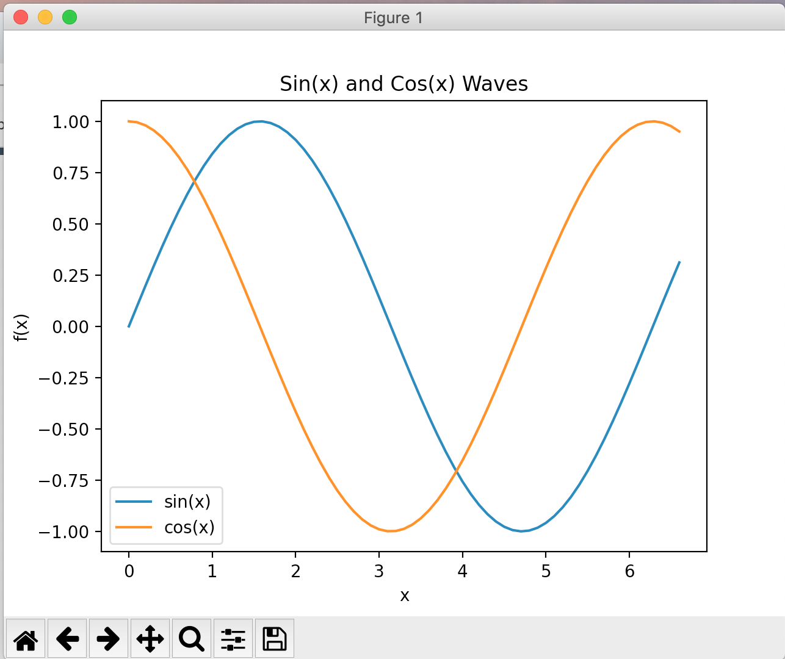

 # 华夏中文学校 Python Level 1 Syllabus

* Familiar with your keyboard
* Getting start
    - Install Python
    - Install Visual Studio Code
    - Install Git
    - How to use VS Code
    - How to use GitHub to turn in homework
* Using Markdown for class notes

* print function
* Turtle
    - Draw Snowman

    

    - Draw House

    
    
    - Draw Card 
!
    

* If-Else
* Data Type

* Python playground and Help
* Loop
* Simple Math
* Function
* Small Games
    - Dice
    - Guess Number
    - Prime
    - Ball Hit Bird in sky

* File Access
    - plaint text file
    - csv file
    - json file
* Plot

* Simple Application Server

* Mongo DB NoSQL database access
    - Install MongoDB
    - Install MongoDB Compass
    - CRUD: Create, Retrieve, Update, Delete operation

* ReactJS Concept
* Use Node JS and npm
* OOP: Object Oriented Programming Concept

* Build python class

