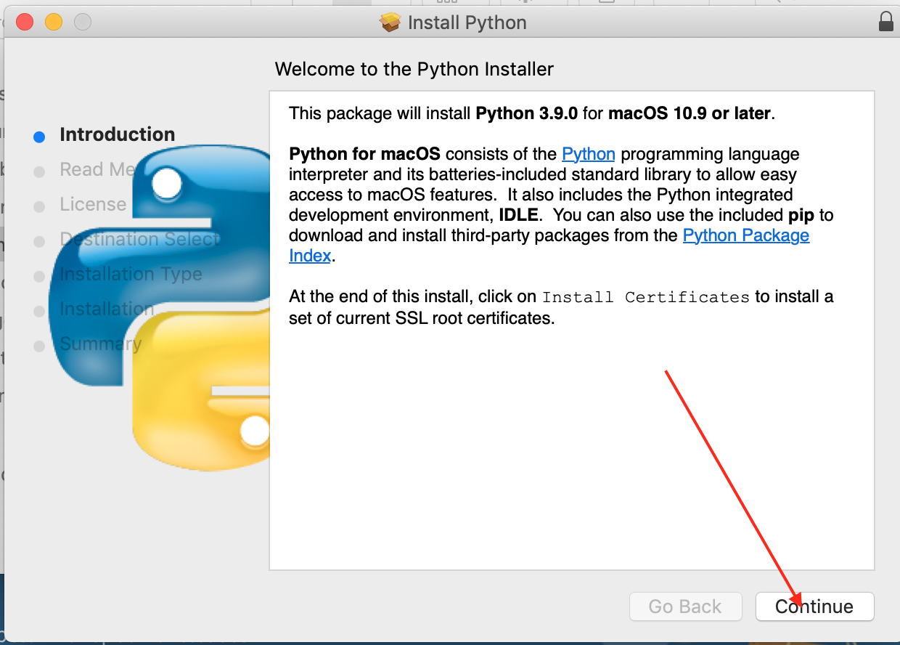

# Python Class Software Installation

## Install VSCode
VSCode is the python program editor we will use in our class.
* 下载 VSCode
>Google search: vscode download
Search result: Download Visual Studio Code - Mac, Linux, Windows

[VSCode Download Website](https://code.visualstudio.com/Download)

> File: VSCode-darwin-stable.zip
* Extract zip file to ~/Downloads folder, 
    - MacOS: move "Visual Studio Code" to Application folder
    - Windows 10: 

* Check the success of the installation
double click the desktop icon, start VSCode.

## Install Python
We need Python interpretor installed in order to execute Python program.
* 下载 Python
>Google search: python download
Search result: Download Python | Python.org
[Python Download Website](https://www.python.org/downloads/)

File: python-3.9.0-macosx10.9.pkg

* Install python
double click the downloaded file, 


* Check the installation
```
python --version
```

## Install Git
Git is very powerful source version control software nowaday, we will use it for our python source code version control and homework repository.

* Download Git
>Google search: git downloads
Search result: Git - Downloads 

[Git Download website](https://git-scm.com/downloads)


File: 
* Use brew to install git on MacOS
```
brew install git
ls -la /usr/local 
sudo chown -R wangqianjiang:wheel /usr/local
brew link git
```

* Check the installation
```
git --version
```