## Language Basics

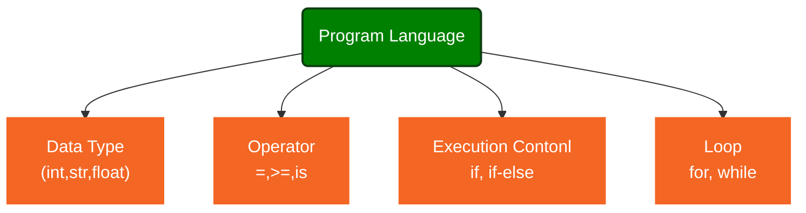

## Python program

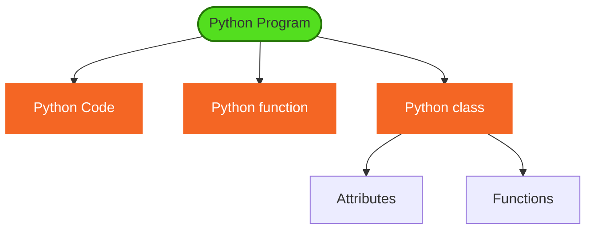

## Monad


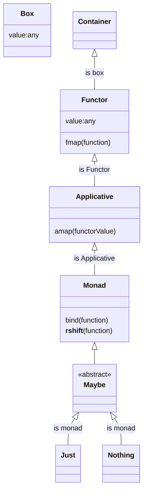

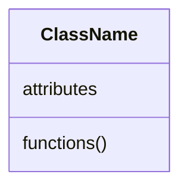


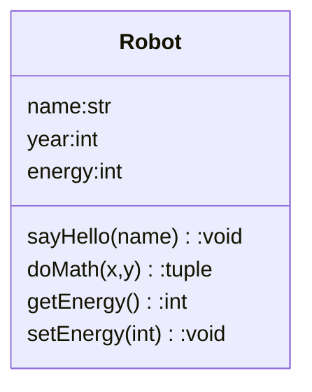

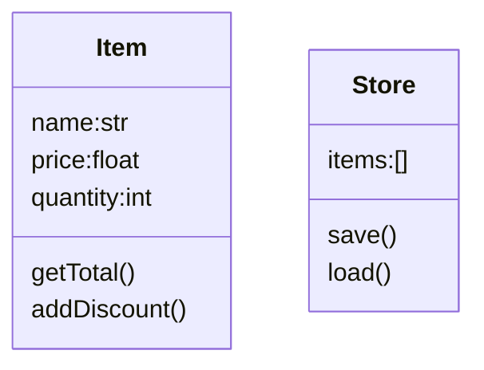

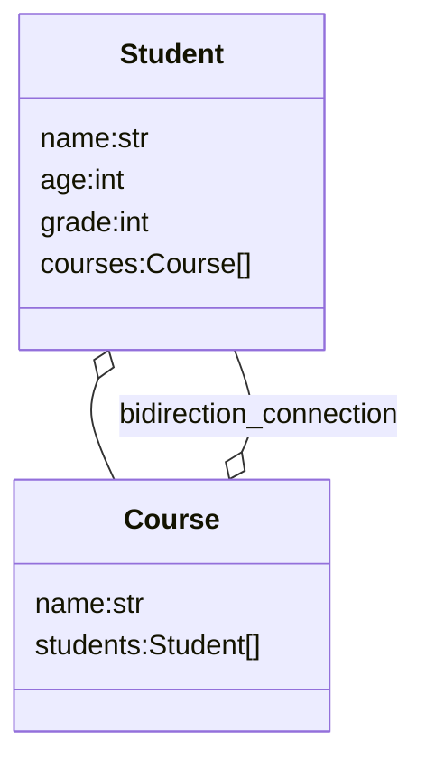

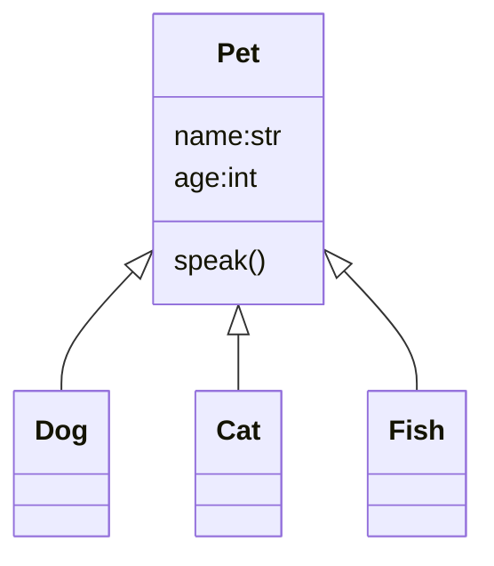

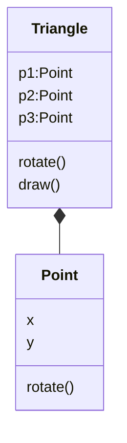


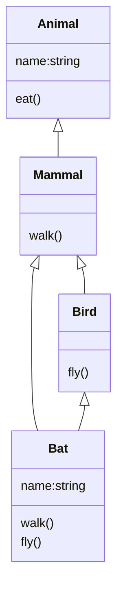

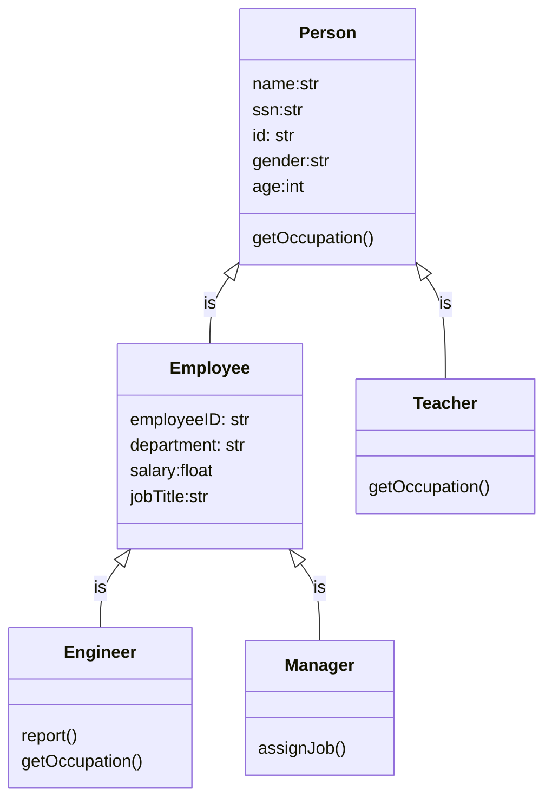

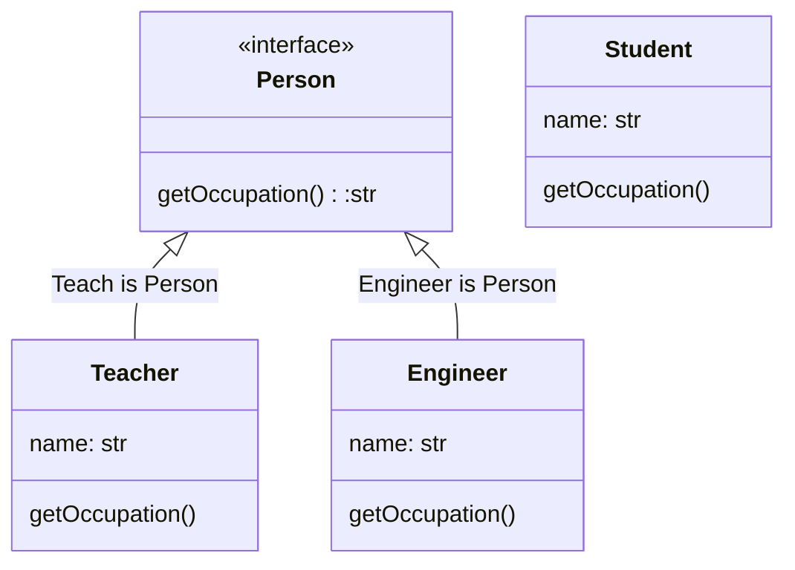

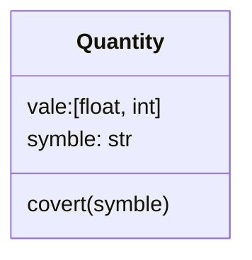

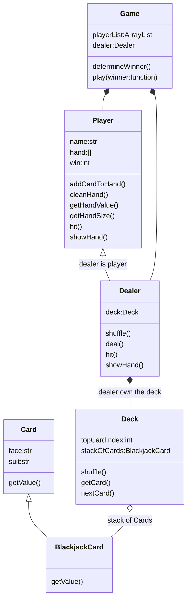

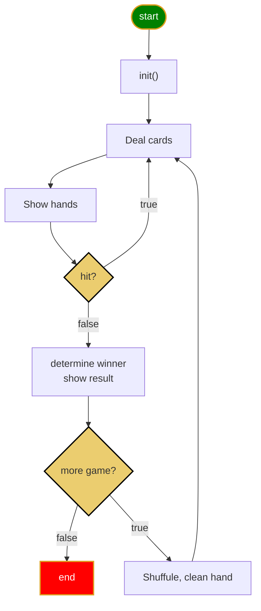

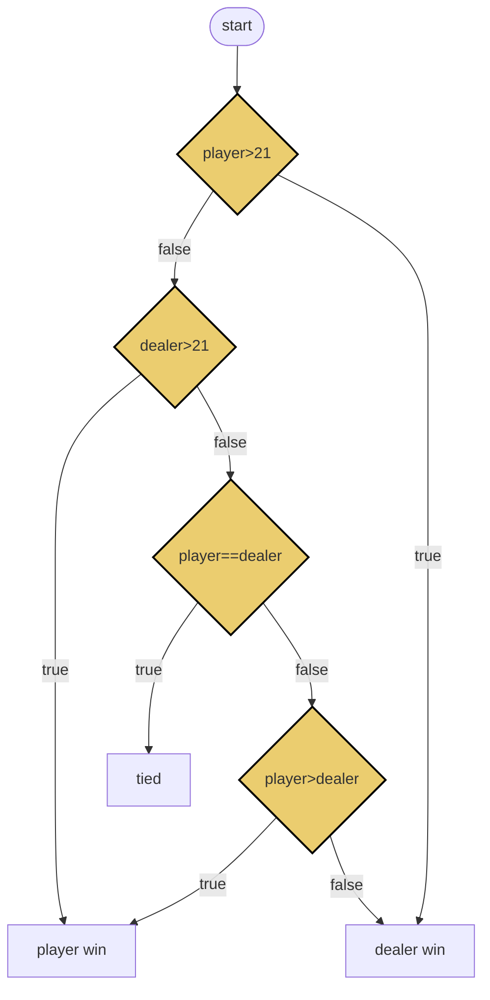

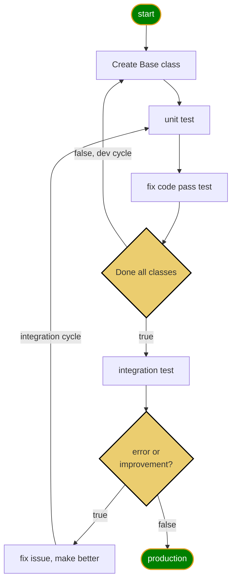

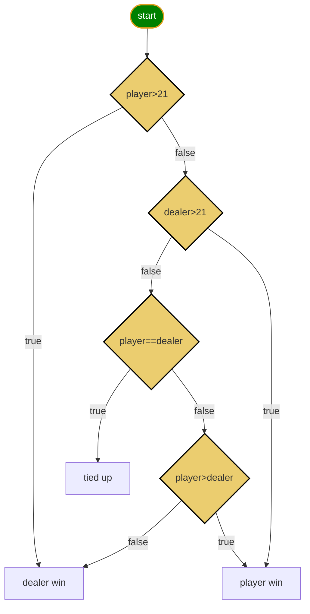

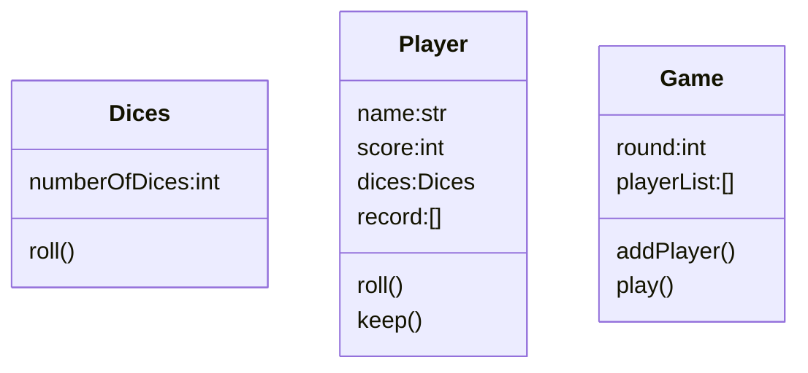

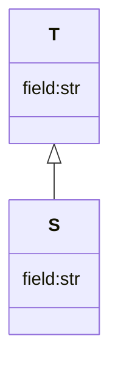

```mermaid
graph LR

OOP([Object Oriented Programming])
ABSTRACT[Abstraction]
INHERIT[Inheritance]
POLY[Polymorphism]
ENCAPS[Encapsulation]

OOP --> ABSTRACT & INHERIT & POLY & ENCAPS

classDef start fill:green,stroke:#DE9E1F,stroke-width:2px,color:white;

class OOP start
```


```mermaid
erDiagram
  PROJECT{
    int id
    string name
  }
  TASK{
    int id
    string name
    date start
    date end
  }
  PROJECT ||--o{ TASK : contains

```

```mermaid
erDiagram
  blackjack {
      int id
      string name
      int win
      int loose
      int tie
  }
```

