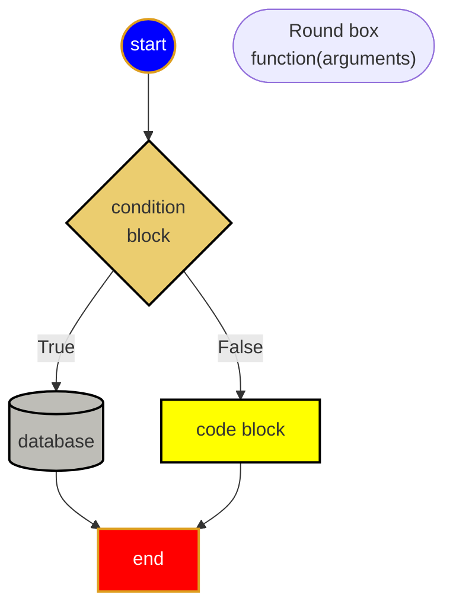

## Useful Icons

❓✔️ 👍😄 👎😱 ❌✔️ 💡👉 🔔⚡️ 🔒🔑
✏️📄✂️♻️
📌❗️📝🔍🔨☝️👇👈👉👍👎👌👊⭐️😢🌎💾🗑🐛📒⚠️🔥🛠📐🎯✉️☎️

:hammer:

[](images/bug.png)


## references
* [Color Picker](https://www.webfx.com/web-design/color-picker/)
* [favorite icon website](https://www.webfx.com/tools/emoji-cheat-sheet/)

## Sample File Structure:

```output
<project root>
    ├── 📝doc/
    |    ├── mistakes.md 
    |    └── python.md 
    ├── 🔨homeworks/
    |       └── filenameXX.md
    ├── 🔥src/
    |       └── string.py
    └── 👉ReadMe.md
```

## Sample Mermaid Diagram

😄Include frequently used mermaid diagram features below👇

