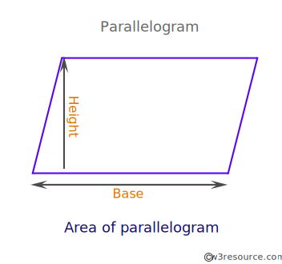

* Write a Python program to calculate the area of a parallelogram.

Note: A parallelogram is a quadrilateral with opposite sides parallel (and therefore opposite angles equal). A quadrilateral with equal sides is called a rhombus, and a parallelogram whose angles are all right angles is called a rectangle.

Expected output:

Length of base: 5                                                   
Measurement of height: 6                                           
Area is:  30.0 