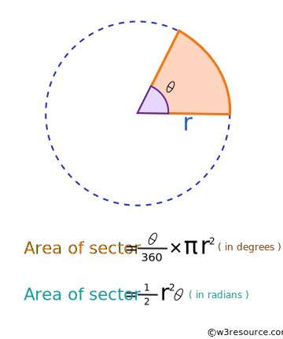

* Write a Python program to calculate the area of the sector. 

Note: A circular sector or circle sector, is the portion of a disk enclosed by two radii and an arc, where the smaller area is known as the minor sector and the larger being the major sector.

