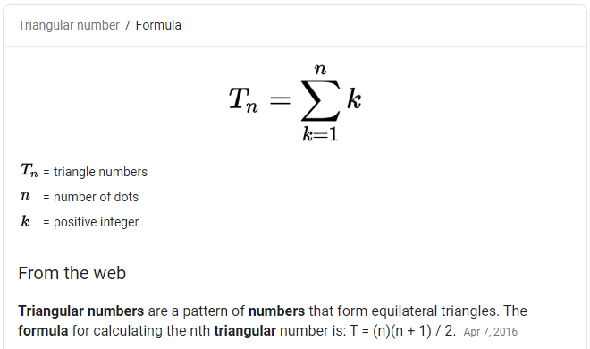

# Triangule numbers
>Use a for loop to compute the 10th triangular number. The nth triangular number is defined as 1+2+3+...+n. (You can also compute the nth triangular number as n*(n+1)/2. Use this formula to double-check that your loop is correct.)
Hint: This outline is an almost-complete solution. You only have to replace each ellipsis by an expression.



```py
n = 10
triangular = 0
for i in ...:
    triangular = ...
print "Triangular number", n, "via loop:", triangular
print "Triangular number", n, "via formula:", n*(n+1)/2
```
