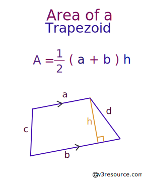

* Write a Python program to calculate the area of a trapezoid.



Expected output:
```
Height of trapezoid: 6                                              
Base one value: 10                                            
Base two value: 5

Area is: 45.0  
```