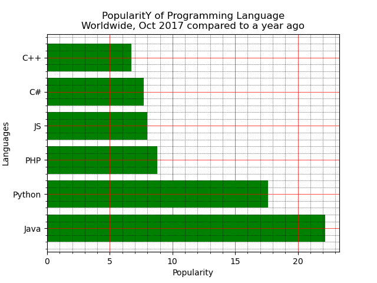

* Write a Python programming to display a horizontal bar chart of the popularity of programming Languages.

Sample data:
Programming languages: Java, Python, PHP, JavaScript, C#, C++
Popularity: 22.2, 17.6, 8.8, 8, 7.7, 6.7
The code snippet gives the output shown in the following screenshot: 

