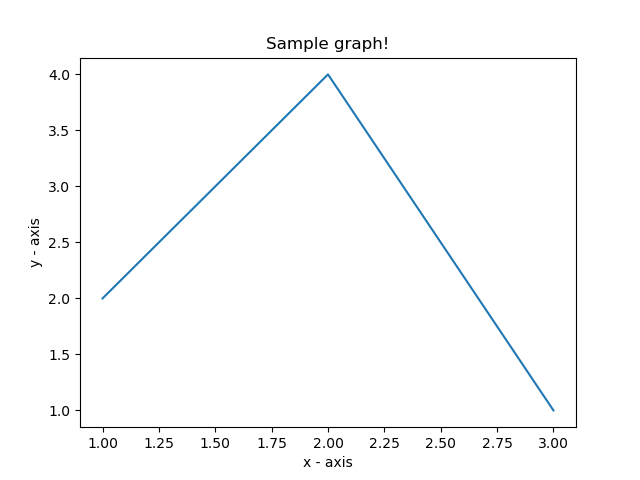

Write a Python program to draw a line using given axis values taken from a text file, with suitable label in the x axis, y axis and a title. 

Test Data:

plotHW2.txt
```
1 2
2 4
3 1
```
The code snippet gives the output shown in the following screenshot:

