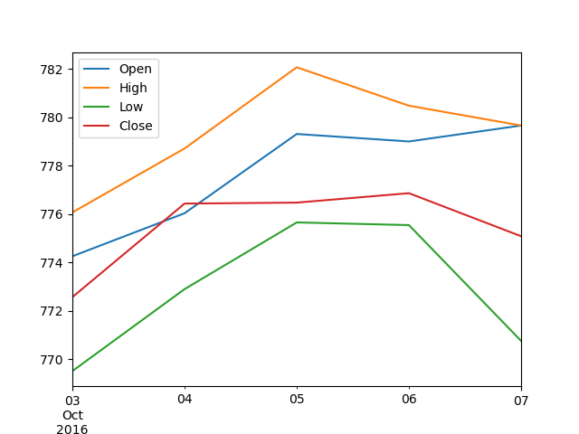

* Write a Python program to draw line charts of the financial data of Alphabet Inc. between October 3, 2016 to October 7, 2016.

Test Data:

plotHW3.txt
```
Date,Open,High,Low,Close
10-03-16,774.25,776.065002,769.5,772.559998
10-04-16,776.030029,778.710022,772.890015,776.429993
10-05-16,779.309998,782.070007,775.650024,776.469971
10-06-16,779,780.47998,775.539978,776.859985
10-07-16,779.659973,779.659973,770.75,775.080017
```
The code snippet gives the output shown in the following screenshot:

