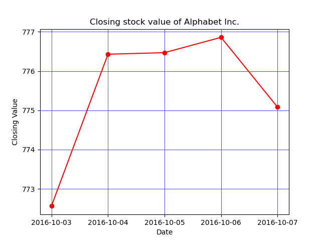

* Write a Python program to display the grid and draw line charts of the closing value of Alphabet Inc. between October 3, 2016 to October 7, 2016. Customized the grid lines with linestyle -, width .5. and color blue.

refer to ployHW3.csv file.

The code snippet gives the output shown in the following screenshot:

