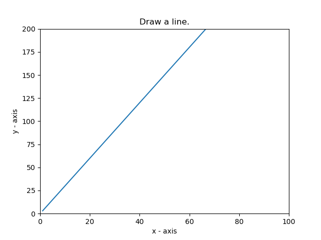

* Write a Python program to display the current axis limits values and set new axis values. for instance, x limit to 0~100, y limit to 0~200.

The code snippet gives the output shown in the following screenshot:

