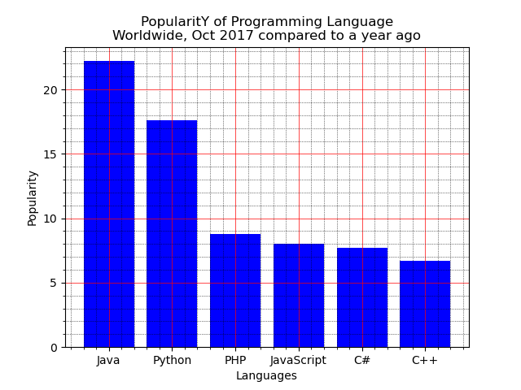

* Write a Python programming to display a bar chart of the popularity of programming Languages. 

Sample data:
Programming languages: Java, Python, PHP, JavaScript, C#, C++
Popularity: 22.2, 17.6, 8.8, 8, 7.7, 6.7
The code snippet gives the output shown in the following screenshot:

[Programming Lauguage Popularity](https://statisticsanddata.org/data/the-most-popular-programming-languages-1965-2021/)

Sample data from TIOBE Index by March 2021
Language | Ratings | Changes
|---     |---     |---      |
C            |15.33 |-1.00
Java         |10.45 |-7.33
Python       |10.31 |+0.20
C++          |6.52  |-0.27
C#           |4.97  |-0.35
Visual Basic |4.85  |-0.4
Java Script  |2.11  |+0.06
PHP          |2.07  |+0.05
Assembly     |1.97  |+0.72
SQL          |1.87  |+0.03

