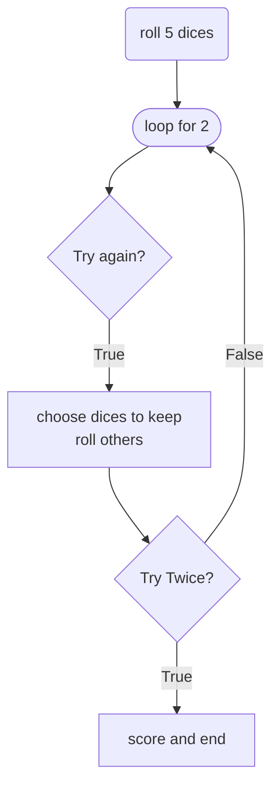
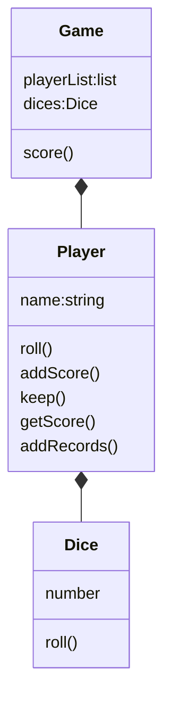
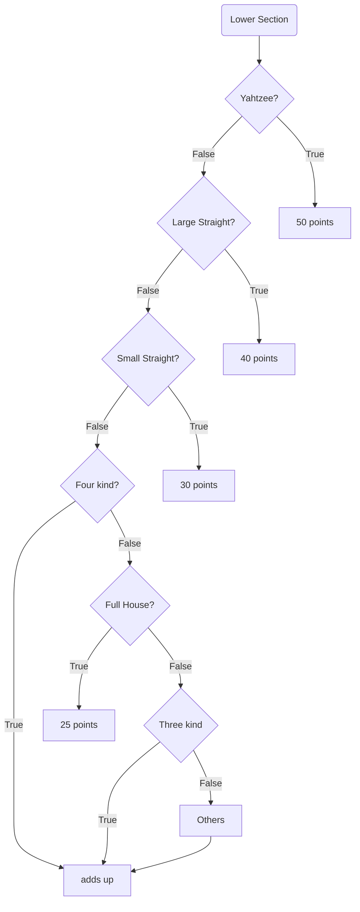

<h1>Yahtzee Game</h1>

[Yahtzee website](https://www.dicegamedepot.com/yahtzee-rules/)

## Object
The object of Yahtzee is for each player to roll dice and fill out their score card over the course of a series of rounds, trying to obtain the best rolls they can in 13 different combinations. The player with the highest score at the end of the game wins.

## Number of Players
2 or more

## How to PlayYahtzee
* Choose a starting player by player order
* player will take turns one at a time
* The game consists of thirteen rounds
* who has the greatest score wins.

## class design

